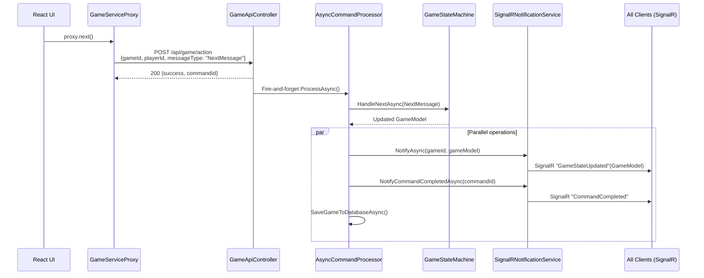
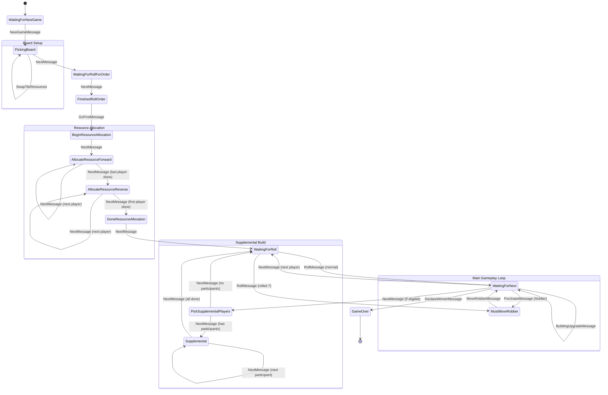

# Message Flow & State Machine

**Last verified:** January 30, 2026

## Communication Architecture

The React client uses **REST POST** for all gameplay commands and **SignalR** only
for receiving state updates. This differs from the Blazor client which uses SignalR
for both directions.



Key points:

- POST returns 200 immediately with `commandId` (fire-and-forget)
- `AsyncCommandProcessor` routes `messageType` string to the correct
  `GameStateMachine.Handle*Async` method
- After processing, three things happen in parallel: client notification,
  command completion, and database persistence
- All clients in the game group receive the full `GameModel` via SignalR

## GameState Enum

Defined in `Catan3.Shared/Models/GameEnums.cs`.

| Value | Phase | Description |
|-------|-------|-------------|
| `Uninitialized` | Setup | Initial state before game creation |
| `WaitingForNewGame` | Setup | Awaiting game creation parameters |
| `PickingBoard` | Setup | Board visible; players can shuffle, balance, swap tiles |
| `WaitingForRollForOrder` | Setup | Players roll to determine turn order |
| `FinishedRollOrder` | Setup | Roll order complete; pick who goes first |
| `BeginResourceAllocation` | Allocation | Transition into allocation phase |
| `AllocateResourceForward` | Allocation | Players place settlements forward (1 -> N) |
| `AllocateResourceReverse` | Allocation | Players place settlements reverse (N -> 1) |
| `DoneResourceAllocation` | Allocation | All initial placements complete |
| `WaitingForRoll` | Gameplay | Current player must roll dice |
| `WaitingForNext` | Gameplay | Current player can trade/build, then click Next |
| `MustMoveRobber` | Gameplay | Player rolled 7 or played Soldier; must move robber |
| `PickSupplementalPlayers` | Gameplay | Choose who participates in supplemental build |
| `Supplemental` | Gameplay | Supplemental build phase (5-6 player games) |
| `WaitingForPlayers` | Setup | Waiting for players to join |
| `TooManyCards` | Gameplay | Player must discard half on rolled 7 |
| `MustDestroyCity` | Gameplay | Cities & Knights: city under attack |
| `PickingRandomGoldTiles` | Gameplay | Gold tile resource selection |
| `HandlePirates` | Gameplay | Pirates expansion handling |
| `DoneDestroyingCities` | Gameplay | City destruction phase complete |
| `MustMoveMerchant` | Gameplay | Must move merchant token |
| `DestroyRoad` | Gameplay | Road destruction action |
| `SwapNumbers` | Gameplay | Number token swap action |
| `PickDeserter` | Gameplay | Pick deserter target |
| `PlaceDeserterKnight` | Gameplay | Place deserter knight |
| `DoneWithDeserter` | Gameplay | Deserter phase complete |
| `UpgradeToMetro` | Gameplay | Metro upgrade action |
| `DisplaceVictimKnight` | Gameplay | Knight displacement |
| `DisplaceKnightMoveVictim` | Gameplay | Knight move after displacement |
| `ClickOnKnight` | Gameplay | Knight selection action |
| `TestCheckpoint` | Testing | Test replay checkpoint |
| `GameOver` | End | Game finished; winner declared |

## State Machine Diagram



Note: `UndoMessage` and `RedoMessage` are valid in any state and revert/restore
the game log without following normal state transitions.

## Message Type Reference

All gameplay messages route through `POST /api/game/action`.

| Message Type | Properties | Valid In States | Transitions To |
|---|---|---|---|
| `UndoMessage` | (none) | Any | Previous log state |
| `RedoMessage` | (none) | Any | Next log state |
| `NextMessage` | (none) | Any | Context-dependent (see state diagram) |
| `ShuffleMessage` | (none) | Any | Same state (reshuffles board) |
| `BalanceBoardMessage` | (none) | PickingBoard | Same state (balanced shuffle) |
| `RollMessage` | roll: TurnRollModel | WaitingForRoll | WaitingForNext or MustMoveRobber |
| `PurchaseMessage` | entitlement: Entitlement | WaitingForNext, Supplemental | Same or MustMoveRobber (Soldier) |
| `RoadPurchaseMessage` | roadKey: RoadKey | WaitingForNext, Allocation, Supplemental | Same state |
| `BuildingUpgradeMessage` | buildingKey: BuildingKey | WaitingForNext, Allocation, Supplemental | Same state |
| `MoveRobberMessage` | coordinates, targetPlayerId? | MustMoveRobber | WaitingForNext or previous state |
| `GoFirstMessage` | playerId: string | FinishedRollOrder | BeginResourceAllocation |
| `SetPlayerOrderMessage` | playerIds: string[] | WaitingForRollForOrder, FinishedRollOrder | Same state |
| `ParticipatingInSupplementalMessage` | playerId, participating | PickSupplementalPlayers | Same state |
| `SwapTileResources` | source/dest coords + resources | PickingBoard | Same state |
| `DeclareWinnerMessage` | winnerId, victoryPoints? | Any (not GameOver) | GameOver |
| `UpdateHouseRulesMessage` | houseRules: HouseRules | Any | Same state |
| `EndGame` | (none) | Any | Same (marks log inactive) |

## REST API Reference

### Game Lifecycle

| Method | Path | Purpose | Request Body |
|--------|------|---------|--------------|
| POST | `/api/game/new` | Create new game | `NewGameMessage` {gameType, playerIds, gameName, houseRules?, saveLifetimeStats} |
| POST | `/api/game/load` | Load from compressed log | `LoadGameMessage` {compressedLog} |
| POST | `/api/game/loadmodel` | Load from GameModel JSON | `LoadGameModelMessage` {gameModelJson, isTest} |
| POST | `/api/game/{gameId}/load` | Load from database | (none) |
| GET | `/api/gamestate/{gameId}` | Get current state | (none) |
| GET | `/api/games` | List saved games | Query: `playerId` |
| GET | `/api/companion/games` | List in-memory games | (none) |

### Gameplay Commands

| Method | Path | Purpose | Request Body |
|--------|------|---------|--------------|
| POST | `/api/game/action` | Execute any command | `{gameId, playerId, messageType, messageData}` |
| POST | `/api/game/{gameId}/shuffle` | Shuffle board | `{playerId}` |
| POST | `/api/game/{gameId}/winner` | Declare winner | `{winnerId, victoryPoints?}` |
| POST | `/api/game/persist` | Save game | `{gameId, action, location?}` |
| PUT | `/api/game/{gameId}/houserules` | Update house rules | `HouseRules` |

### Player Management

| Method | Path | Purpose | Request Body |
|--------|------|---------|--------------|
| GET | `/api/players` | List all players | (none) |
| POST | `/api/players` | Create player | `PlayerProfile` |
| PUT | `/api/players/{id}` | Update player | `PlayerProfile` |
| DELETE | `/api/players/{id}` | Delete player | (none) |
| POST | `/api/players/{id}/image` | Upload avatar | multipart/form-data |
| GET | `/api/images/{id}` | Get player image | (none) |

### Deprecated

| Method | Path | Notes |
|--------|------|-------|
| POST | `/api/game/register` | Returns 400; use `/api/game/new` instead |

## SignalR Events

The React client connects to the `/gameHub` endpoint.

### Server to Client

| Event | Payload | Purpose |
|-------|---------|---------|
| `GameStateUpdated` | `GameModel` | Full game state after any command |
| `CommandCompleted` | commandId, success, message | Confirm command processed |
| `CommandFailed` | commandId, error | Report command failure |
| `PlayersUpdated` | `PlayerProfile[]` | Player profile changes |
| `PlayerPresenceChanged` | playerId, isPresent | Player connected/disconnected |

### Client to Server (Hub Methods)

The React client calls `JoinGame` and `LeaveGame` directly via SignalR.
All gameplay commands go through REST POST instead.

| Method | Parameters | Purpose |
|--------|-----------|---------|
| `JoinGame` | gameId, playerId | Join game group for broadcasts |
| `LeaveGame` | gameId, playerId | Leave game group |

Note: The `GameHub` also exposes `Shuffle`, `Undo`, `Redo`, `Next`,
`ExecutePurchase`, `ExecuteRoadPurchase`, `ExecuteBuildingUpgrade`,
`ExecuteMoveRobber`, `ExecuteRoll`, `ExecuteSetPlayerOrder`,
`ExecuteGoFirst`, `ExecuteSwapTileResources`, `ExecuteBalanceBoard`,
and `ExecuteParticipatingInSupplemental` as hub methods. These are used
by the Blazor client but NOT by the React client, which uses REST instead.

## AsyncCommandProcessor Message Routing

The `messageType` string in `POST /api/game/action` maps to handlers:

```
messageType switch:
  "UndoMessage"                        -> GameStateMachine.HandleUndoAsync()
  "RedoMessage"                        -> GameStateMachine.HandleRedoAsync()
  "NextMessage"                        -> GameStateMachine.HandleNextAsync()
  "ShuffleMessage"                     -> GameStateMachine.HandleShuffleAsync()
  "PurchaseMessage"                    -> GameStateMachine.HandlePurchaseAsync()
  "RoadPurchaseMessage"                -> GameStateMachine.HandleRoadPurchaseAsync()
  "BuildingUpgradeMessage"             -> GameStateMachine.HandleBuildingUpgradeAsync()
  "MoveRobberMessage"                  -> GameStateMachine.HandleMoveRobberAsync()
  "RollMessage"                        -> GameStateMachine.HandleRollAsync()
  "SetPlayerOrderMessage"              -> GameStateMachine.HandleSetPlayerOrderAsync()
  "BalanceBoardMessage"                -> GameStateMachine.HandleBalanceBoardAsync()
  "GoFirstMessage"                     -> GameStateMachine.HandleGoFirstAsync()
  "ParticipatingInSupplementalMessage" -> GameStateMachine.HandleParticipatingInSupplementalAsync()
  "SwapTileResourcesMessage"           -> GameStateMachine.HandleSwapResourcesAsync()
  "DeclareWinnerMessage"               -> GameStateMachine.HandleDeclareWinnerAsync()
```

Source: `Catan3.GameService/Services/AsyncCommandProcessor.cs`

## Adding New Game Messages

To add a new message type to the system:

1. **Define the record** in `Catan3.Shared/Messages/` as an
   immutable message class
2. **Add recording support** with `[JsonDerivedType]` attribute for
   polymorphic serialization
3. **Implement `Handle*Async`** in `GameStateMachine` with the game
   logic
4. **Register in `AsyncCommandProcessor`** -- add a case to the
   `messageType` switch for REST routing
5. **Register in `GameHub`** (optional) -- add a hub method for
   Blazor/Desktop clients
6. **Register in `GameMessageService`** (Desktop) -- add handler in
   both local and service branches
7. **Expose in `GameServiceProxy`** -- add method for React client
   to call

### Error Handling Pattern

- Local handlers catch `GameException` and call `SendErrorMessage`
  to surface errors as toasts
- Service handlers wrap proxy exceptions similarly
- `GameException` carries structured error info (exception name,
  message, inner exception, timestamp)

### Recording Support

Messages that implement `IRecordedMessage` are automatically
captured by `GameRecorder` when recording is active. The recorder
serializes the message and the resulting `GameHash` for replay
verification.

## GameStateMachine Architecture

**File:** `Catan3.Shared/GameLogic/GameStateMachine.cs` (~2000+
lines)

The authoritative rules engine. Every public handler follows the
same pattern:

1. `_gameLog.CopyCurrent()` -- get current game state
2. Log the request with trace level
3. `_recorder?.RecordAction()` -- optional recording capture
4. Call private helper for actual mutation
5. `LogGameModel(model)` -- push onto undo/redo log
6. Return updated `GameModel`

### Undo/Redo

`HandleUndoAsync` / `HandleRedoAsync` manipulate the log directly
without calling `LogGameModel`, keeping history accurate. The log
is backed by:

- Desktop: `Trace<string>` (writes `.catan` files)
- Service: `Log<string>` (serializes to JSON/compressed bytes)

### Rule Enforcement

All validation lives in private helpers (`RoadPurchase`,
`MoveRobber`, `BalanceBoard`, `SoldierDiscardFlow`, etc.). These
ensure identical behavior regardless of which client sends the
command.

## GameStateMachineRegistry

**File:** `Catan3.GameService/Services/GameStateMachineRegistry.cs`

Singleton that holds all active game instances in memory. Games
are loaded from the database on first access and remain in memory
until explicitly ended or the service restarts.

**Key gap:** No authentication or authorization. All endpoints
trust the caller-supplied `playerId`. Any client can impersonate
any player.
