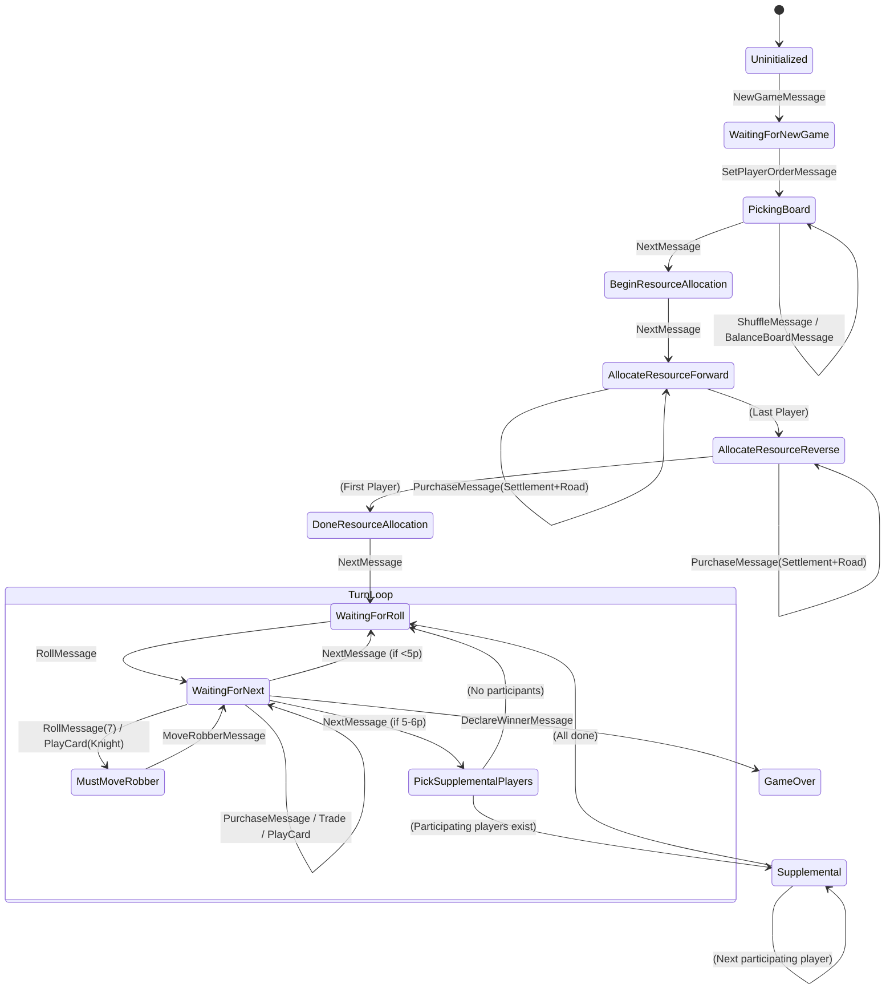
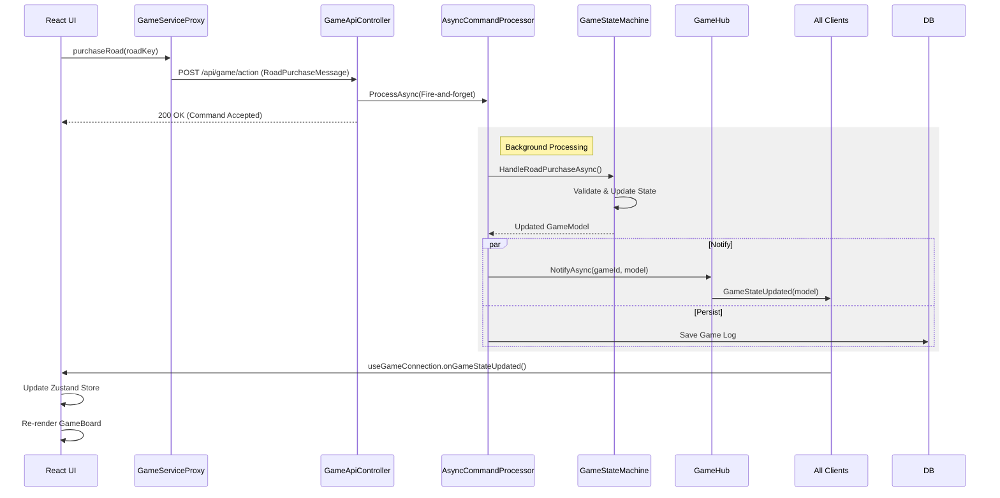

# Message & State Flow Reference

**Status:** As-Built
**Source:** `Catan3.Shared/GameLogic/GameStateMachine.cs` & `Catan3.Shared/Models/MessageObjects.cs`

## 1. GameState Enum

The `GameState` enum drives the UI and rule enforcement.

| State | Description |
|---|---|
| **Uninitialized** | Initial state before game load. |
| **WaitingForNewGame** | Game loaded, waiting for players/start. |
| **PickingBoard** | Players can shuffle/balance the board. |
| **WaitingForRollForOrder** | Players rolling to determine turn order. |
| **FinishedRollOrder** | Turn order determined. |
| **BeginResourceAllocation** | Setup phase starts. |
| **AllocateResourceForward** | Placing first settlement/road (1st pass). |
| **AllocateResourceReverse** | Placing second settlement/road (2nd pass). |
| **DoneResourceAllocation** | Setup complete. |
| **WaitingForRoll** | Start of turn. Waiting for dice roll. |
| **WaitingForNext** | Main turn phase. Trade, build, play cards. |
| **PickSupplementalPlayers** | (5-6p) Identifying eligible players. |
| **Supplemental** | (5-6p) Special build phase between turns. |
| **TooManyCards** | Rolled 7. Players > 7 cards must discard. |
| **MustMoveRobber** | Rolled 7 or played Knight. Must move robber. |
| **Buying...** | Various ephemeral purchase states (Road, Building). |
| **GameOver** | Winner declared. |

*(Note: Extended states for Cities & Knights like `UpgradeToMetro`, `HandlePirates` are defined but not fully detailed here.)*

## 2. State Machine Diagram

## 3. Message Type Reference

Messages are JSON payloads sent via signalR or REST to trigger transitions.

| Message Type | Properties | Valid States | REST Endpoint |
|---|---|---|---|
| `NewGameMessage` | GameType, PlayerIds, GameName, HouseRules | Uninitialized | POST /api/game/new |
| `RollMessage` | Roll (TurnRollModel) | WaitingForRoll | POST /api/game/action |
| `PurchaseMessage` | Entitlement (Road, Settlement, etc.) | WaitingForNext, Supplemental | POST /api/game/action |
| `RoadPurchaseMessage` | RoadKey (coords) | WaitingForNext | POST /api/game/action |
| `BuildingUpgradeMessage` | BuildingKey (coords) | WaitingForNext | POST /api/game/action |
| `MoveRobberMessage` | Coordinates, TargetPlayerId | MustMoveRobber | POST /api/game/action |
| `NextMessage` | (none) | *Many* (advances phase) | POST /api/game/action |
| `UndoMessage` | (none) | Any | POST /api/game/action |
| `ShuffleMessage` | (none) | PickingBoard | POST /api/game/action |
| `DECLARE_WINNER` | WinnerId, VictoryPoints | WaitingForNext | POST /api/game/winner |

## 4. REST API Reference

The React client uses REST for commands to ensure delivery and correct ordering.

| Method | Path | Purpose | Request Body | Response |
|---|---|---|---|---|
| **POST** | `/api/game/action` | Execute generic command | `{playerId, messageType, messageData}` | `{success, message, gameId}` |
| **POST** | `/api/game/new` | Create new game | `NewGameMessage` | `{gameId, success}` |
| **GET** | `/api/game/{id}` | Get game state | - | `GameModel` |
| **GET** | `/api/game` | List games | - | `[GameInfo]` |

## 5. SignalR Events

Real-time updates are pushed to all clients.

| Event | Direction | Payload | Role |
|---|---|---|---|
| `GameStateUpdated` | Server -> Client | `GameModel` | **Primary sync**. Full state replacement. |
| `CommandCompleted` | Server -> Client | `commandId`, `success` | Acknowledge action success. |
| `CommandFailed` | Server -> Client | `commandId`, `error` | Notify action error. |
| `JoinGame` | Client -> Server | `gameId` | Subscribe to game updates. |

## 6. Command Flow Sequence

