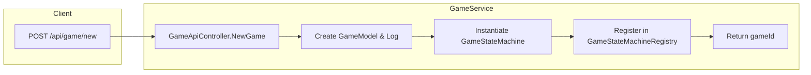

# Game Flow & State Machine As-Built

**Status:** As-Built
**Source:** `Catan3.Shared/GameLogic/GameStateMachine.cs` & `new-game-swimlane.md`

## 1. Overview

The core game logic is driven by a finite state machine (`GameStateMachine`) residing in `Catan3.Shared`. This ensures identical rule enforcement across the Desktop App, CLI, and Web Service.

## 2. Initialization Flow

The system supports two distinct initialization paths depending on the host (Desktop vs. Web Service).

### Web Service (Standard Path)



### Desktop App (Legacy/Hybrid)

```mermaid
graph LR
    subgraph "Desktop MVVM"
        A1[User Click New Game] --> B1[GameMessageService]
        B1 --> C1[Create GameModel (Local)]
        C1 --> D1[Create GameStateMachine (Local)]
        D1 --> E1[Initialize Direct Logging]
    end
```

## 3. State Machine Stages

The game progresses through a strict sequence of states defined in `GameState`.

### I. Setup Phase
1.  **Uninitialized**: Technical starting state.
2.  **WaitingForPlayers**: Lobby phase.
3.  **PickingBoard**: Host configures the board (shuffle, balance).
4.  **WaitingForRollForOrder**: Players roll dice to decide seating.
5.  **FinishedRollOrder**: Seating finalized.

### II. Allocation Phase (The "Snake" Draft)
6.  **BeginResourceAllocation**: Setup starts.
7.  **AllocateResourceForward**: Player 1 -> N place 1st Settlement/Road.
8.  **AllocateResourceReverse**: Player N -> 1 place 2nd Settlement/Road.
9.  **DoneResourceAllocation**: Resources distributed based on 2nd Settlement.

### III. Main Gameplay Loop
10. **WaitingForRoll**: Active player must roll dice.
11. **WaitingForNext**: Active player performs actions (Trade, Build, Buy Card).
    *   *Sub-states*: `MustMoveRobber` (if 7 rolled), `MustDiscard` (if hand > 7 cards).
12. **EndTurn**: Passing dice to next player.

### IV. Supplemental Phase (5-6 Players)
13. **PickSupplementalPlayers**: Between turns, other players can build.
14. **Supplemental**: Restricted building phase for non-active players.

## 4. State Transitions

Transitions are deterministic and triggered by `GameStateMachine.NextState()` or specific actions.
*   **Automatic**: `AllocateResourceForward` -> `AllocateResourceReverse` happens automatically when the last player places their piece.
*   **Manual**: `WaitingForNext` -> `EndTurn` requires user confirmation.
