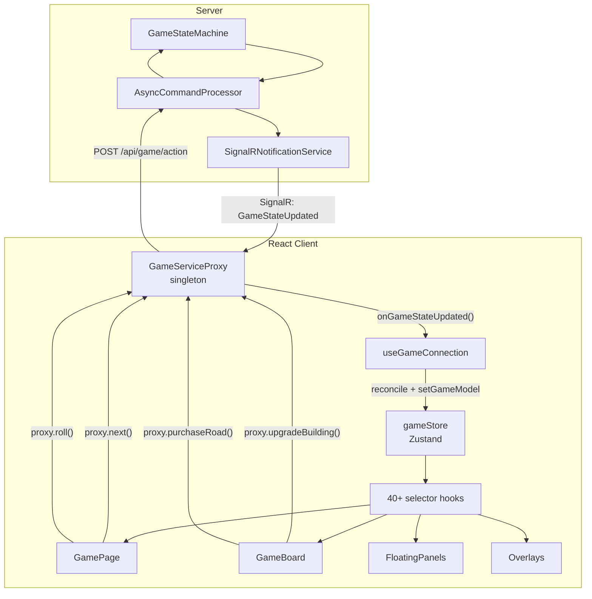

# React UI Architecture

**Last verified:** January 30, 2026

## Technology Stack

### Runtime Dependencies

| Package | Version | Purpose |
|---------|---------|---------|
| next | 16.1.2 | React framework (App Router) |
| react | 19.2.3 | UI library |
| react-dom | 19.2.3 | DOM rendering |
| zustand | ^5.0.10 | State management (4 stores) |
| @microsoft/signalr | ^10.0.0 | SignalR client for real-time GameModel updates |
| framer-motion | ^12.26.2 | Animations (AnimatePresence for overlays) |
| @fortawesome/fontawesome-svg-core | ^7.1.0 | Icon system core |
| @fortawesome/free-solid-svg-icons | ^7.1.0 | Solid icon set |
| @fortawesome/react-fontawesome | ^3.1.1 | React icon component |
| clsx | ^2.1.1 | Conditional CSS class composition |
| use-sync-external-store | ^1.6.0 | Zustand peer dependency |

### Dev Dependencies

| Package | Version | Purpose |
|---------|---------|---------|
| tailwindcss | ^4 | CSS framework (v4, PostCSS plugin mode) |
| @tailwindcss/postcss | ^4 | Tailwind v4 PostCSS integration |
| typescript | ^5 | Type checking |
| vitest | ^4.0.17 | Unit + integration testing |
| @vitejs/plugin-react | ^5.1.2 | Vitest React support |
| @testing-library/react | ^16.3.1 | React component testing |
| @testing-library/jest-dom | ^6.9.1 | DOM assertion matchers |
| jsdom | ^27.4.0 | DOM environment for tests |
| eslint | ^9 | Linting |
| eslint-config-next | 16.1.2 | Next.js ESLint rules |
| eslint-config-prettier | ^10.1.8 | Prettier/ESLint compat |
| prettier | ^3.8.0 | Code formatting |
| nswag | ^14.6.3 | TypeScript type generation from .NET models |

### Configuration

- **next.config.ts** - Default Next.js config (no customizations)
- **tsconfig.json** - Target ES2017, bundler module resolution, `@/*` path alias
- **postcss.config.mjs** - Uses `@tailwindcss/postcss` plugin (Tailwind v4 style)

## Directory Structure

```
react-ui/
├── app/                              # Next.js App Router
│   ├── layout.tsx                    # Root layout
│   ├── globals.css                   # Global styles + @utility + @keyframes
│   ├── page.tsx                      # Home page (hex grid menu)
│   ├── game/[id]/page.tsx            # Main game page (884 lines)
│   ├── new-game/page.tsx             # Game creation
│   ├── load-game/page.tsx            # Load saved game
│   ├── edit-players/page.tsx         # Player profile management
│   ├── settings/page.tsx             # Game settings
│   ├── stats/page.tsx                # Statistics
│   ├── hex-test/page.tsx             # Dev: hex rendering test
│   └── controls-test/page.tsx        # Dev: control component test
│
├── components/
│   ├── hex-grid/                     # Reusable hex layout engine
│   │   ├── HexGrid.tsx               # Grid layout with fitToParent + overlay
│   │   ├── HexTile.tsx               # Individual hex container
│   │   ├── hex-geometry.ts           # Cubic coords, pixel conversion, neighbors
│   │   ├── hex-geometry.test.ts      # Geometry unit tests
│   │   ├── layouts.ts                # CLUSTER_7, CLUSTER_30 layouts
│   │   ├── constants.ts              # Hex sizing constants
│   │   ├── content/CenterHex.tsx     # Center hex content
│   │   ├── content/MenuHex.tsx       # Home page menu hex
│   │   ├── content/WaterHex.tsx      # Water border hex
│   │   └── index.ts                  # Re-exports
│   │
│   ├── game/
│   │   ├── board/
│   │   │   ├── GameBoard.tsx         # Board with tiles, buildings, roads
│   │   │   └── index.ts
│   │   ├── controls/
│   │   │   ├── RollRing.tsx          # Circular dice statistics
│   │   │   ├── ActionCluster.tsx     # Undo/Redo/Next/Build buttons
│   │   │   ├── DiceCluster.tsx       # Dice roller
│   │   │   ├── MeasurementCluster.tsx  # Board stats (star counts)
│   │   │   └── index.ts
│   │   ├── overlays/
│   │   │   ├── GoFirstOverlay.tsx    # Pick first player
│   │   │   ├── SupplementalOverlay.tsx # Supplemental build picker
│   │   │   ├── RobberTargetMenu.tsx  # Robber steal target
│   │   │   ├── WinnerOverlay.tsx     # NEW: unified 3-phase winner
│   │   │   ├── WinnerDialog.tsx      # DEPRECATED: confirmation dialog
│   │   │   ├── WinnerCelebration.tsx # DEPRECATED: spin animation
│   │   │   ├── VictoryPointsOverlay.tsx # DEPRECATED: VP adjustment
│   │   │   └── index.ts
│   │   ├── panels/
│   │   │   ├── FloatingPanel.tsx     # Draggable/resizable container
│   │   │   ├── MinimizedBar.tsx      # Taskbar for minimized panels
│   │   │   ├── PlayersPanel.tsx      # Player info/resources
│   │   │   ├── GameResourcesHeader.tsx # Game resource counts
│   │   │   ├── ResourcesPanel.tsx    # Current player resources
│   │   │   └── index.ts
│   │   ├── tiles/
│   │   │   ├── GameTile.tsx          # Hex tile renderer
│   │   │   ├── Building.tsx          # Settlement/city visual
│   │   │   ├── Road.tsx              # Road segment visual
│   │   │   ├── NumberToken.tsx       # Dice number on tile
│   │   │   ├── HarborHex.tsx         # Harbor/port tile
│   │   │   └── index.ts
│   │   ├── viewport/
│   │   │   ├── BoardViewport.tsx     # Pan/zoom container (future)
│   │   │   └── index.ts
│   │   └── index.ts
│   │
│   ├── layout/
│   │   ├── MainLayout.tsx            # App shell with nav
│   │   ├── NavMenu.tsx               # Navigation menu
│   │   └── index.ts
│   │
│   └── new-game/
│       ├── GameTypeSelector.tsx      # Regular vs Expansion
│       ├── PlayerSelector.tsx        # Player roster picker
│       ├── GameNameInput.tsx         # Game name entry
│       ├── GameOptions.tsx           # House rules
│       └── index.ts
│
├── lib/
│   ├── stores/
│   │   ├── gameStore.ts              # Game state (GameModel)
│   │   ├── gameStoreHooks.ts         # 40+ fine-grained hooks
│   │   ├── layoutStore.ts            # Panel positions, viewport
│   │   ├── connectionStore.ts        # SignalR connection state
│   │   ├── uiStore.ts                # UI preferences, overlay visibility
│   │   └── index.ts
│   ├── services/
│   │   ├── GameServiceProxy.ts       # REST + SignalR client (singleton)
│   │   ├── RecordingPlayer.ts        # Test replay harness
│   │   ├── config.ts                 # Service URL config
│   │   └── index.ts
│   ├── hooks/
│   │   ├── useGameConnection.ts      # Connection lifecycle + store wiring
│   │   ├── useBoardData.ts           # Board rendering data derivation
│   │   └── index.ts
│   ├── api/
│   │   ├── gameApi.ts                # REST API client
│   │   └── index.ts
│   ├── extensions/
│   │   ├── gameModelExtensions.ts    # GameModel helpers
│   │   ├── buildingExtensions.ts     # Building queries
│   │   ├── roadExtensions.ts         # Road queries
│   │   ├── playerExtensions.ts       # Player lookups
│   │   ├── resourcesExtensions.ts    # Resource checks
│   │   ├── tileExtensions.ts         # Tile lookups
│   │   └── index.ts
│   ├── utils/
│   │   ├── playerColors.ts           # Color palette + gradient builder
│   │   ├── modelUtils.ts             # RollStats type
│   │   ├── reconciliation.ts         # GameModel reference preservation
│   │   └── index.ts
│   ├── constants/
│   │   ├── board-assets.ts           # Pips, harbor images, resource images
│   │   └── catanGlyphs.ts            # Catan font glyph mappings
│   ├── geometry/
│   │   ├── boardConstants.ts         # Board geometry constants
│   │   ├── boardGeometry.ts          # Position conversion
│   │   └── index.ts
│   └── test-data/
│       └── expansion-game.ts         # Sample game data for tests
│
└── types/
    ├── player-profile.ts             # PlayerProfile, PlayerColors interfaces
    ├── css.d.ts                      # CSS module type augmentation
    └── generated/models/             # 56 auto-generated from .NET (nswag)
        ├── game-model.ts             # GameModel interface
        ├── game-state.ts             # GameState enum
        ├── player-model.ts           # PlayerModel interface
        ├── tile-model.ts             # TileModel interface
        ├── building-model.ts         # BuildingModel + BuildingState
        ├── road-model.ts             # RoadModel + RoadState
        ├── harbor-model.ts           # HarborModel interface
        ├── action-flags.ts           # ActionFlags
        ├── entitlement.ts            # Entitlement enum
        ├── resource-type.ts          # ResourceType enum
        ├── hex-coordinates.ts        # HexCoordinates
        ├── building-key.ts           # BuildingKey
        ├── road-key.ts               # RoadKey
        └── ...                       # ~40 more model files
```

## State Management

### gameStore (primary)

Holds the `GameModel` received from SignalR broadcasts.

**State:**

- `gameModel: GameModel | null` - Current game state from server
- `playerProfiles: Map<string, PlayerProfile>` - Player display info
- `currentPlayerId: string | null` - Local player identifier
- `lastRoll: number | null` - Last dice roll (for tile dimming)
- `shownStars: number` - Star filter threshold

**Key selectors** (18 total): `selectGameState`, `selectPlayers`, `selectTiles`,
`selectBuildings`, `selectRoads`, `selectRobber`, `selectActionFlags`,
`selectCurrentTurnPlayerId`, `selectIsMyTurn`, etc.

**Hooks** (40+ in `gameStoreHooks.ts`): Each selector has a corresponding hook
with custom equality functions to prevent unnecessary re-renders. Examples:
`useGameState()`, `usePlayers()`, `useTiles()`, `useBuildings()`,
`useCurrentPlayer()`, `useRollStats()`, `usePlayerColors()`.

### layoutStore

Panel positions and viewport state. Persisted to localStorage.

**PanelId enum:** `'dice' | 'actions' | 'measurements' | 'players' |
'resources' | 'board' | 'goFirst' | 'supplemental' | 'winner'`

**State:** `panels: Record<PanelId, WindowPosition>` where WindowPosition
includes `left`, `top`, `width`, `height`, `minimized`, `visible`, `zIndex`.

Provides default layouts for both landscape (1920x1080) and portrait.
Panel metadata maps each PanelId to title + icon for the minimized bar.

### connectionStore

SignalR connection lifecycle tracking.

**State:** `status` (disconnected/connecting/connected/reconnecting),
`gameId`, `reconnectAttempts`, `lastError`, `isPageVisible`.

### uiStore

Client-side UI preferences. Partially persisted to localStorage.

**State:** `isPortrait`, `isMobile`, `viewportScale`, `activePortraitTab`,
`isNavMenuOpen`, `isShowingCelebration`, `isWinnerDialogOpen`,
`isRobberMenuOpen`, `menuPosition`.

## Component Hierarchy (Game Page)

```
GamePage (app/game/[id]/page.tsx)
├── MainLayout
│   └── <div> (relative, full viewport)
│       ├── GameBoard (always rendered)
│       │   └── HexGrid with overlay for buildings/roads/robber
│       │
│       ├── Connection status badge (when disconnected)
│       │
│       ├── FloatingPanel[dice] → RollRing
│       ├── FloatingPanel[actions] → ActionCluster
│       ├── FloatingPanel[measurements] → MeasurementCluster
│       ├── FloatingPanel[players] → PlayersPanel
│       ├── FloatingPanel[resources] → GameResourcesHeader
│       │
│       ├── FloatingPanel[goFirst] → GoFirstOverlay
│       │   (when gameState === 'FinishedRollOrder')
│       │
│       ├── FloatingPanel[supplemental] → SupplementalOverlay
│       │   (when gameState === 'PickSupplementalPlayers')
│       │
│       ├── RobberTargetMenu
│       │   (when pendingRobberTile !== null)
│       │
│       ├── AnimatePresence > WinnerDialog
│       │   (when showWinnerDialog)   ← BEING REPLACED by WinnerOverlay
│       ├── AnimatePresence > WinnerCelebration
│       │   (when showWinnerCelebration) ← BEING REPLACED
│       ├── AnimatePresence > VictoryPointsOverlay
│       │   (when showVictoryPoints)  ← BEING REPLACED
│       │
│       ├── MinimizedBar (bottom taskbar)
│       │
│       └── Info badges (game name, state, connection)
```

## Data Flow



### Reconciliation

`useGameConnection` runs `reconcileGameModel()` before updating the store.
This preserves object references for unchanged arrays/objects, enabling
React.memo to skip re-renders of components whose data hasn't changed.

## CSS Architecture

- **Tailwind v4** via `@tailwindcss/postcss` plugin (not the older
  `tailwindcss` CLI approach)
- Custom utilities use `@utility` directive (Tailwind v4 syntax).
  NOT `@layer utilities` (Tailwind v3 syntax that silently breaks in v4)

### Custom @utility Directives

| Utility | Purpose |
|---------|---------|
| `backface-hidden` | 3D transform: hide backface |
| `preserve-3d` | 3D transform: preserve children |
| `perspective-1000` | 3D transform: perspective |
| `rotate-y-180` | 3D transform: flip 180 degrees |
| `hex-clip` | Clip-path for pointy-top hexagon |
| `hex-clip-flat` | Clip-path for flat-top hexagon |
| `animate-winner-spin` | Winner celebration orbital spin |
| `animate-winner-counter-spin` | Counter-rotation (faces stay upright) |
| `animate-confetti-burst` | Confetti particle burst |
| `animate-firework-rocket` | Firework rocket upward trajectory |
| `animate-firework-flash` | Firework explosion flash |
| `animate-firework-spark` | Firework spark radial burst |

### Custom @keyframes

`winner-spin`, `winner-counter-spin`, `confetti-burst`, `firework-rocket`,
`firework-flash`, `firework-spark`

All animation utilities use CSS custom properties (e.g.,
`--winner-spin-duration`, `--rocket-delay`) set via React inline styles,
allowing per-instance control of timing.

## Key Patterns

### Server-Driven UI

Components trust the `GameModel` from the server. `buildingState`,
`roadState`, `actionFlags`, and `gameState` drive all rendering decisions.
The client never computes game rules locally.

### Singleton Proxy

`GameServiceProxy` is a singleton per `playerId`, created via
`getGameServiceProxy(playerId)`. It manages the SignalR connection and
exposes typed methods for all game commands.

### Fine-Grained Subscriptions

Each Zustand selector hook uses custom equality functions (e.g., shallow
array comparison for `usePlayers()`, deep object comparison for
`useActionFlags()`) to prevent cascading re-renders.

### Type Generation

Types in `types/generated/` are auto-generated from .NET models using nswag.
Hand-written types (e.g., `PlayerProfile`, `PlayerColors`) live alongside
in `types/`.
