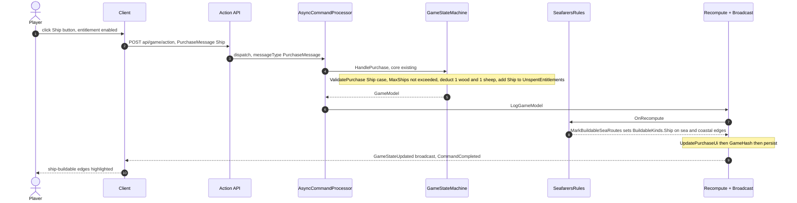
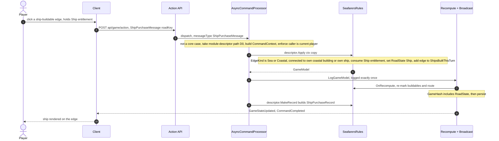
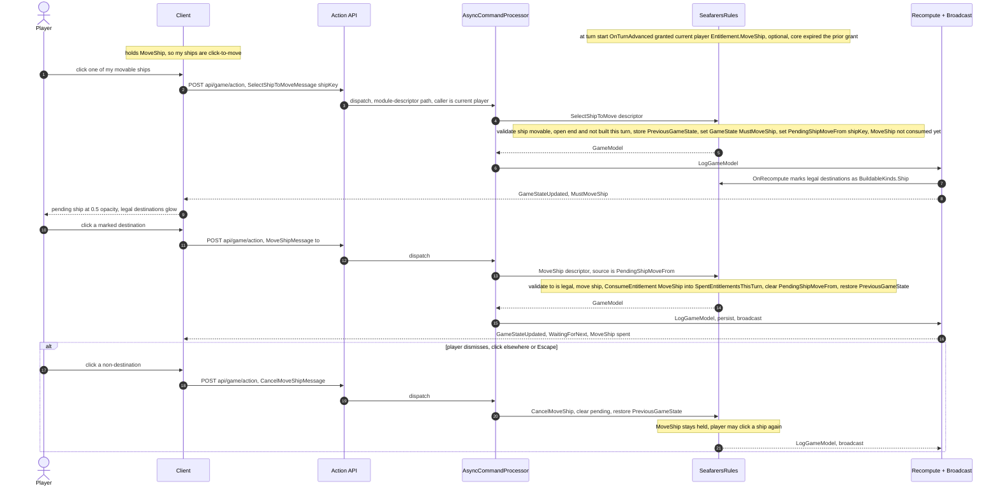
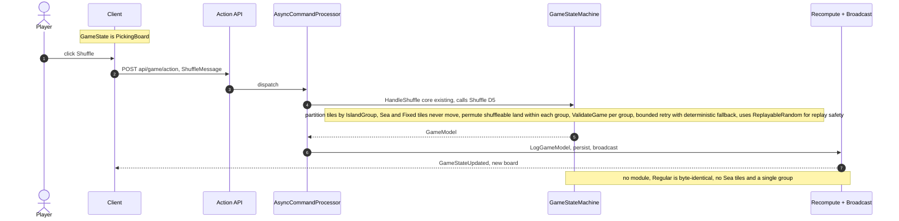

# Design: Seafarers support (epic #200)

**Status:** Design — awaiting approval
**Supersedes:** `.design/old/seafarers-2026-02-draft.md` (Feb 2026 draft; reverses
its separate-`ShipModel` decision — see D3).
**Review history:** two Copilot rounds
(`.design/reviews/seafarers-review-copilot.md`). All accepted findings are folded
into the decisions below — each decision has one authoritative wording. Rejected:
a roll-production hook and a setup-allocation hook (not needed for New Shores) and
a separate gold-field mechanic (permanent `GoldMine` tiles already work — see D2).

## Goal — build *Expansion*; Seafarers is the test

The deliverable is a **reusable expansion capability** across the engine, the
REST/Action layer, and the client. More expansions **will** follow (Cities &
Knights, etc.) — so **"expansion" is the feature; "Seafarers" is the acceptance
test** that proves the capability is real. The concrete milestone is one fully
playable scenario — "Heading for New Shores" — reached *entirely through* the
expansion mechanisms, never through Seafarers special-casing. Rules reference: the
official Catan Seafarers rulebook (catan.com), FAQ, and UltraBoardGames.

### Prime rule (highest priority — overrides "just make it work")

Every seam this work touches — the `api/game/action` dispatch, the Action/message and
replay-record model, the rule-module hooks, the scenario profile, and the client
interaction registry — is designed as a **general expansion mechanism**, not a
Seafarers special case:

+ Prefer a generic, data/registration-driven path over a hardcoded
  `if (seafarers)` / `case "ship"`. A tempting one-off is a signal the seam is
  wrong — fix the seam, don't special-case.
+ **No expansion name in core control flow.** Seafarers appears only as *data* — a
  template, a scenario profile, a registered `SeafarersRules` module — never as a
  branch in `GameStateMachine`, the dispatcher, or the client core.
+ Every step's plan **states which part is reusable framework and which is
  Seafarers config/test**; the framework part gets the design scrutiny and tests.

**Framework (the product) vs. Seafarers (the test).** The composition module
system + `CommandContext` dispatch (D0), scenario profile (D2), edge classifier
(D10), fixed/shuffleable board model (D5), versioned hash (D8), and client
interaction registry (D9) are the **reusable capability**. Ships, islands,
movement, and the New Shores template are its **first client and proof** — nothing
more. If a future expansion (e.g. Cities & Knights) would need core surgery to add,
the framework is not done.

## Guiding principle: table-assistant, not strict referee

CatanWeb assists **co-located** players. It makes play convenient; it need not
enforce every rule perfectly. Where a rule is impossible or expensive to enforce,
implement the common, high-value cases and **let players enforce genuinely rare
edge cases** at the table. This bounds only *pathological* graph cases (see D4) —
it does **not** excuse skipping frequent, load-bearing rules.

## Constraints (from the epic — non-negotiable)

1. **Backwards compatible** — existing Regular/Expansion and saved games unchanged.
2. **All state in GameModel.**
3. **Service is authoritative** — clients send typed messages; engine validates.
4. **Leverage existing mechanisms** — a human building the board in the editor
   should "just work."

## Rules that shape the architecture

+ **Ships**: cost **1 wood + 1 sheep**; **15 per player**; built on any edge
  bordering ≥1 sea hex (sea–sea or coastal), never between two land hexes; connect
  to your own coastal settlement/city or your own ship. A road and ship connect
  only **through a building**.
+ **Ship movement**: once per turn you may move one **open** ship (not connecting
  two of your buildings, not built this turn) to another sea edge on your network.
+ **Longest Trade Route**: the Longest Road award (2 VP) counts **roads + ships**
  combined (joined through buildings).
+ **New-island bonus VP**: +2 VP for your first settlement on a new island.
+ **Scenario = a rules profile** (VP target + active mechanics), not just a map.
+ **Later** (foundation must not preclude): Pirate, Fog/exploration, cloth,
  wonders.

## What already exists (large leverage)

| Capability | Where | Status |
|---|---|---|
| `RoadState.Ship`, `Entitlement.Ship` | `Catan3.Shared/Models/GameEnums.cs:31`, `:103` | exist |
| `ResourceType.Sea` / `GoldMine` | `GameEnums.cs:5` | exist |
| Ship glyph `U+E90A`; `PirateShip` `U+E90D` (legacy `Pirate` alias = robber `U+E90C`) | `react-ui/lib/constants/catanGlyphs.ts:14`, `:69` | exist |
| `Road` renders `'Ship'` state | `react-ui/components/game/tiles/Road.tsx:10` | exists |
| Permanent gold: `GoldMine` tile → settlement 1 / city 2 gold | `Catan3.Shared/Models/BuildingModel.cs:94-95`; `ResourcesModelExtensions.cs:75,106`; `GameStateMachine.cs:1008` | works |
| Template → board (sea tile = `Resource:"Sea"`) | `BoardInfoJsonAdapter.cs`, `GameTemplateData.cs` | exists |
| Generic action REST API | `GameApiController.cs:126` → `AsyncCommandProcessor.cs:127` | reuse |
| Longest-road traversal (fork/loop-aware, **not** DFS) | `GameStateMachine.cs:2216`; adjacency `RoadModelExtensions.cs:17` | extend in place |
| New optional JSON fields default to empty on load | System.Text.Json (`JsonHelper.cs`) | auto |

## Architectural decisions

### D0 (lead). Engine structure: composition + rule modules

Chosen over a monolithic state machine (previous approach, became unwieldy) and
over one `GameStateMachine` subclass per template (multi-axis scenario variation —
ships × pirate × gold × fog — fights single inheritance).

**Seams in the current code.** Every handler is `Task<GameModel> HandleXxxAsync(msg)`
ending in `LogGameModel(gameModel)`. **`LogGameModel` (`GameStateMachine.cs:1461`)
is the single post-move recompute pipeline** (`UpdateScore :1463 → UpdatePlayerStars
→ MarkBuildableRoads → MarkBuildableBuildings → SetActionFlags :1062 → UpdatePurchaseUi
:1490 → … → UpdateGameHash → persist`) and the primary hook site. The machine is
built per game (ctor `:84`) and initialized by `HandleNewGameAsync(IGameMetadata)`
(`:295`) or `HandleLoadCompressedLogAsync` (`:404`).

**Module contract.** Modules are **stateless**; all state lives in `GameModel`.

```csharp
public interface IRulesModule
{
    // Expansion messages this module owns (dispatched via api/game/action; see below).
    IReadOnlyList<IExpansionMessageDescriptor> Messages { get; }

    // Lifecycle hooks the core calls at fixed points (no-op by default):
    void OnRecompute(GameModel game);                        // in LogGameModel — buildable marking, flags
    void OnBuildingPlaced(GameModel game, BuildingModel b);  // after a settlement/city is placed
    void OnScore(GameModel game, PlayerModel p, ScoreBreakdown s); // add scenario VP (island bonus, etc.)
    void OnTurnAdvanced(GameModel game);                     // at UpdateStateOnNextPlayer — per-turn resets
    void OnSevenRolled(GameModel game);                      // robber vs pirate (later)
}

public abstract class RulesModuleBase : IRulesModule { /* virtual no-ops + Messages => [] */ }
```

**Holding/invoking modules.** `GameStateMachine` gains
`IReadOnlyList<IRulesModule> _modules = []`, resolved at new/load time:
`_modules = RulesModuleRegistry.Resolve(gameModel.Scenario)` (Regular ⇒ empty).
The core invokes each hook as a single `foreach` loop at its site; with an empty
list every loop is a no-op ⇒ Regular is byte-identical (backwards-compat is free).

**Expansion dispatch — reuse `api/game/action` with a command context.**
`AsyncCommandProcessor` (`:127`) switches on `messageType`, deserializes, calls a
handler, and returns `(GameModel, IRecordedMessage)`; its default **throws** (`:154`).
Replace that default with a **module descriptor** path that preserves the same
caller validation, logging, and replay contract as core actions:

```csharp
public sealed record CommandContext(string GameId, string PlayerId,
                                    string MessageType, JsonElement Payload);

public interface IExpansionMessageDescriptor
{
    string MessageType { get; }
    // Validate caller + rules, mutate a COPY, return it. Does NOT call LogGameModel;
    // the processor logs exactly once (mirrors core handlers). Throws GameException on illegal action.
    GameModel Apply(CommandContext ctx, GameModel current);
    IRecordedMessage MakeRecord(CommandContext ctx, GameModel result);
}
```

Processor flow for a non-core `messageType`: build `CommandContext`; find the
descriptor across `gsm.Modules` (unknown ⇒ still rejected, bounded to active
modules' allow-list); **enforce caller == current player** (same policy the
SignalR handlers apply); `model = descriptor.Apply(ctx, copy)`; `LogGameModel(model)`
once; `record = descriptor.MakeRecord(ctx, model)`. **Failure semantics are
unchanged from core:** the REST POST still returns "accepted" immediately; a
thrown `GameException` surfaces to the caller via the existing SignalR
`CommandFailed`/commandId path, and nothing is logged. New expansion piece = new
message type + descriptor — zero new endpoints/hub methods; replay uses the same
`IRecordedMessage`. A matching `ActionType` entry is added for CLI/replay scripts,
and the React `RecordingPlayer` union gets one case.

**Net core growth:** five hook loops + one dispatch fallback, then nothing more
per future expansion. Module framework lands in **Phase 3** before any mechanic
uses it.

### D1. Islands are **tiles**, with fixed/shuffleable classification

Island land tiles are regular `TileModel` entries at sea-region coordinates (they
render, take buildings, anchor ships — no new plumbing). Two tags carry the
epic's intent:

+ **`IslandGroup`** (int, default `0` = main board) on `TemplateTile`/`TileModel`
  — the shuffle-partition key ("never shuffle across islands").
+ **Fixed vs. shuffleable** (see D5): **sea tiles are always fixed**; land tiles
  are shuffleable within their group. This must exist *before* any Seafarers game
  is created (Phase 1), because game creation calls `Shuffle`.

### D2. Scenario profile + score/victory/winner

Extend `GameTemplateData` (→ `IGameMetadata` → `GameModel`) with a `Scenario`
descriptor: `VictoryPointTarget` and mechanic flags (`ShipsEnabled`,
`ShipMovementEnabled`, `NewIslandBonusVp`, `ShipsCountForLongestRoute`,
`PirateEnabled`, `FogEnabled`). Default = Regular (all off, target 10). `MaxShips`
lives in `ResourceRules` (15 Seafarers / 0 Regular). Flags select active modules.

**Scoring/winner:** `UpdateScore` gains the module `OnScore` contribution
(scenario bonus VP). Per-player scenario bonus VP is stored in `GameModel`
(so score is recomputed deterministically and hashed). `HandleDeclareWinnerAsync`
(`:628`) still allows a table-assistant **manual** winner, but the UI **displays
the scenario `VictoryPointTarget`** and each player's computed total incl. bonus
VP; winner declaration may warn if below target (not hard-block — table-assistant).

### D3. Ships reuse `RoadModel` + `RoadState.Ship`; Ship is a first-class entitlement

Ships are `RoadModel`s with `RoadState.Ship`. Ship purchase (`ShipPurchaseMessage`
→ `SeafarersRules.ShipPurchase`) mirrors the road path (analogous to
`RoadPurchase`, which sets `RoadState.Road` at `:1408`) plus sea/coastal-edge +
connectivity validation. Ship is **first-class**, not free-riding on road plumbing:

+ `ResourceRules.MaxShips` + a `MaxEntitlementCount(Ship)` case; a `ValidatePurchase`
  Ship case; ship cost; a `ShipPurchaseRecord`; generated TS types.
+ `Ship` in the scenario's default `EntitlementPurchaseModel` so `UpdatePurchaseUi`
  (`:1490`) enables/disables it generically; the client maps entitlements→buttons
  generically (no hardcoded `case`).

**Buildable-edge affordance model.** One `RoadState.Buildable` bit cannot express
that a coastal edge is buildable as *road, ship, or both*. Add
`RoadModel.BuildableKinds` (flags: `Road`, `Ship`) populated during marking: core
`MarkBuildableRoads` sets `Road` on land/coastal edges; module
`MarkBuildableSeaRoutes` sets `Ship` on sea/coastal edges. Rendering, hit-testing,
purchase validation, and replay tests read `BuildableKinds`. Regular games only
ever get `Road`, so behavior is unchanged.

### D4. Ship movement — an **optional per-turn entitlement**, click-to-move

Ship movement is modeled as an **entitlement**, so it rides the *existing*
once-per-turn machinery instead of a bespoke ship flag. (Rationale: a
`ShipMovedThisTurn` bool special-cases ships — and every ship-like mechanic we add
later would need its own such flag. `ConsumeEntitlement` already moves a used
entitlement into `SpentEntitlementsThisTurn`, which is cleared at turn advance —
that *is* "once per turn," done "just like everything else." Only **one** new
enum value, `Entitlement.MoveShip`, and one small generalization — optional
entitlements — are added; nothing ship-specific enters core control flow.)

**New generic concept: optional entitlements.** Today `AllowNext`
(`GameStateMachine.cs:1079`) and the turn-end gate (`:1912`) block "Next" while
`UnspentEntitlements.Count > 0` ("you can't advance holding something unplayed").
A ship move is *optional* — it must **not** block turn-end. Add a generic
classifier `Entitlement.IsOptional` (data about the entitlement, not an expansion
branch); both gates change to `UnspentEntitlements.Any(e => !e.IsOptional())`, and
`UpdateStateOnNextPlayer` **expires** unused optional entitlements. This is a
reusable seam: any future optional per-turn action classifies its entitlement
optional — no new special case.

**Grant / gate / consume (all via the existing entitlement system):**

+ **Grant** — `SeafarersRules.OnTurnAdvanced` grants the new current player one
  `Entitlement.MoveShip` (gated by `Scenario.ShipMovementEnabled`); core
  turn-advance has already expired the prior optional grant. "Can I move a ship
  this turn?" is exactly *"do I hold `MoveShip`?"* — no `ShipMovedThisTurn` field,
  no `ActionFlags.MoveShipEnabled`.
+ **Initiate (click the ship, no button)** — while holding `MoveShip`, clicking one
  of your movable ships sends **`SelectShipToMoveMessage {shipKey}`**. The server
  (client owns no rules — [[client-two-responsibilities]]) validates the ship is
  movable, stores `PreviousGameState`, sets `GameState = MustMoveShip` and
  `PendingShipMoveFrom = shipKey`, and **marks the legal destinations by reusing
  `BuildableKinds.Ship`** (same affordance as placement). The entitlement is **not**
  consumed yet. The pending ship renders at reduced opacity (`RoadState == Ship &&
  key == PendingShipMoveFrom`) — **no `RoadState.ReadyToMove`** (that would conflate
  "is a ship" with "is being moved," the orthogonality trap `BuildableKinds` avoids).
+ **Complete** — clicking a marked destination sends **`MoveShipMessage {to}`** (the
  source is `PendingShipMoveFrom`, server-side). Validate `to` is legal; move the
  ship; **`ConsumeEntitlement(MoveShip)`** (→ `SpentEntitlementsThisTurn`, so it
  cannot recur this turn); clear `PendingShipMoveFrom`; restore `PreviousGameState`.
+ **Dismiss** — a non-destination click / Escape sends **`CancelMoveShipMessage`**:
  clear `PendingShipMoveFrom`, restore `PreviousGameState`. Entitlement stays held,
  so the player can click a ship again. (`MustMoveShip`'s interaction session owns
  all clicks, so dismiss logic is centralized — not scattered across handlers.)
+ **Undo** — snapshot-based: after `SelectShipToMove` → back to `WaitingForNext`;
  after `MoveShip` → back to `MustMoveShip` with the entitlement restored.

**Minimal ship-specific state that remains:** `ShipsBuiltThisTurn` (`List<RoadKey>`
on `GameModel`, cleared in `OnTurnAdvanced`) — needed only for the movability rule
"a ship built this turn cannot move," which is a per-*ship* property the entitlement
system can't express. (Under the table-assistant principle this rule could be
relaxed and the field dropped; kept for now — decided at Phase 8.)

**Enforced (frequent) legality:** a ship is movable iff (a) not built this turn
(`ShipsBuiltThisTurn`), (b) it has an **open end** — a vertex not continuing to
another owned ship/road through the route — and (c) it is not the sole segment
joining two of the player's buildings. This is a bounded traversal of the player's
ship graph. **Only genuinely pathological multi-loop disconnection cases are
table-enforced** — the common rule above is always enforced. Undo/cancel/turn-reset
are covered by tests in Phase 8.

### D5. Fixed/shuffleable, island-partitioned, bounded shuffle

`Shuffle` (`Catan3.Shared/Extensions/GameModelExtensions.cs:715`) currently
permutes resource+number across **all** tiles and loops until `ValidateGame`
passes. For Seafarers this would corrupt sea tiles. Change it to:

+ **Never shuffle fixed tiles** (all `Sea` tiles are fixed; optionally
  template-marked fixed land tiles). Only **shuffleable land tiles within each
  `IslandGroup`** are permuted, independently per group.
+ Keep the existing no-adjacent-6/8 (`ValidateGame`) + desert rules **per group**,
  but make the retry loop **bounded** (iteration cap) with a deterministic
  fallback if a small group can't satisfy constraints — no unbounded loop.

This lands in **Phase 1** (before any game creation), not Phase 2.

### D6. Longest Trade Route — segment-traversable predicate (NOT a DFS)

The `CalculateLongestRoad` traversal (`:2216`) works and must **not** be rewritten
as a DFS. The current adjacency helper `OwnedAdjacentRoadsNotCounted`
(`RoadModelExtensions.cs:17`) filters by **owner only** — so ships are *already*
traversed; the real work is a correct **junction rule**, not "add road-or-ship."
Replace the adjacency predicate with an explicit **`IsRouteSegmentTraversable`**
that checks: same owner, `ShipsCountForLongestRoute` gate, shared vertex, and that
a **road↔ship transition only occurs through the owner's building**. Also fix the
early-exit `max == gameModel.Roads.Count` to count eligible route segments. UI
renames the award "Longest Trade Route" when ships are enabled.

### D7. New-island discovery bonus VP

The "points for discovering a new island" are a first-class scenario score. To be
**undo/redo- and replay-safe**, they are **computed deterministically during
recompute**, not accumulated on an event: `SeafarersRules.OnScore` (inside
`UpdateScore`) sets each player's `ScenarioBonusVp` from current
building/island-group state, and `UpdateScore` adds it to the total. Because it is
re-derived from `Buildings` every `LogGameModel`, undo/redo and replay reproduce it
exactly; the value is stored on the player (D2) and included in the scenario hash
(D8). `SeafarersRules.OnBuildingPlaced` bumps `PlayerModel.IslandsPlayed` for the
stat/UI when a settlement first reaches a new group.

**Scoring rule — follow the rulebook (decided).** Per the official "Heading for New
Shores" rule: **each player scores `NewIslandBonusVpAmount` (2) VP for their first
settlement on *each* island other than the main island** — i.e. **per island, per
player** (a player settling three foreign islands earns 6). It is **not** a race
(later settlers on an island the player themselves reaches still score their own
first-settlement there) and it is **not** capped at one island.

`OnScore` computes it directly from `Buildings` + `TileModel.IslandGroup`: `2 ×
(count of distinct non-main IslandGroups where the player holds ≥1 settlement)`,
guarded by `Scenario.NewIslandBonusVp`. `Scenario.NewIslandBonusVpAmount` keeps the
per-island value configurable for other scenarios. (If a future scenario needs a
different rule — once-per-player, or a first-discoverer race using `BuildIndex`
order — it is the same one-predicate seam; New Shores uses per-island.)

### D8. Backwards compatibility + versioned hash policy

New fields are optional with empty/zero defaults; old saves deserialize cleanly.
But `GameHash` is a separate contract: today the owned-road hash includes owner +
position, **not `RoadState`** (`GameModelExtensions.cs:262`), so a road and a ship
on the same edge hash identically, and scenario/island/ship-move state is absent.

Policy: add **`GameHashVersion`**. For **scenario-opted** games, the hash includes
`RoadState` (road vs ship), scenario id/flags, per-player scenario bonus VP, and
pending-ship-move state. For **Regular/Expansion**, the formula is **unchanged**
(hash-neutral) so existing `.catan_test` hashes still match. (No legacy Seafarers
saves exist, so there is no in-progress migration case — only Regular/Expansion
legacy, which stays neutral.) Tests: existing Regular/Expansion replay hashes
unchanged; a Seafarers hash distinguishes road vs ship, island bonus, and pending
move.

### D9. Client: render the GameModel; collect Actions — data-driven + stateful seam

The client has exactly **two responsibilities**: (1) **render the GameModel** (a
pure projection), and (2) **collect Actions** to send to the authoritative
service, which returns the next GameModel. It owns no rules and no game state — so
it renders **any** GameModel without branching on `GameType`.

**Render.** Data-driven from state: `Tiles` (sea/island tiles), `Roads` (a
`RoadState.Ship` renders as a ship — `Road.tsx`), robber/pirate, gold via
`TemporarilyGold`. Buildable edges are distinguished from `RoadModel.BuildableKinds`
(D3): ship-buildable vs road-buildable get different affordances; a coastal edge
can show both per the active placement.

**Collect Actions.** Today interaction is scattered `gameState === …` conditionals
(robber at `page.tsx:527-583`). Replace with a **`GameState → interaction session`
registry**: sessions are **stateful** (pending selection, cancellation, keyboard,
sea-edge hit-testing) to support multi-step collection (pick ship → pick
destination), not just stateless click handlers. Core states migrate
opportunistically; expansion states (`MustMoveShip`) register a session.

+ Buttons stay data-driven from `entitlementPurchaseModel` (`page.tsx:112,166`); a
  `Ship` entitlement yields a Ship button with no hardcoded `case`.
+ Sending needs no new plumbing: `GameServiceProxy.executeCommand(messageType,
  data)` posts to `/api/game/action` (`GameServiceProxy.ts:693`); `moveShip`/
  `shipPurchase` are one-line wrappers like `moveRobber` (`:476`).
+ Scenario flags (in GameModel) drive affordances — never `gameType` checks.

Enumerable client touchpoints per expansion: a GameState label
(`gameStateMessages.ts:36`), state classification (`gameModelExtensions.ts:96`),
one interaction session, one entitlement→button entry, one `executeCommand`
wrapper, one `RecordingPlayer` replay case.

### D10. Shared edge classifier

A shared classifier from the two adjacent tiles: **LandEdge** (land|land),
**CoastalEdge** (land|sea), **SeaEdge** (sea|sea). Legality (server-enforced):
**roads** on Land + Coastal, never SeaEdge; **ships** on Sea + Coastal (border ≥1
sea hex), never LandEdge; a CoastalEdge accepts either. Used by core road
buildability (excludes SeaEdge), ship buildability, purchase validation, route
adjacency, and hit-testing — the single source of truth feeding `BuildableKinds`
(D3) and the UI distinction (D9).

## Message-flow swimlanes (for review)

All client actions travel the **same authoritative backbone**: the React proxy
`executeCommand(messageType, data)` POSTs to `/api/game/action`
(`GameServiceProxy.ts:693`); `AsyncCommandProcessor` switches on `messageType`;
the handler mutates a copy; `LogGameModel` runs the single recompute pipeline,
persists, and broadcasts `GameStateUpdated` to the game group; the caller gets
`CommandCompleted`/`CommandFailed`. **Core** messages hit an existing
`GameStateMachine` handler; **expansion** messages take the module-descriptor path
(D0). The four flows below differ only in *which handler runs* and *what state it
sets* — no new endpoints or hub methods.

### 1. Buying a ship (acquire the entitlement — a purchase)

Buying is a **core** flow (`PurchaseMessage`, existing `HandlePurchase`) with a new
`Ship` case; the module only marks buildable sea edges during recompute. This is
the "hold the entitlement" step — placement is flow 2.



### 2. Placing a ship (spend the held entitlement)

Placement is an **expansion** flow: `ShipPurchaseMessage` is not a core case, so it
takes the module-descriptor path — the reusable dispatch seam is the deliverable.



### 3. Moving a ship (optional per-turn entitlement, click-to-move)

Not a purchase, but **an entitlement** (D4): `Entitlement.MoveShip` is auto-granted
each turn (optional — it never blocks Next), and consumed on a completed move so it
can only happen once per turn "just like everything else." No button: clicking a
movable ship initiates; the server marks legal destinations (client owns no rules).



**Why `MustMoveShip` (a sub-state) rather than staying in `WaitingForNext`:** its
interaction session owns every click during the gesture, so "dismiss on
non-destination click" lives in one place instead of being sprinkled through the
other click handlers. `PendingShipMoveFrom` is the server-authoritative source
(this resolves the earlier open point — it is **kept**, because the server, not the
client, must compute legal destinations).

### 4. Shuffling (sea-safe, per-island — pure core)

Shuffle is a **core** flow with no module: the sea-safe/per-group behavior is a
data-gated edit to `Shuffle()` (D5) that is inert for Regular (all tiles
`IslandGroup 0`, no `Sea` tiles).



## Extensibility points added to the core (consolidated)

| # | Extension point | Kind | Core site | SeafarersRules use | Scope |
|---|---|---|---|---|---|
| 1 | `_modules` + `Modules`; `RulesModuleRegistry.Resolve(scenario)` | field | ctor `:84`; `HandleNewGameAsync :295`, `HandleLoadCompressedLogAsync :404` | resolve `[SeafarersRules]` from flags | New Shores |
| 2 | `OnRecompute` | hook | `LogGameModel :1469` | `MarkBuildableSeaRoutes` → `BuildableKinds`; movable-ship marks; expansion-state flags | New Shores |
| 3 | `OnBuildingPlaced` | hook | `BuildingUpgrade :1558` | `AwardNewIslandBonusIfFirst` (D7) | New Shores |
| 4 | `OnScore` | hook | `UpdateScore :1463` | add per-player scenario bonus VP | New Shores |
| 5 | `OnTurnAdvanced` | hook | `UpdateStateOnNextPlayer` | grant `MoveShip` entitlement; reset `ShipsBuiltThisTurn` | New Shores |
| 6 | Expansion descriptor dispatch (`CommandContext`) | core edit | `AsyncCommandProcessor` default `:154`; expose `Modules`; caller validation | `ShipPurchase`, `SelectShipToMove`, `MoveShip`, `CancelMoveShip` (+ records) | New Shores |
| 7 | `IsRouteSegmentTraversable` predicate | core edit (not DFS) | `OwnedAdjacentRoadsNotCounted :17` + early-exit count `:2216` | road-or-ship + junction-through-building (D6) | New Shores |
| 8 | `Entitlement.MoveShip` + `Entitlement.IsOptional` + optional-entitlement gate/expiry + `GameState.MustMoveShip` | core edit (data + generic logic) | `GameEnums.cs`; `AllowNext :1079`; turn-gate `:1912`; `UpdateStateOnNextPlayer :1349` | optional per-turn ship move (D4); click-to-move, no button | New Shores |
| 9 | `RoadModel.BuildableKinds` (flags) | core edit (data) | `MarkBuildableRoads` sets `Road`; module sets `Ship` | road/ship/both affordance (D3) | New Shores |
| 10 | `Scenario` + `ResourceRules.MaxShips` + `MaxEntitlementCount(Ship)` + `Ship` `EntitlementPurchaseModel` + `GameHashVersion` | core edit (data) | `GameModel.cs`, `GameModels.cs`, hash `:252` | limit + purchase UI + hash policy (D2/D8) | New Shores |
| 11 | `OnSevenRolled` | hook | seven path `:1051` | pirate move | Later |

The core gains **five hook loops + one dispatch fallback + `IsRouteSegmentTraversable`**
and data edits — then nothing more per future expansion.

## GameModel & data-model changes (explicit) — for review

This section enumerates the **concrete C# model edits** in `Catan3.Shared` that
back the decisions above. It is the single place a reviewer can see *exactly* what
the serialized GameModel shape becomes. Ground rules:

+ **All models live in `Catan3.Shared/Models`.** TypeScript is **generated**, never
  hand-written: add each new type/enum to
  `Catan3.Shared/TypeScript/CatanTypeGenSpec.cs` and run
  `pwsh ./catan.ps1 generate-types` (writes `react-ui/types/generated/models/`).
  No manual `.ts` model edits.
+ **Every new field is optional with a safe default** (`0`, `false`, `null`, `[]`,
  or a `Regular` scenario) so old saves and existing `.catan_test` files
  deserialize unchanged (System.Text.Json via `JsonHelper`). Nothing here changes
  the Regular/Expansion serialized shape's *meaning*; new fields simply default.
+ **Hash impact is versioned (D8).** The "Hashed?" column below is the *scenario-opted*
  hash (`GameHashVersion ≥ 2`). For Regular/Expansion the hash formula is unchanged,
  so these fields are hash-neutral there even when present at defaults.
+ **Naming note.** The scenario ship toggle is `Scenario.ShipsEnabled` (not
  `SupportShips`); the island grouping key is `IslandGroup`. If we prefer
  `SupportShips` as the public flag name, rename in one place (`Scenario`) — it is
  not referenced by core control flow.

### New enum members / new enums

| Enum | Change | File | Notes |
|---|---|---|---|
| `RoadState` | *(already has `Ship`)* — no change | `GameEnums.cs:31` | reused for ships (D3) |
| `Entitlement` | `Ship` reused (buy+place); **add** `MoveShip` (optional, granted per turn) | `GameEnums.cs:115` | ship purchase (D3) + ship movement (D4) |
| `ResourceType` | *(already has `Sea`, `GoldMine`)* — no change | `GameEnums.cs:5` | islands/gold (D1/D2) |
| `GameState` | **add** `MustMoveShip` | `GameEnums.cs` | ship-move gesture sub-state (D4) |
| `BuildableKind` | **new `[Flags]` enum**: `None=0, Road=1, Ship=2` | new, `GameEnums.cs` | road/ship/both affordance (D3) |
| `EdgeKind` | **new enum**: `Land, Coastal, Sea` | new, `GameEnums.cs` | edge classifier (D10); may be compute-only, see note |
| `ActionType` | **add** (`ShipPurchase`, `SelectShipToMove`, `MoveShip`, `CancelMoveShip`) | `ActionType.cs` | CLI/replay + dispatch (D0) |

`EdgeKind` is derived from the two adjacent tiles and may live purely as a computed
classifier (not persisted) — decide at Phase-6 plan time whether it is worth a
cached field on `RoadModel`. Default plan: **compute-only**, no stored field.

### New fields on existing models

| Model (file) | New field | Type | Default | Purpose (decision) | Hashed? |
|---|---|---|---|---|---|
| `GameModel` (`GameModel.cs`) | `Scenario` | `Scenario` | `Scenario.Regular` | scenario profile: VP target + mechanic flags (D2) | yes |
| `GameModel` | `GameHashVersion` | `int` | `1` | hash policy selector; `≥2` opts into scenario hash (D8) | n/a (selector) |
| `GameModel` | `ShipsBuiltThisTurn` | `List<RoadKey>` | `[]` | ships ineligible to move this turn (D4 movability); cleared `OnTurnAdvanced` | yes |
| `GameModel` | `PendingShipMoveFrom` | `RoadKey?` | `null` | server-authoritative selected ship during `MustMoveShip` (D4) | yes |
| `TileModel` (`TileModel.cs`) | `IslandGroup` | `int` | `0` | shuffle-partition key; `0` = main board (D1/D5) | yes (scenario) |
| `TileModel` | `Fixed` | `bool` | `false` | never-shuffle marker; sea tiles treated fixed regardless (D5) | no |
| `RoadModel` (`RoadModel.cs`) | `BuildableKinds` | `BuildableKind` | `BuildableKind.None` | can this edge take a road / ship / both (D3) | no (transient marking) |
| `PlayerModel` (`PlayerModel.cs`) | `ScenarioBonusVp` | `int` | `0` | island bonus + future scenario VP; feeds `OnScore` (D2/D7) | yes |
| `ResourceRules` (`GameModels.cs`) | `MaxShips` | `int` | `0` | ship entitlement cap (15 Seafarers / 0 Regular) (D3) | no |

Notes:

+ `PlayerModel` already has `IslandsPlayed`, `LongestRoad`, `HasLongestRoad` —
  reused, no new fields for those.
+ **Two distinct ship entitlements — both ride the existing system (D3/D4):**
  **`Entitlement.Ship`** = *buy + place* a ship (a purchase, two-step like
  `Entitlement.Road`: buying adds `Ship` to `UnspentEntitlements` + marks
  `BuildableKinds.Ship`; clicking a ship-buildable edge **consumes** it via
  `ShipPurchaseMessage`, mirroring `RoadPurchase` `GameStateMachine.cs:1387/1410`).
  **`Entitlement.MoveShip`** = *move* a ship — **optional**, auto-granted each turn
  (not bought), consumed on a completed move so it recurs only once per turn via
  `ConsumeEntitlement` → `SpentEntitlementsThisTurn`. No `ShipMovedThisTurn` flag,
  no `ActionFlags.MoveShipEnabled` — "can I move?" is "do I hold `MoveShip`?"
+ **Optional-entitlement support (generic core-logic edits, not a model field):**
  `Entitlement.IsOptional()` classifier; `AllowNext` (`:1079`) and the turn-end gate
  (`:1912`) change `UnspentEntitlements.Count > 0` → `.Any(e => !e.IsOptional())` so
  an unused `MoveShip` never blocks Next; `UpdateStateOnNextPlayer` **expires** unused
  optional entitlements. `SeafarersRules.OnTurnAdvanced` grants the fresh `MoveShip`.
  Reusable by any future optional per-turn action — no ship reference in core.
+ `ResourceRules` uses a positional primary ctor for JSON; `MaxShips` is added as a
  plain `{ get; set; } = 0` **auto-property** (not a ctor parameter), so the
  existing ctor-name-matching contract is untouched.
+ `ResourceRules.MaxEntitlementCount` (`GameModels.cs:47`) gets the `Entitlement.Ship`
  case return `MaxShips` (currently `break`/0).
+ **Ship cost (1 wood + 1 sheep) is logic, not a field** — `ValidatePurchase`
  (`GameStateMachine.cs:845`) gains a `Ship` case and the resource-deduction path
  handles cost, mirroring roads. Listed here only so reviewers know it is *not* a
  model change.

### New standalone types

| Type | Kind | Fields | Decision |
|---|---|---|---|
| `Scenario` | class | `string Id`, `int VictoryPointTarget = 10`, `bool ShipsEnabled`, `bool ShipMovementEnabled`, `bool NewIslandBonusVp`, `int NewIslandBonusVpAmount = 2`, `bool ShipsCountForLongestRoute`, `bool PirateEnabled`, `bool FogEnabled`; static `Scenario Regular` (all-off) | D2 — flags select active modules; default = Regular |
| `CommandContext` | record | `string GameId`, `string PlayerId`, `string MessageType`, `JsonElement Payload` | D0 — generic dispatch payload |
| `ShipPurchaseMessage` + `ShipPurchaseRecord` | message/record | edge `RoadKey` | D3 |
| `SelectShipToMoveMessage`, `MoveShipMessage`, `CancelMoveShipMessage` (+ records) | messages/records | `SelectShipToMove`: `shipKey` `RoadKey`; `MoveShip`: `to` `RoadKey` (source = `PendingShipMoveFrom`) | D4 |

`Scenario` is threaded: `GameTemplateData.Scenario` (authored) → `IGameMetadata` →
`GameModel.Scenario`. `GameTemplateData` (and `TemplateTile`) also gain the island
authoring fields below.

### Template-authoring model changes (`GameTemplateData.cs`)

| Model | New field | Type | Default | Purpose |
|---|---|---|---|---|
| `GameTemplateData` | `Scenario` | `Scenario` | `Scenario.Regular` | authored scenario profile (D2) |
| `TemplateTile` | `IslandGroup` | `int` | `0` | authored island partition (D1) |
| `TemplateTile` | `Fixed` | `bool` | `false` | authored never-shuffle marker (D5) |

`Sea` is already expressible as `TemplateTile.Resource = "Sea"` (no change).

### Type-generation registrations to add (`CatanTypeGenSpec.cs`)

`AddEnum<BuildableKind>()`, `AddEnum<EdgeKind>()` *(if persisted)*;
`AddInterface<Scenario>()`, `AddInterface<CommandContext>()`,
`AddInterface<ShipPurchaseMessage>()`, `AddInterface<SelectShipToMoveMessage>()`,
`AddInterface<MoveShipMessage>()`, `AddInterface<CancelMoveShipMessage>()`. Then
`pwsh ./catan.ps1 generate-types`. (`RoadKey`, `TemplateTile`, `GameTemplateData`,
`GameModel`, `PlayerModel`, `TileModel`, `RoadModel`, `ResourceRules` are already
registered — regeneration picks up their new fields automatically.)

### Landing order (matches the sequencing plan)

+ **Phase 1 (before any game creation):** `TileModel.IslandGroup` + `Fixed`,
  `TemplateTile.IslandGroup` + `Fixed` (D1/D5 need these before `Shuffle`).
+ **Phase 6 (module framework):** `Scenario`, `GameHashVersion`,
  `ResourceRules.MaxShips`, `BuildableKind`, `CommandContext`, `GameState.MustMoveShip`
  scaffolding.
+ **Phase 7–10:** `RoadModel.BuildableKinds` population, ship messages/records,
  turn-scoped `GameModel` ship fields (D4), `PlayerModel.ScenarioBonusVp` (D7).

## New statistics to track

Ships built / remaining (of 15); Longest Trade Route length; islands settled +
bonus VP; (later) pirate steals, cloth/special VP.

## Sequencing plan (verify each step)

Each step is its own implementation plan, PR, and **full review**, and is
independently verifiable. **Framework-first:** in each step the reusable
expansion mechanism is the deliverable and carries the tests; the Seafarers piece
is only the config/test that exercises it (see the Prime rule). **Arc A** (1–5)
makes the Seafarers board visible and
**standard-playable** — create, shuffle, render, complete setup — before any ship
mechanic. **Arc B** (6–10) adds the Seafarers mechanics. Every game-creating step
preserves sea tiles.

### Arc A — board visible & standard play

+ **1. Template + view in editor.** Author `seafarers.json` (main island + ≥1
  small island + sea tiles + harbors); the template editor renders `Sea` and
  island tiles. *Verify:* open the template in the editor → correct
  land/sea/island layout.
+ **2. Appears in New Game + creates a board.** `Seafarers` GameType (enum,
  typegen, `GameTypeSelector` card, API template-ID mapping); create a game from
  the **authored board as-is (no shuffle on create)**. *Verify:* pick Seafarers →
  create → the in-game board matches the template. *(Ordering: create unshuffled
  so this verifies before step 3; or land step 3 first — decided at plan time.)*
+ **3. Sea-safe Shuffle + Balance.** Fixed/shuffleable tiles (sea always fixed) +
  per-`IslandGroup` bounded shuffle (D5); wire the existing Shuffle + Balance
  actions. *Verify:* shuffle repeatedly — sea never moves, resources/numbers stay
  within each island, no adjacent 6/8 per group; Balance works; Regular unchanged.
+ **4. Render the game on the client.** The game board (not just the editor)
  renders the Seafarers `GameModel` — sea + island tiles with numbers, coastal
  geometry, robber, pan/zoom (mostly data-driven, D9). *Verify:* a
  created+shuffled Seafarers game renders correctly in play.
+ **5. Edge classifier + allocation.** Land D10 (Land/Coastal/Sea edges); core
  road buildability **excludes sea edges**; run standard allocation (two
  settlements and two roads). *Verify:* forward+reverse allocation places a coastal settlement,
  setup roads cannot be placed on a sea edge, allocation completes into
  `WaitingForRoll`. **Ships are not placed during New Shores allocation** — setup
  is standard; ships are bought in normal play (a scenario-gated setup-ship is a
  future seam).

*Editor full-authoring* (create islands/groups from scratch, mark fixed/sea,
prevent invalid combos — epic constraint #4, SF2-009 acceptance) is **not** on the
critical path to a playable game; it can land any time after step 3, before Arc A
is called "done."

### Arc B — Seafarers mechanics

+ **6. Module framework + scenario profile.** D0 hooks + `CommandContext`
  dispatch, `Scenario`, `MaxShips`, `GameHashVersion`, D10 `BuildableKinds`
  scaffolding. *Verify:* Regular byte-identical; a no-op Seafarers module loads;
  hashes stable.
+ **7. Ship purchase + placement.** `SeafarersRules` ship build,
  `MarkBuildableSeaRoutes`, Ship entitlement/button. *Verify:* buy a ship
  (1 wood + 1 sheep), place it on a sea/coastal edge connected to your coastal
  building; cannot place on land; 15-ship limit.
+ **8. Ship movement.** `MoveShip` optional entitlement + Select/Move/Cancel state
  chart + enforced open-ship legality (D4). *Verify:* move an open ship once/turn
  (entitlement consumed); an unused `MoveShip` never blocks Next; cannot move one
  built this turn or a closed-route ship; undo/cancel/turn-reset (fresh grant next
  turn).
+ **9. Longest Trade Route.** `IsRouteSegmentTraversable` + UI rename (D6).
  *Verify:* a mixed road+ship route through a building counts; award flips;
  Regular longest-road unchanged.
+ **10. New-island bonus VP + winner.** D7 + scenario score/target display (D2).
  *Verify:* first settlement on a new island grants +2 VP; VP target shown; winner
  reflects total.

Steps 1–10 deliver a playable "Heading for New Shores." **Later** (own epics):
Pirate, Fog/exploration, cloth, wonders.

## Type generation & tooling

New models (`Scenario`, `CommandContext` payloads, ship/move messages + records) →
`pwsh ./catan.ps1 generate-types`; register in `CatanTypeGenSpec.cs`.

## Testing strategy

+ **Backwards-compat:** existing Regular/Expansion `.catan_test` replay hashes
  unchanged; zero modules loaded for Regular.
+ **Shuffle:** fixed sea tiles never move; land shuffles stay within group;
  impossible small-group constraint hits the bounded fallback.
+ **Hash:** road vs ship distinguished; island bonus + pending ship-move affect
  the Seafarers hash; Regular hash-neutral.
+ **Ships:** purchase validation (edge kind, connectivity); `BuildableKinds` on
  coastal edges; movement legality (open end, not this turn, once/turn via the
  `MoveShip` entitlement); optional entitlement does not block Next; expiry + fresh
  grant on turn advance; undo-after-select, undo-after-move, cancel, turn reset.
+ **Longest Trade Route:** road→settlement→ship junction; ship-only and mixed routes.
+ **Client:** stateful ship-move session; React replay of ship actions; generated types.
+ **Editor:** create/save/load a Seafarers board and start a game from it.

## Non-goals (initial scope)

Pirate, Fog/exploration, Cloth, Wonders, and scenarios beyond New Shores. (Gold
fields are *not* excluded — permanent `GoldMine` tiles already work — but New
Shores does not use them.)

## Open questions

1. **Per-scenario VP target** — confirm New Shores' exact target from the rulebook
   at Phase 3; it is a config value.
2. **Ship-movement pathological cases (D4)** — Phase 8 fixes the exact boundary
   between code-enforced and table-enforced disconnection cases.

**Decided (kept for the record):**

+ **New-island scoring (D7)** — **per island, per player** (rulebook rule): 2 VP for
  each non-main island a player is first to settle themselves. Not a race, not
  capped.
+ **Ship-move initiation (D4)** — **direct ship-click, no button**, modeled as an
  **optional per-turn `Entitlement.MoveShip`**; pending selection is
  server-authoritative via `PendingShipMoveFrom` (not a `RoadState`).
