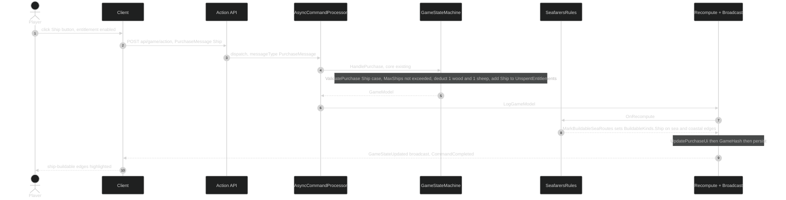
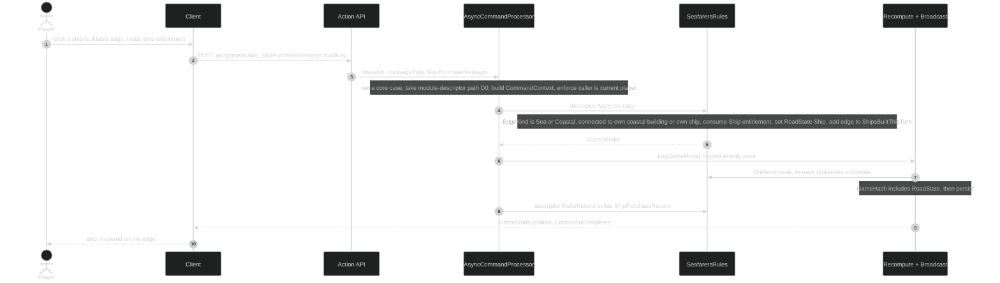
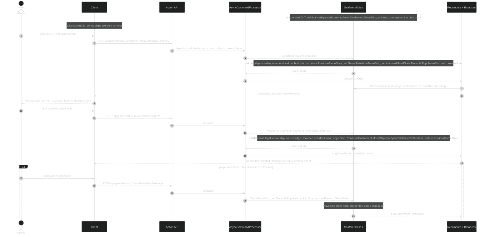
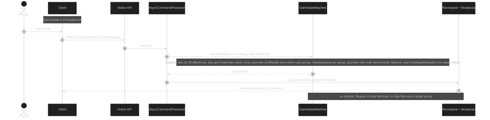
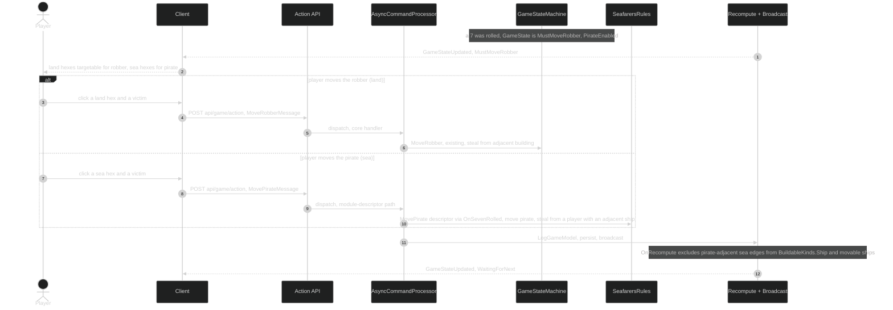

# Design: Seafarers support (epic #200)

**Status:** In progress — Step 1 (+ reconciliation) landed on `seafarers`; later
steps still awaiting their per-step plans.
**Supersedes:** `.design/old/seafarers-2026-02-draft.md` (Feb 2026 draft; reverses
its separate-`ShipModel` decision — see D3).
**Review history:** two Copilot rounds
(`.design/reviews/seafarers-review-copilot.md`). All accepted findings are folded
into the decisions below — each decision has one authoritative wording. Rejected:
a roll-production hook and a setup-allocation hook (not needed for New Shores) and
a separate gold-field mechanic (permanent `GoldMine` tiles already work — see D2).

**Governing law — the architecture constitution.** This design is subordinate to
[`.ai/architecture-invariants.md`](../.ai/architecture-invariants.md). Where any
decision below disagrees with an invariant, the invariant wins. The load-bearing
ones for this epic: **(1)** `GameModel` is the single runtime source of truth — the
template is a creation-time factory input, **never read at play time**; **(3)**
client-only render/interaction options (glyphs, labels, keyboard shortcuts) live in
the client, keyed by a shared enum, **never in `GameModel` or on a template**;
**(4)** enums are defined once in `Catan3.Shared` and generated to TS. See
**"As-built status & constitution alignment"** immediately below for how this
revises the D13 purchase family.

## As-built status & constitution alignment (2026-07-17)

What has actually shipped on `seafarers`, and how it revises the older sections:

+ **Step 1 (`d5dfe7e`) + reconciliation (`6b013cc`) landed, hash-neutral.**
  `GameType.Seafarers` (family), the New Shores board as **data**
  (`Default Data/SystemTemplates/seafarers.json`, loaded by `DatabaseSeeder`), and
  the editor rendering it. Verified via `./catan.ps1 test` (the only sanctioned test
  path — it provisions the Cosmos emulator; raw `dotnet test` gives false failures).
+ **`GameFeature`** enum shipped with `[Description]` labels; **`GameTemplateData.Features`
  is `List<GameFeature>`** (the flat step-1 authoring surface). It is authored data
  only — **routing it into `GameModel.Scenario` happens at Step 6**; nothing reads it
  at play time yet (invariant 1 holds).
+ **Keyboard shortcuts are a Shared `KeyboardShortcut` enum** (`[Description]` = the
  browser `event.key`), generated to TS; `useGameKeyboard.ts` reads it. This replaces
  the "author `KeyboardShortcut` on `TemplateEntitlement`" idea in D13a/b.
+ **`TemplateEntitlement` is `{ Entitlement }` only.** The render/interaction fields
  (`Title/Description/Icon/PurchaseType/KeyboardShortcut`) and `TemplateResourceCost`
  were **removed** — they are client concerns keyed by the `Entitlement` enum
  (invariant 3), not model/template data. `Cost` stays deferred (engine hardcodes it).

**This revises D13 (purchase) — read D13a/b/d through this lens.** The buyable
*list* stays data-driven (`entitlementPurchaseModel[]` in `GameModel`, authoritative:
which entitlements + `enabled` + any authored `Max`, all baked at creation). But the
*per-entitlement presentation* (glyph, label, tooltip, keyboard) is **client-static,
keyed by the `Entitlement`/`KeyboardShortcut` enums** — it does **not** travel through
the model and is **not** resolved from the template at runtime. **D13d's "TemplateId +
live template resolution" delivery is superseded** — see the rewritten D13d.

**Deferred as their own tracked steps (constitution-driven):** migrate Regular/
Expansion authoring from the C# `RegularBoardInfo`/`ExpansionBoardInfo` remnants to
`SystemTemplates/*.json` (byte-identical `GameTemplateData` + full replay pass as the
gate); and generate a `GameTemplateData` JSON Schema from the type pipeline (the
structural "XSD" gate, prerequisite for deleting the C# type-safety net).

## Goal — build *Expansion*; Seafarers is the test

The deliverable is a **reusable expansion capability** across the engine, the
REST/Action layer, and the client. More expansions **will** follow (Cities &
Knights, etc.) — so **"expansion" is the feature; "Seafarers" is the acceptance
test** that proves the capability is real. The concrete milestone is one fully
playable scenario — "Heading for New Shores" — reached *entirely through* the
expansion mechanisms, never through Seafarers special-casing. Rules reference: the
official Catan Seafarers rulebook (catan.com), FAQ, and UltraBoardGames.

### Prime rule (highest priority — overrides "just make it work")

Every seam this work touches — the `api/game/action` dispatch, the Action/message and
replay-record model, the rule-module hooks, the scenario profile, and the client
interaction registry — is designed as a **general expansion mechanism**, not a
Seafarers special case:

+ Prefer a generic, data/registration-driven path over a hardcoded
  `if (seafarers)` / `case "ship"`. A tempting one-off is a signal the seam is
  wrong — fix the seam, don't special-case.
+ **No expansion name in core control flow.** Seafarers appears only as *data* — a
  template, a scenario profile, a registered `SeafarersRules` module — never as a
  branch in `GameStateMachine`, the dispatcher, or the client core.
+ Every step's plan **states which part is reusable framework and which is
  Seafarers config/test**; the framework part gets the design scrutiny and tests.

**Framework (the product) vs. Seafarers (the test).** The composition module
system + `CommandContext` dispatch (D0), scenario profile (D2), edge classifier
(D10), fixed/shuffleable board model (D5), versioned hash (D8), and client
interaction registry (D9) are the **reusable capability**. Ships, islands,
movement, and the New Shores template are its **first client and proof** — nothing
more. If a future expansion (e.g. Cities & Knights) would need core surgery to add,
the framework is not done.

## Guiding principle: table-assistant, not strict referee

CatanWeb assists **co-located** players. It makes play convenient; it need not
enforce every rule perfectly. Where a rule is impossible or expensive to enforce,
implement the common, high-value cases and **let players enforce genuinely rare
edge cases** at the table. This bounds only *pathological* graph cases (see D4) —
it does **not** excuse skipping frequent, load-bearing rules.

## Constraints (from the epic — non-negotiable)

1. **Backwards compatible** — existing Regular/Expansion and saved games unchanged.
2. **All state in GameModel.**
3. **Service is authoritative** — clients send typed messages; engine validates.
4. **Leverage existing mechanisms** — a human building the board in the editor
   should "just work."

## GameHash — the GameModel's identity (foundational)

**If the `GameHash` differs, the game is different; if two `GameHash`es match, the
`GameModel` is the same.** The hash *is* the game's identity — it is how the service,
every client, and replay verify they hold **identical** state; a mismatch means
someone is out of sync.

**Mechanism (deliberately trivial).** `ComputeGameHash`
(`GameModelExtensions.ComputeGameHash`) sums one term per **discriminating value**:
`hash += nextPrime × value` — a prime popped off a stack, times the
field/enum/property value (enums cast to `int`: `(int)GameState × prime`, robber
`Q/R/S × prime`, …). **Adding a new discriminating value = pop the next prime,
multiply by the value, add. Nothing more.**

**Accurate baseline (verified against current code) — and its gap.** For **tiles**
and **harbors** the code iterates *every* slot in sorted order and hashes the content
per slot, so slot identity is implicit in the sort. But **owned roads and buildings
iterate the *owned-only* subset** and hash the **sorted-list index** (`0..N-1`) +
owner (+ `BuildingState`) — **the canonical `RoadKey`/`BuildingKey` position is used
only to sort, then discarded, and `RoadState` is not hashed at all.** So the current
hash under-discriminates: two boards where the same owner holds the same *number* of
roads can collide regardless of *where* they are (this is **bug #205**). D8 must be
read against *this* baseline, not a stronger imagined one.

**Rule for this epic — classify every new value.** Each field/enum a step introduces
is explicitly marked **discriminating** (enters the hash) or **not**:

+ *Discriminating* — anything two otherwise-identical games could differ on and must
  read as different: owner, **canonical slot key (`RoadKey`/`BuildingKey`)**,
  `GameState`, `RoadState` (road vs `Ship`/`MovableShip`), scenario id/flags,
  `ShuffleGroup`, per-player scenario-bonus VP, `TemporarilyGold`, pirate/robber
  coordinates.
+ *Not* — display-only / derived / metadata: `GameName`, timestamps, `BuildableKinds`
  and other recomputed markings, `IsShip`-style helpers, computed island ids (derived
  from tiles already hashed).

D8 governs **when** a value may enter the hash (scenario-opted games get the
strengthened v2 hash; Regular/Expansion stay **hash-neutral** so existing
`.catan_test` hashes never change) via `GameHashVersion`. The "Hashed?" column of the
model tables is this classification.

## Rules that shape the architecture

+ **Ships**: cost **1 wood + 1 sheep**; **15 per player**; built on any edge
  bordering ≥1 sea hex (sea–sea or coastal), never between two land hexes; connect
  to your own coastal settlement/city or your own ship. A road and ship connect
  only **through a building**.
+ **Ship movement**: once per turn you may move one **open** ship (not connecting
  two of your buildings, not built this turn) to another sea edge on your network.
+ **Longest Trade Route**: the Longest Road award (2 VP) counts **roads + ships**
  combined (joined through buildings).
+ **New-island bonus VP**: +2 VP for your first settlement on a new island.
+ **Scenario = a rules profile** (VP target + active mechanics), not just a map.
+ **Pirate**: on a 7 (or a played Soldier) the active player moves **either** the
  robber (onto a land hex, blocks production, steal from an adjacent building) **or**
  the pirate (onto a sea hex, blocks ship build/move on adjacent edges, steal from a
  player with an adjacent ship). **One choice, one piece** — never both.
+ **Later** (foundation must not preclude): Fog/exploration, cloth, wonders.

## Seafarers is a family of scenarios — `GameType` vs `Scenario`

**`GameType.Seafarers` is the *family* (one enum value)** for the New-Game selector
and template category. The individual scenarios below are **`Scenario`s = data**
(a template board + a `Scenario` profile: a `GameFeature` set + VP target), **not**
`GameType` values — branching core control flow on a scenario name is exactly what
the Prime rule forbids. So there is **one** `GameType.Seafarers`, and many scenarios
as data underneath it.

**"Supported vs not-supported" is decided by mechanics, not names.** A scenario is
playable **iff every flag it needs maps to an implemented rule module**
(`RulesModuleRegistry.Resolve`, D0); otherwise it resolves to a clear
*"scenario X requires the missing mechanic (not yet implemented)."* Adding
`GameType.Seafarers`
also gets a **defensive `default` ("not yet supported")** on the few `switch (GameType)`
sites — hygiene, nothing scenario-specific.

The 8 official Seafarers scenarios and what each needs (implement **New Shores**
first; the rest are documentation + future *data*, not pre-authored):

| Scenario | Mechanics it needs | Status under this roadmap |
|---|---|---|
| **Heading for New Shores** | ships, movement, route, island-VP, pirate, gold | **target of this epic** |
| The Four Islands | ships, movement, route, island-VP, pirate | data-only later (no main island → `(0,0,0)` is *sea*, the D7 all-score case) |
| Through the Desert | ships, movement, route, island-VP, pirate | data-only later |
| The Fog Island | + fog/exploration | needs Fog (deferred) |
| The Forgotten Tribe | + special tokens | needs token mechanic (deferred) |
| Cloth for Catan | + cloth | needs Cloth (deferred) |
| The Pirate Islands | + advanced pirate / fleet | needs advanced pirate (deferred) |
| The Wonders of Catan | + wonders | needs Wonders (deferred) |

Once this epic's mechanics land, **Four Islands** and **Through the Desert** become
new-data follow-ons (a template + a `Scenario` profile, no engine change) — the
clearest proof that the framework, not the scenario, is the product.

## What already exists (large leverage)

| Capability | Where | Status |
|---|---|---|
| `RoadState.Ship`, `Entitlement.Ship` | `Catan3.Shared/Models/GameEnums.cs:31`, `:103` | exist |
| `ResourceType.Sea` / `GoldMine` | `GameEnums.cs:5` | exist |
| Ship glyph `U+E90A`; `PirateShip` `U+E90D` (legacy `Pirate` alias = robber `U+E90C`) | `react-ui/lib/constants/catanGlyphs.ts:14`, `:69` | exist |
| `Road` renders `'Ship'` state | `react-ui/components/game/tiles/Road.tsx:10` | exists |
| Permanent gold: `GoldMine` tile → settlement 1 / city 2 gold | `Catan3.Shared/Models/BuildingModel.cs:94-95`; `ResourcesModelExtensions.cs:75,106`; `GameStateMachine.cs:1008` | works |
| Template → board (sea tile = `Resource:"Sea"`) | `BoardInfoJsonAdapter.cs`, `GameTemplateData.cs` | exists |
| Generic action REST API | `GameApiController` `/api/game/action` → `AsyncCommandProcessor.ExecuteGameLogicAsync` | reuse |
| Longest-road traversal (fork/loop-aware, **not** DFS) | `GameStateMachine.cs:2216`; adjacency `RoadModelExtensions.cs:17` | extend in place |
| New optional JSON fields default to empty on load | System.Text.Json (`JsonHelper.cs`) | auto |

## Architectural decisions

### D0 (lead). Engine structure: composition + rule modules

Chosen over a monolithic state machine (previous approach, became unwieldy) and
over one `GameStateMachine` subclass per template (multi-axis scenario variation —
ships × pirate × gold × fog — fights single inheritance).

**Seams in the current code.** Every handler is `Task<GameModel> HandleXxxAsync(msg)`
ending in `LogGameModel(gameModel)`. **`LogGameModel` (`GameStateMachine.cs:1461`)
is the single post-move recompute pipeline** (`UpdateScore :1463 → UpdatePlayerStars
→ MarkBuildableRoads → MarkBuildableBuildings → SetActionFlags :1062 → UpdatePurchaseUi
:1490 → … → UpdateGameHash → persist`) and the primary hook site. The machine is
built per game (ctor `:84`) and initialized by `HandleNewGameAsync(IGameMetadata)`
(`:295`) or `HandleLoadCompressedLogAsync` (`:404`).

**Module contract.** Modules are **stateless**; all state lives in `GameModel`.

```csharp
public interface IRulesModule
{
    // Expansion messages this module owns (dispatched via api/game/action; see below).
    IReadOnlyList<IExpansionMessageDescriptor> Messages { get; }

    // Lifecycle hooks the core calls at fixed points (no-op by default):
    void OnRecompute(GameModel game);                        // in LogGameModel — buildable marking, flags
    void OnBuildingPlaced(GameModel game, BuildingModel b);  // after a settlement/city is placed
    void OnScore(GameModel game, PlayerModel p, ScoreBreakdown s); // add scenario VP (island bonus, etc.)
    void OnTurnAdvanced(GameModel game);                     // at UpdateStateOnNextPlayer — per-turn resets
    void OnSevenRolled(GameModel game);                      // robber vs pirate (later)
}

public abstract class RulesModuleBase : IRulesModule { /* virtual no-ops + Messages => [] */ }
```

**Holding/invoking modules.** `GameStateMachine` gains
`IReadOnlyList<IRulesModule> _modules = []`, resolved at new/load time:
`_modules = RulesModuleRegistry.Resolve(gameModel.Scenario)` (Regular ⇒ empty).
The core invokes each hook as a single `foreach` loop at its site; with an empty
list every loop is a no-op ⇒ Regular is byte-identical (backwards-compat is free).

**Expansion dispatch — reuse `api/game/action` with a command context.**
`AsyncCommandProcessor.ExecuteGameLogicAsync` switches on `messageType`,
deserializes, calls a handler, and returns `(GameModel, IRecordedMessage)`; its
`default` arm **throws** on an unknown message type. Replace that default with a
**module descriptor** path that preserves the same caller validation, logging, and
replay contract as core actions:

```csharp
public sealed record CommandContext(string GameId, string PlayerId,
                                    string MessageType, JsonElement Payload);

public interface IExpansionMessageDescriptor
{
    string MessageType { get; }
    // Validate caller + rules, mutate a COPY, return it. Does NOT call LogGameModel;
    // the processor logs exactly once (mirrors core handlers). Throws GameException on illegal action.
    GameModel Apply(CommandContext ctx, GameModel current);
    IRecordedMessage MakeRecord(CommandContext ctx, GameModel result);
}
```

Processor flow for a non-core `messageType`: build `CommandContext`; find the
descriptor across `gsm.Modules` (unknown ⇒ still rejected, bounded to active
modules' allow-list); **enforce caller == current player** (same policy the
SignalR handlers apply); `model = descriptor.Apply(ctx, copy)`; `LogGameModel(model)`
once; `record = descriptor.MakeRecord(ctx, model)`. **Failure semantics are
unchanged from core:** the REST POST still returns "accepted" immediately; a
thrown `GameException` surfaces to the caller via the existing SignalR
`CommandFailed`/commandId path, and nothing is logged. New expansion piece = new
message type + descriptor — zero new endpoints/hub methods; replay uses the same
`IRecordedMessage`. A matching `ActionType` entry is added for CLI/replay scripts,
and the React `RecordingPlayer` union gets one case.

**Net core growth:** five hook loops + one dispatch fallback, then nothing more
per future expansion. Module framework lands in **Phase 3** before any mechanic
uses it.

### D1. Islands are **tiles**; identity is **derived**, shuffling is a separate tag

Island land tiles are regular `TileModel` entries at sea-region coordinates (they
render, take buildings, anchor ships — no new plumbing). The epic needs **two
orthogonal things** that an earlier draft wrongly folded into one `IslandGroup` (the
old UWP code already kept them separate — `TileGroups` vs `Islands`):

+ **Shuffling — a `ShuffleGroup` tag** (int, default `0`) on
  `TemplateTile`/`TileModel`: land tiles with the same `ShuffleGroup` permute
  **together**; sea tiles are always fixed and never move (D5). **To "shuffle
  several islands with each other," give their land tiles the same `ShuffleGroup`**
  (exactly what old Seafarers4Player did — one outer group spanning three islands).
  This is an authoring choice, not derivable, so it stays a tag. It must exist
  *before* any game is created (Phase 1), because creation calls `Shuffle`.
+ **Island VP identity — derived, not tagged** (D7): an island is a **connected
  component of land hexes** (flood-fill; sea breaks connectivity). Because sea
  positions are **fixed**, shuffling only moves *contents* among fixed land/sea
  slots, so the components (the islands) are **invariant** under shuffle, undo, and
  replay. The engine computes island identity from position — **no per-tile island
  tag** — which is both less authoring burden and more correct.

**Why the split:** one shuffle group can contain many scoring islands, and no
scoring island is ever split by a shuffle. So `IslandGroup` is **replaced by
`ShuffleGroup`**; VP-island identity is computed (see D7's `ComputeIslands`).

### D2. Scenario profile + score/victory/winner

Extend `GameTemplateData` (→ `IGameMetadata` → `GameModel`) with a `Scenario`
descriptor: a **`Features` set** (`List<GameFeature>`) + numeric **config values**
(`VictoryPointTarget`, `NewIslandBonusVpAmount`, …). Default = Regular (empty
features, target 10). `MaxShips` lives in `ResourceRules` (15 Seafarers / 0 Regular).

**`GameFeature` — the explicit capability vocabulary (enum, not per-feature bools).**
A scenario's *requirements* are a **`GameFeature` set** on the scenario (data), never
on `GameType`. This applies the "prefer an enum value over a new field" principle to
the capability layer: a new mechanic (Cloth, Wonders) is **one enum value**, and a
scenario opts in by **listing** it — no new `bool XEnabled` field per mechanic. New
Shores' features are `{Ships, ShipMovement, ShipsInLongestRoute, NewIslandVp,
Pirate}`. (Gold is **not** a feature — fixed `GoldMine` needs no module and its
presence is derivable from the board.) Convenience accessors bridge the prose
(`scenario.HasShips` ⇔ `Features.Contains(GameFeature.Ships)`).

**Features drive module selection *and* support-gating.** `RulesModuleRegistry`
maps each `GameFeature` → the module that implements it; `implementedFeatures` is the
union those registered modules cover. A scenario is **playable iff
`Features ⊆ implementedFeatures`**; otherwise it resolves to a clear *"requires the
missing feature (not yet implemented)"*. The client reads `Features` to enable
capability UI. (`Regular` = empty features ⇒ zero modules ⇒ byte-identical, D0.)

**Features are also the build tracker — a scenario's definition of done.** A
scenario's `Features` set *is* its acceptance checklist: New Shores needs `{Ships,
ShipMovement, ShipsInLongestRoute, NewIslandVp, Pirate}`. As each Arc-B step
registers the module for one feature, `implementedFeatures` grows, and the scenario
**flips from "not yet supported" to playable exactly when its set is fully covered**.
So progress is *visible and mechanical* — `Features \ implementedFeatures` is
literally the remaining work — and each step's "done" is "this feature's module is
registered and its tests pass." The sequencing maps 1:1: step 7 → `Ships`, step 8 →
`ShipMovement`, step 9 → `ShipsInLongestRoute`, step 10 → `NewIslandVp`, step 11 →
`Pirate` (step 6 lands the registry itself).

**Scoring/winner:** `UpdateScore` gains the module `OnScore` contribution
(scenario bonus VP). Per-player scenario bonus VP is stored in `GameModel`
(so score is recomputed deterministically and hashed). `HandleDeclareWinnerAsync`
(`:628`) still allows a table-assistant **manual** winner, but the UI **displays
the scenario `VictoryPointTarget`** and each player's computed total incl. bonus
VP; winner declaration may warn if below target (not hard-block — table-assistant).

### D3. Ships reuse `RoadModel` + `RoadState.Ship`; Ship is a first-class entitlement

Ships are `RoadModel`s with `RoadState.Ship`. Ship purchase (`ShipPurchaseMessage`
→ `SeafarersRules.ShipPurchase`) mirrors the road path (analogous to
`RoadPurchase`, which sets `RoadState.Road` at `:1408`) plus sea/coastal-edge +
connectivity validation. Ship is **first-class**, not free-riding on road plumbing:

+ `ResourceRules.MaxShips` + a `MaxEntitlementCount(Ship)` case; a `ValidatePurchase`
  Ship case; ship cost; a `ShipPurchaseRecord`; generated TS types.
+ `Ship` in the scenario's default `EntitlementPurchaseModel` so `UpdatePurchaseUi`
  (`:1490`) enables/disables it generically; the client maps entitlements→buttons
  generically (no hardcoded `case`).

**Buildable-edge affordance model.** One `RoadState.Buildable` bit cannot express
that a coastal edge is buildable as *road, ship, or both*. Add
`RoadModel.BuildableKinds` (flags: `Road`, `Ship`) populated during marking: core
`MarkBuildableRoads` sets `Road` on land/coastal edges; module
`MarkBuildableSeaRoutes` sets `Ship` on sea/coastal edges. Rendering, hit-testing,
purchase validation, and replay tests read `BuildableKinds`. Regular games only
ever get `Road`, so behavior is unchanged.

### D4. Ship movement — an **optional per-turn entitlement**, click-to-move

Ship movement is modeled as an **entitlement**, so it rides the *existing*
once-per-turn machinery instead of a bespoke ship flag. (Rationale: a
`ShipMovedThisTurn` bool special-cases ships — and every ship-like mechanic we add
later would need its own such flag. `ConsumeEntitlement` already moves a used
entitlement into `SpentEntitlementsThisTurn`, which is cleared at turn advance —
that *is* "once per turn," done "just like everything else." The additions are
**two enum values** (`Entitlement.MoveShip`, `RoadState.MovableShip`) and one small
generalization — optional entitlements — with **no new top-level `GameModel` field**
for the gesture; nothing ship-specific enters core control flow.)

**New generic concept: optional entitlements.** Today `GameStateMachine.AllowNext`
and the server-side gate `GameStateMachine.CanTransitionToNext` block "Next" while
`UnspentEntitlements.Count > 0` ("you can't advance holding something unplayed").
A ship move is *optional* — it must **not** block turn-end. Add a generic
classifier `Entitlement.IsOptional` (data about the entitlement, not an expansion
branch); both gates change to `UnspentEntitlements.Any(e => !e.IsOptional())`, and
`UpdateStateOnNextPlayer` **expires** unused optional entitlements. This is a
reusable seam: any future optional per-turn action classifies its entitlement
optional — no new special case.

**Grant / gate / consume (all via the existing entitlement system):**

+ **Grant** — `SeafarersRules.OnTurnAdvanced` grants the new current player one
  `Entitlement.MoveShip` (gated by `Scenario.ShipMovementEnabled`); core
  turn-advance has already expired the prior optional grant. "Can I move a ship
  this turn?" is exactly *"do I hold `MoveShip`?"* — no `ShipMovedThisTurn` field,
  no `ActionFlags.MoveShipEnabled`.
+ **Initiate (click the ship, no button)** — while holding `MoveShip`, clicking one
  of your movable ships sends **`SelectShipToMoveMessage {shipKey}`**. The server
  (client owns no rules — [[client-two-responsibilities]]) validates the ship is
  movable, stores `PreviousGameState`, sets `GameState = MustMoveShip`, sets that
  road's **`RoadState = MovableShip`** (the ship is now "picked up"), and **marks
  legal destinations by reusing `BuildableKinds.Ship`** (same affordance as
  placement). The entitlement is **not** consumed yet. The picked-up ship renders at
  reduced opacity from its `RoadState == MovableShip`.
+ **Complete** — clicking a marked destination sends **`MoveShipMessage {to}`**; the
  **source is the road whose `RoadState == MovableShip`** (no separate field to
  carry it). Validate `to` is legal; move the ship (source edge → `Unowned`,
  destination edge → `Ship`); **`ConsumeEntitlement(MoveShip)`** (→
  `SpentEntitlementsThisTurn`, so it cannot recur this turn); restore
  `PreviousGameState`.
+ **Dismiss** — a non-destination click / Escape sends **`CancelMoveShipMessage`**:
  set the `MovableShip` road back to `RoadState = Ship`, restore `PreviousGameState`.
  Entitlement stays held, so the player can click a ship again. (`MustMoveShip`'s
  interaction session owns all clicks, so dismiss logic is centralized.)
+ **Undo** — snapshot-based: after `SelectShipToMove` → back to `WaitingForNext`
  (ship's `RoadState` back to `Ship`); after `MoveShip` → back to `MustMoveShip`
  with the entitlement restored.

**Why `RoadState.MovableShip`, not a `GameModel` field.** These state enums exist
for exactly two jobs: **(1) drive the `GameStateMachine` rules/transitions, and
(2) tell the client how to render the object** — that is what `RoadState.Buildable`
and `BuildingState.PossibleSettlement`/`NotBuildable` already do. So the trigger for
a new state value is precisely **"we need to render (or rule on) this in a new
way"** — a picked-up ship renders at 0.5 opacity and is gated by the move rules, so
it *earns* a state. A ship is `Ship` **xor** `MovableShip` (one mutually-exclusive
axis), unlike the two-axis road/ship buildability that needed `BuildableKinds`. This
**removes** the would-be `PendingShipMoveFrom` field. Two invariants hold:

+ **Only `GameStateMachine` (the server engine, incl. the `SeafarersRules` module
  running inside its pipeline) transitions `RoadState`.** The client **renders** the
  state and **sends actions** (`SelectShipToMove`/`MoveShip`/`Cancel`); it never sets
  `MovableShip` itself ([[client-two-responsibilities]]).
+ Guiding principle: **when a piece must be shown or ruled on a new way, add a state
  value — do not add a new top-level `GameModel` field, and do not compute it on the
  client.** A helper `RoadModel.IsShip => RoadState is Ship or MovableShip` keeps the
  few "is this a ship" sites (render glyph, `MaxShips` count, route traversal) from
  each special-casing the new value.

**The one remaining new field — scrutinized per that principle:** `ShipsBuiltThisTurn`
(`List<RoadKey>` on `GameModel`, cleared in `OnTurnAdvanced`) backs the movability
rule "a ship built this turn cannot move." It is genuinely per-*ship* temporal data
with no enum home (a just-built ship is a fully normal `Ship` in every other
respect — production, count, route — so it must **not** be a `RoadState`). It is
kept as a deliberate, well-scoped exception; under the table-assistant principle the
rule could instead be table-enforced and the field dropped. Decided at Phase 8.

**Enforced (frequent) legality:** a ship is movable iff (a) not built this turn
(`ShipsBuiltThisTurn`), (b) it has an **open end** — a vertex not continuing to
another owned ship/road through the route — and (c) it is not the sole segment
joining two of the player's buildings. This is a bounded traversal of the player's
ship graph. **Only genuinely pathological multi-loop disconnection cases are
table-enforced** — the common rule above is always enforced. Undo/cancel/turn-reset
are covered by tests in Phase 8.

### D5. Fixed/shuffleable, island-partitioned, bounded shuffle

`Shuffle` (`Catan3.Shared/Extensions/GameModelExtensions.cs:715`) currently
permutes resource+number across **all** tiles and loops until `ValidateGame`
passes. For Seafarers this would corrupt sea tiles. Change it to:

+ **Never shuffle fixed tiles** (all `Sea` tiles are fixed; optionally
  template-marked fixed land tiles). Only **shuffleable land tiles within each
  `ShuffleGroup`** are permuted, independently per group (D1). (Islands that should
  shuffle *together* share a `ShuffleGroup`; VP-island identity is derived
  separately — D7 — so pooling islands into one shuffle group never merges them for
  scoring.)
+ Keep the existing no-adjacent-6/8 (`ValidateGame`) + desert rules **per group**,
  but make the retry loop **bounded** (iteration cap) with a deterministic
  fallback if a small group can't satisfy constraints — no unbounded loop. (The
  prior implementation's retry was **unbounded with no fallback** and could spin
  forever — this cap is a real fix, not just parity.)
+ **Pool/target consistency (lesson from the old code).** Build the permutation
  **pool** from the *same* filtered set you assign into: both must exclude `Sea`
  **and** `Fixed` tiles. (The old `RandomizeTiles` drew its pool from all tiles
  incl. sea but assigned only into non-sea slots, so a land slot could draw `Sea`
  and a land resource was silently dropped.)
+ **Harbors are shuffled too.** Harbor **positions** stay as authored (tile + edge,
  `TemplateHarbor.Side`), but `Shuffle` **permutes the harbor `Type`s** across the
  scenario's harbors each time (as the old code did via `RandomHarborTypeList`) —
  so each shuffle yields a fresh harbor layout. Bound the harbor-type pool to the
  scenario's authored harbor set; keep it deterministic (`ReplayableRandom`).

This lands in **Phase 1** (before any game creation), not Phase 2.

### D6. Longest Trade Route — segment-traversable predicate (NOT a DFS)

The `CalculateLongestRoad` traversal (`:2216`) works and must **not** be rewritten
as a DFS. The current adjacency helper `OwnedAdjacentRoadsNotCounted`
(`RoadModelExtensions.cs:17`) filters by **owner only** — so ships are *already*
traversed; the real work is a correct **junction rule**, not "add road-or-ship."
Replace the adjacency predicate with an explicit **`IsRouteSegmentTraversable`**
that checks: same owner, `ShipsCountForLongestRoute` gate, shared vertex, and that
a **road↔ship transition only occurs through the owner's building**. Also fix the
early-exit `max == gameModel.Roads.Count` to count eligible route segments. UI
renames the award "Longest Trade Route" when ships are enabled.

**The through-building junction is net-new (no prior art) — highest-risk in D6.**
The prior implementation joined road↔ship **geometrically at any shared vertex** and
only broke a route on an **opponent's** building; it never required *your own*
building at a road↔ship transition. So `IsRouteSegmentTraversable`'s
through-building rule is written from scratch and carries the tests. **Award
semantics already live in our `CalculateLongestRoad`** (`:2237-2268`): the **≥5
minimum** (`:2246`) and **current-holder-keeps-ties** (`:2262` — a challenger takes
the award only with a strictly longer route). Because D6 swaps only the *adjacency
predicate*, that threshold/tie logic is untouched and applies to combined road+ship
routes automatically — nothing to port.

### D7. New-island discovery bonus VP

The "points for discovering a new island" are a first-class scenario score. To be
**undo/redo- and replay-safe**, they are **computed deterministically during
recompute**, not accumulated on an event: `SeafarersRules.OnScore` (inside
`UpdateScore`) sets each player's `ScenarioBonusVp` from current
building/island-group state, and `UpdateScore` adds it to the total. Because it is
re-derived from `Buildings` every `LogGameModel`, undo/redo and replay reproduce it
exactly; the value is stored on the player (D2) and included in the scenario hash
(D8). `SeafarersRules.OnBuildingPlaced` bumps `PlayerModel.IslandsPlayed` for the
stat/UI when a settlement first reaches a new island.

**Island identity is computed, not tagged (D1).** A helper `ComputeIslands(game)`
runs a **flood-fill / union-find over land tiles** (`ResourceTileType != Sea`),
joining hex-neighbors via the existing adjacency (`HexCoordinates.GetAllNeighbors`
/ `TileModelExtensions.AdjacentTiles` — the same the D10 edge classifier uses; two
land hexes sharing a `LandEdge` are one island). Each connected component is an
island with a **stable id = the canonical (min) `HexCoordinates`** in the component
— position-based, so it survives shuffles and is hashable. A component is "an
island" precisely because it is a **maximal** connected land group, so it is
automatically surrounded by sea / board-edge — no separate "surrounded by water"
check is needed.

**Main island = the component that contains the center hex `(0,0,0)`.** `(0,0,0)`
is the board origin (ring 0 of `HexCoordinates.GenerateSpiral`, the spiral layout
generator) and is land on the main island. That component **never scores**; every
other component is a scoring island. No "largest component" heuristic and **no
template `MainIsland` tag** — just geometry. Edge case handled for free: if
`(0,0,0)` is *sea* (a main-less scenario like Four Islands), no component contains
it, so **all** components score.

**Template validation (guard, not just a guideline).** Because a malformed board
could silently mis-score, any scenario with `NewIslandBonusVp` enabled is
**validated at template-load / game-create**: `(0,0,0)` must exist and be a **land**
tile (so it anchors the intended main island). Fail the create with a clear error
rather than scoring the wrong islands. (New Shores satisfies this naturally — the
main island is the central landmass.)

**Scoring rule — follow the rulebook (decided).** Per the official "Heading for New
Shores" rule: **each player scores `NewIslandBonusVpAmount` (2) VP for their first
settlement on *each* island other than the main island** — i.e. **per island, per
player** (a player settling three foreign islands earns 6). It is **not** a race
(later settlers on an island the player themselves reaches still score their own
first-settlement there) and it is **not** capped at one island.

`OnScore` computes it from `Buildings` + the computed islands: `2 × (count of
distinct **non-main island components** where the player holds ≥1 settlement)`,
guarded by `Scenario.NewIslandBonusVp`. `Scenario.NewIslandBonusVpAmount` keeps the
per-island value configurable for other scenarios. (If a future scenario needs a
different rule — once-per-player, or a first-discoverer race using `BuildIndex`
order — it is the same one-predicate seam; New Shores uses per-island.)

### D8. Backwards compatibility + versioned hash policy

New fields are optional with empty/zero defaults, so old saves deserialize cleanly.
But `GameHash` is a **separate contract**, and the current (v1) formula is **weaker
than a stronger reading suggests** — state it accurately before extending it.

**v1 baseline as it actually is** (`GameModelExtensions.ComputeGameHash`): tiles and
harbors hash content per **every** sorted slot (slot identity implicit). Owned
**roads** hash `sortedOwnedIndex + ownerHash`; owned **buildings** hash
`sortedOwnedIndex + BuildingState + ownerHash`. So v1 **does not hash the canonical
`RoadKey`/`BuildingKey` position** (only the owned-list index) and **does not hash
`RoadState`**. Consequences: a road and a ship on the same edge hash identically,
*and* different owned-edge sets can collide when owner counts/order match
(**bug #205**). Do not describe v1 as "owner + position."

**Policy: add `GameHashVersion`.**

+ **v1 (Regular/Expansion) — frozen and unchanged.** The formula stays byte-for-byte
  identical so existing `.catan_test` hashes still match. **Bug #205 is therefore
  *not* fixed for Regular** here — a deliberate compat choice; its collision class
  has been harmless in practice, and strengthening v1 would invalidate every
  recording. (Fixing #205 for all game types is a separate, versioned decision —
  see "Open questions".)
+ **v2 (scenario-opted) — the strengthened hash.** Adds, per owned road/building, a
  **deterministic scalar derived from the canonical `RoadKey`/`BuildingKey`** (this
  is exactly the **#205 fix**, scoped to scenario games) **plus `RoadState`** (road
  vs `Ship` vs `MovableShip`), and the new scenario discriminators: `Scenario`
  id/flags, per-player `ScenarioBonusVp`, `TemporarilyGold`, and the `Pirate`
  position. (`MovableShip` and the selected ship are captured *via* `RoadState` +
  slot key — no separate field. Islands are derived from already-hashed tile
  positions, so they need no term. `ShuffleGroup` is static board metadata; hashing
  it is optional and adds only board-identity discrimination.)

No legacy Seafarers saves exist, so there is no in-progress migration case — only
Regular/Expansion legacy, which stays v1-neutral. **Tests (required for confidence):**
(a) existing Regular/Expansion replay-hash fixtures unchanged; (b) a v1 baseline test
that *documents* the owned-set-permutation collision (so the known gap is pinned);
(c) v2 tests proving it distinguishes road vs ship, two different owned-edge sets,
island bonus, pirate position, and temp-gold.

**Performance — a benchmark, not live instrumentation.** `ComputeGameHash` is linear
in board size (~hundreds of small `BigInteger` adds + a few sorts of tens of items)
and runs once per move in `LogGameModel`, at human speed — so it is **tens of
microseconds, sub-millisecond**, and does **not** warrant timing code in the hot
path. v2 makes it heavier (slot key + `RoadState` + scenario terms), so add **one
micro-benchmark test** on a worst-case Seafarers board (max tiles/roads/ships/
buildings) asserting the hash stays well under a threshold (e.g. `< 1 ms`), guarding
against a v2/#205 regression. If recompute latency ever becomes a real question,
instrument the **whole `LogGameModel` pipeline** behind a trace level — `CalculateLongestRoad`'s
per-player DFS is the likelier hotspot, not the hash.

### D9. Client: render the GameModel; collect Actions — data-driven + stateful seam

The client has exactly **two responsibilities**: (1) **render the GameModel** (a
pure projection), and (2) **collect Actions** to send to the authoritative
service, which returns the next GameModel. It owns no rules and no game state — so
it renders **any** GameModel without branching on `GameType`.

**Render.** Data-driven from state: `Tiles` (sea/island tiles), `Roads` (a
`RoadState.Ship` renders as a ship — `Road.tsx`), robber/pirate, gold via
`TemporarilyGold`. Buildable edges are distinguished from `RoadModel.BuildableKinds`
(D3): ship-buildable vs road-buildable get different affordances; a coastal edge
can show both per the active placement.

**Collect Actions.** Today interaction is scattered `gameState === …` conditionals
(robber at `page.tsx:527-583`). Replace with a **`GameState → interaction session`
registry**: sessions are **stateful** (pending selection, cancellation, keyboard,
sea-edge hit-testing) to support multi-step collection (pick ship → pick
destination), not just stateless click handlers. Core states migrate
opportunistically; expansion states (`MustMoveShip`) register a session.

+ Buttons stay data-driven from `entitlementPurchaseModel` (`page.tsx:112,166`); a
  `Ship` entitlement yields a Ship button with no hardcoded `case`.
+ Sending needs no new plumbing: `GameServiceProxy.executeCommand(messageType,
  data)` posts to `/api/game/action` (`GameServiceProxy.ts:693`); `moveShip`/
  `shipPurchase` are one-line wrappers like `moveRobber` (`:476`).
+ Scenario flags (in GameModel) drive affordances — never `gameType` checks.

Enumerable client touchpoints per expansion: a GameState label
(`gameStateMessages.ts:36`), state classification (`gameModelExtensions.ts:96`),
one interaction session, one entitlement→button entry, one `executeCommand`
wrapper, one `RecordingPlayer` replay case.

### D10. Shared edge classifier

A shared classifier from the two adjacent tiles: **LandEdge** (land|land),
**CoastalEdge** (land|sea), **SeaEdge** (sea|sea). Legality (server-enforced):
**roads** on Land + Coastal, never SeaEdge; **ships** on Sea + Coastal (border ≥1
sea hex), never LandEdge; a CoastalEdge accepts either. Used by core road
buildability (excludes SeaEdge), ship buildability, purchase validation, route
adjacency, and hit-testing — the single source of truth feeding `BuildableKinds`
(D3) and the UI distinction (D9).

### D11. Pirate ship — sea-robber via `OnSevenRolled`, one "resolve the 7" state

Activated by `Scenario.PirateEnabled`. The pirate is the robber's sea counterpart.
(There is **no working pirate today** — only leftover scaffolding: a no-op
`GameState.HandlePirates`, a `PirateShip` glyph, and a legacy comment mislabeling
the *robber* glyph `U+E90C` as "Pirate." This builds it.)

**One choice, one piece — reuse the existing `MustMoveRobber` state; do NOT add a
second state.** A rolled 7 (or a played Soldier) already routes to
`GameState.MustMoveRobber`, which means "resolve the 7 by moving the blocking
piece." When `PirateEnabled`, that same state additionally accepts a new
**`MovePirateMessage {seaHex, targetPlayerId}`** — so the player moves the robber
(land) **or** the pirate (sea), never both, and never two states. No new
`GameState`: the client, while in `MustMoveRobber` with `PirateEnabled`, offers
land hexes (robber) and sea hexes (pirate); whichever the player targets picks the
piece. Consistent with "one state that allows either to happen."

**Piece = a justified new field.** The pirate is a distinct board piece with a
*position*, so it is genuinely field-shaped (not a render-state — the
enum-vs-field principle's carve-out for board pieces). Add `GameModel.Pirate`
**reusing the `RobberModel` shape** (`Coordinates`, `MovedBy`, `Targeted`,
`ResourcesStolen`), symmetric with the existing `GameModel.Robber`. New Shores
authors a **pirate start sea hex** in the template.

**Move + steal (`SeafarersRules.OnSevenRolled`, now in-scope).** Pirate moves to the
chosen sea hex; steal a random card from an opponent with a **ship adjacent** to the
pirate's new hex — mirrors the robber's steal-from-adjacent-building, reusing
`Targeted`/`ResourcesStolen`.

**No-victim / no-target resolution (a frequent case, not pathological).** `targetPlayerId`
is **nullable** — mirroring the existing `MoveRobberMessage` (which already accepts a
null target). Semantics: **moving the piece is the action; the steal is optional.** If
the chosen hex has no eligible victim (no adjacent enemy ship for the pirate; no
adjacent enemy building for the robber), the move still completes with **no steal**
(`Targeted = null`, `ResourcesStolen = 0`). Because the player may move **either**
piece, the 7 is always resolvable even if one piece has no target. (A player may not
"skip" the move — a 7 must be resolved by relocating one piece, exactly as the base
robber flow requires today.) Covered by replay assertions for both branches.

**Continuous block (`OnRecompute`).** While the pirate occupies a sea hex, **no ship
may be built or moved on an edge adjacent to it.** The module excludes
pirate-adjacent sea edges from `BuildableKinds.Ship` and from the movable-ship set;
`ShipPurchase`/`MoveShip` validation rejects them. So the pirate folds into the D10
hex classifier and the D3/D4 ship seams — no core surgery. Legality: pirate only on
**sea** hexes.

### D12. Gold — fixed and random (both already exist; Seafarers keeps and tunes them)

Two independent gold mechanisms already ship in the engine. **New Shores uses fixed
gold, and the random-gold house rule is retained** (not excluded):

+ **Fixed gold** — a tile authored as `ResourceType.GoldMine`; a settlement on it
  yields 1 gold, a city 2 (`BuildingModel.cs:94-95`; production at
  `GameStateMachine.cs:1008`). New Shores authors gold tiles directly in the
  template — no new code, just authoring data.
+ **Random gold (house rule) — kept.** `HouseRules.GoldTiles` (int, default 1) tiles
  are marked `TileModel.TemporarilyGold` each turn by `SetTempGoldTiles`
  (`GameStateMachine.cs:1924`, called from `UpdateStateOnNextPlayer :1357` and
  `DoneResourceAllocation :1178`); a temp-gold tile produces gold via the same
  `:1008` path. Deterministic via `NextRandom` (replay-safe). Two Seafarers tweaks to
  the existing selection loop (`:1950-1971`):
  + **Selection = any tile that is not `Desert` and not `Sea`** — add the `Sea`
    exclusion (new: a gold sea hex produces nothing and takes no building). Desert
    stays excluded.
  + **May re-pick an already-gold tile** — drop the current "skip previously-gold"
    guard (`:1955-1959`) so a tile that was gold last turn, or a fixed `GoldMine`,
    can be chosen again. (Still avoid duplicates *within one* selection via
    `usedIndices`.)
  + **Bound the loop (required — new failure mode).** The current loop spins until it
    has picked `GoldTiles` distinct tiles. Adding the `Sea` exclusion means a
    sea-heavy board can have **fewer eligible (non-`Desert`, non-`Sea`) tiles than
    `GoldTiles`**, which would loop forever. Clamp the target to
    `min(GoldTiles, eligibleTileCount)` (or cap attempts with a deterministic
    fallback) so it always terminates. Same "bounded with deterministic fallback"
    rule as the D5 shuffle — apply it to every random-pick loop Seafarers constrains.

### D13. Template-driven client behaviors — Purchase is the first

> **Revised by the constitution (see "As-built status" up top).** The split below is
> now: the **buyable list** is data-driven and authoritative (`entitlementPurchaseModel[]`
> in `GameModel`, baked at creation — which entitlements, `enabled`, authored `Max`);
> the **per-entitlement presentation** (glyph, label, tooltip, keyboard) is
> **client-static, keyed by the `Entitlement`/`KeyboardShortcut` enums** (invariant 3),
> not carried through the model and not resolved from the template at runtime. The
> passages below that route metadata through `EntitlementPurchaseModel` (D13a) or fetch
> the template live (D13d) are **superseded**; keep them for the reasoning trail, but
> D13b's static-catalog and D13d's rewrite are the current model.

**The extensibility thesis.** A new buyable appears because it is authored into the
template's entitlement list and is a value of the `Entitlement` enum — **no `GameType`
branch, no per-entitlement `case` in control flow**. *What* is buyable is template
data (baked into `GameModel` at creation); *how* each entitlement looks and which key
triggers it is **client config keyed by the shared enum** (glyphs in `catanGlyphs.ts`,
keys in the `KeyboardShortcut` enum). This is the client-side complement to D0's
server-side rule modules — "data, not conditionals" — split across the
service/client boundary exactly as invariants 1 and 3 require. **Purchase is the first
behavior we make truly extensible**; the same seam later serves other behaviors
(harbor-trade offers, dev-card deck presentation, victory-condition display).

**Where D9 is aspirational vs. real.** D9 says "buttons stay data-driven from
`entitlementPurchaseModel`; a `Ship` entitlement yields a Ship button with no
hardcoded `case`." Today that is **not** true, in two places:

+ **The metadata is dropped server-side.** `BoardInfoJsonAdapter.PurchaseableEntitlements`
  (`BoardInfoJsonAdapter.cs:42-45`) maps each `TemplateEntitlement` to
  `new EntitlementPurchaseModel(Enum.Parse<Entitlement>(...))` — discarding the
  authored `title/description/cost/icon/purchaseType`. `EntitlementPurchaseModel`
  (`EntitlementPurchaseModel.cs`) carries only `{ Entitlement, Enabled }`, so the
  GameModel the client receives has no icon/cost/message to render from.
+ **The UI is hardcoded client-side, in three spots.** `ActionCluster.tsx` has a
  fixed `BUTTON_ORDER` and per-button literals (`glyph={CatanGlyph.Road}`, label
  `"Road"`, tooltip `"Buy Road"`); the game page's `handleAction` switch
  (`app/game/[id]/page.tsx:324-354`) maps `'road' -> proxy.purchase('Road')` case by
  case; and `enabledButtons` (`:177-196`) reads a hand-listed
  `canPurchaseRoad/Settlement/City/DevCard/Soldier`. Adding `Ship` today means
  editing all three plus `catanGlyphs.ts`.

**Target flow (make D9 real).**

```text
TemplateEntitlement (title, description, cost, icon, purchaseType, entitlement)
  -> BoardInfoJsonAdapter carries the metadata (stops dropping it)
  -> EntitlementPurchaseModel carries it + server-computed `enabled`
  -> GameModel.entitlementPurchaseModel[]  (already serialized to the client)
  -> ActionCluster renders one purchase button PER entry:
       glyph   = resolve(icon)         // "Ship" -> CatanGlyph.Ship
       tooltip = title + description + cost
       enabled = model.enabled
       onClick = proxy.purchase(entitlement)   // PurchaseMessage { entitlement }
```

No per-entitlement `case` anywhere; `Ship` (or any future buyable) appears because
it is authored in the template.

**What we need to do (Purchase).**

1. **Carry the metadata server->client.** Add the display/purchase fields to
   `EntitlementPurchaseModel` (`Title`, `Description`, `Cost`, `Icon`,
   `PurchaseType` — optional, mirroring `TemplateEntitlement`), and populate them in
   `BoardInfoJsonAdapter` from the template. `RegularBoardInfo`/`ExpansionBoardInfo`
   (the code-defined boards) supply the same metadata so existing games keep their
   icons/labels — via a small default map keyed by `Entitlement`, so un-enriched
   boards still render. Regenerate TS (`AddInterface` already covers the model).
2. **Resolve icon name -> glyph on the client.** `icon` is a `CatanGlyph` key string
   (e.g. `"Ship"`); the client looks it up in `catanGlyphs.ts` with a safe fallback.
   Keeps the font mapping on the client (where the font lives) while the *choice* is
   authored in data.
3. **Send the generic message.** Click sends `PurchaseMessage { entitlement }`
   (`GameServiceProxy.ts:456`) — already generic; the server routes by the
   `Entitlement` enum (`HandlePurchaseAsync`). `purchaseType` is **server-facing
   metadata** for now (documents/So selects the handler); the client does not need it
   to send a standard purchase. Revisit only if a buyable needs a non-standard
   message.
4. **Data-drive the buttons.** Replace `ActionCluster`'s fixed purchase configs and
   the game page's `handleAction` purchase cases + `enabledButtons` list with
   iteration over `entitlementPurchaseModel`. The **non-purchase** controls
   (State/Undo/Next/Redo) stay fixed; only the buyables become data-driven.
5. **Cost stays server-authoritative.** The engine still owns and deducts cost
   (rules are the authority — costs are hardcoded in `GameStateMachine`); the
   template `cost` is **display-only** here (show it in the tooltip/back). Making the
   engine *read* template costs is a separate, later decision (the deferred phase-2
   data-driven-cost idea), not part of this step.

**Open sub-decision — grid layout for a variable buyable set.** `ActionCluster` is a
fixed 3x3 (`LAYOUTS.SQUARE_3x3`) with named slots; a data-driven buyable count
(4 today, +Ship = 5, more later) needs a slot policy. Options: (a) keep a fixed set
of purchase slots addressed by a stable order and let the data fill/enable them, or
(b) a flexible cluster that grows. Resolve when we implement; it does not change the
data contract above.

Cross-refs: D3 (Ship is a first-class entitlement — the motivating buyable), D9 (the
client seam this concretizes), and the template-authoring model
(`TemplateEntitlement` enrichment, already landed).

### D13a. Purchase data model — full analysis (drives the structures below)

Rewriting the purchase UI to be template-driven *forces* the data model: the client
can only render a buyable it has the data for. This is the full inventory of what the
purchase UI consumes today, where each piece comes from, and the target source.

| Data (per buyable) | Used for | Source today | Static or per-player | Target source |
| --- | --- | --- | --- | --- |
| `enabled` | card face-up vs face-down (flip) | `EntitlementPurchaseModel.Enabled`, server recompute = `Phase==Purchase` AND a buildable spot exists AND under Max (`AllowPurchase`, `GameStateMachine.cs:2095-2214`) | per-player | same (server) |
| `unspent` | count badge | client-derived from `Player.UnspentEntitlements` (`page.tsx:222`) | per-player | same (client-derived) |
| `spent` | back-of-card "N of Max" | client-derived from `Player.SpentEntitlementsThisGame` (`page.tsx:231`) | per-player | same (client-derived) |
| `max` | the "of Max" + Max enforcement | `ResourceRules.MaxCities/Settlements/Roads` — **only 3**; `Ship`⇒0⇒unlimited (`GameModels.cs:29`) | static (per board) | **per-entitlement `Max` (authored)** |
| glyph | button face | hardcoded `CatanGlyph.Road` in `ActionCluster.tsx` | static | `TemplateEntitlement.Icon` |
| label | button label | hardcoded `"Road"` | static | `TemplateEntitlement.Title` |
| tooltip | hover | hardcoded `"Buy Road"` | static | `Title` + `Description` (+ `Cost`) |
| cost | display | not shown; hardcoded in engine | static | `TemplateEntitlement.Cost` |
| send | click → message | hardcoded `handleAction` case → `proxy.purchase(entitlement)` | — | generic `PurchaseMessage { entitlement }`; `PurchaseType` server-facing |
| keyboard shortcut | key → purchase | hardcoded switch in `useGameKeyboard.ts` (`s/c/k/r/d`) | static | `TemplateEntitlement.KeyboardShortcut` |
| which stats show | Soldier shows played; DevCard spent-only; others "N of Max" | hardcoded per button | static | derive from `Max` (0 ⇒ no "of Max") — no per-entitlement code |

**The Max smoking gun.** `ResourceRules.MaxEntitlementCount(entitlement)` is a 25-arm
switch returning non-zero only for Settlement/City/Road; **Ship falls through to `0`
(unlimited)** though Seafarers caps ships (15). Capping a ship today means editing
that switch. Max must be **authored per entitlement**, not switch-coded — the concrete
reason the model must change.

**Proposed structures (for review).**

Authored (static) — add `Max` to `TemplateEntitlement` (the rest, incl.
`KeyboardShortcut`, already landed):

```csharp
public class TemplateEntitlement {
  public string  Entitlement;                       // "Ship"
  public string? Title, Description, Icon, PurchaseType;
  public string? KeyboardShortcut;                  // single key, e.g. "p" for Ship (hard P in shiP)
  public TemplateResourceCost? Cost;
  public int     Max;                               // NEW: per-piece supply cap; 0 = unlimited
}
```

Runtime (the client-facing descriptor) — `EntitlementPurchaseModel` carries the
authored metadata (copied at game-create) plus the server-computed `Enabled`, so the
client renders from the GameModel alone (it never sees the template):

```csharp
public class EntitlementPurchaseModel {
  public Entitlement Entitlement;
  public bool        Enabled;                        // server recompute (unchanged)
  // carried from the template so the client is self-sufficient:
  public string?     Title, Description, Icon, PurchaseType;
  public ResourceCost? Cost;
  public int         Max;                            // powers "N of Max" + face-down-at-cap
}
```

Counts (`unspent`/`spent`) stay **client-derived** from the player's entitlement
lists (the client already has them) — no duplicated state (open Q1).

Wiring the flow:

+ `BoardInfoJsonAdapter.PurchaseableEntitlements` copies **all** fields from
  `TemplateEntitlement` (stops dropping them at `:42-45`).
+ `RegularBoardInfo`/`ExpansionBoardInfo` (code boards) supply the same via a default
  `Entitlement → { icon, title, cost, max }` map, so pre-template games keep their look.
+ Server enable/`AllowPurchase` reads `Max` from the per-entitlement descriptor; the
  `ResourceRules.MaxEntitlementCount` switch **and the three `ResourceRules.Max*`
  fields are removed** (decision 2 — no compat projection; `ResourceRules` keeps only
  `Min/MaxPlayers`).

**Client contract (data → `ActionCluster`).** Iterate `entitlementPurchaseModel`:
`glyph = resolveGlyph(icon)`, `label = title`, `tooltip = title + description + cost`,
`isEnabled = enabled`, `count = unspent(entitlement)`,
`backStats = Max > 0 ? "{spent} of {Max}" : "{spent}"`. No per-entitlement `case`;
Soldier/DevCard specialness falls out of `Max`/counts, not code.

**Hash note (D8).** The authored metadata is static per board and must **not** enter
`ComputeGameHash` — identity stays state-only. Only `Enabled` (transient) is a
candidate; keep the new fields out of the hash (exclude / hash-ignore).

**Open decisions for review.**

1. **Counts** — keep client-derived (recommended: no duplicate state), or have the
   server stamp `Unspent`/`Spent` onto the descriptor for a fully self-describing model?
2. **`Max` home — RESOLVED: retire, no compat.** `Max` lives per-entitlement on the
   descriptor; **`ResourceRules.MaxCities/Settlements/Roads` and the
   `MaxEntitlementCount` switch are removed** ("the only way forward is forward"). No
   compat projection. Migration: existing templates' `resourceRules.max*` values fold
   into per-entitlement `Max` on the entitlement descriptors, and the engine's
   enable/`AllowPurchase` reads `Max` from the descriptor. (`ResourceRules` keeps only
   `Min/MaxPlayers`.)
3. **List contents — RESOLVED: model the acquisition mechanism, button only when a
   manual action is needed.** An entitlement can be obtained several ways — **rolls**,
   a **dev card**, **direct purchase**, or **playing a held entitlement**. Rule: *if an
   existing mechanism can grant it, use that (no button); otherwise show a button to
   grant/activate it.* This is why Soldier/Knight has a button — you manually play a
   held (dev-card-granted) Soldier. So the catalog descriptor carries an **acquisition
   kind** (generalizes `PurchaseType`: e.g. `Purchase`, `PlayHeld`, `MechanismGranted`);
   the cluster renders a button only for entitlements whose acquisition is a manual
   player action and omits mechanism-granted ones. Pure non-actionable entitlements
   (`RolledSeven`, `KnightDisplacement`) never get a button.
4. **Grid layout** — the fixed 3×3 `ActionCluster` vs. a variable buyable count
   (carried from D13). **Resolved in D13c.**

### D13b. Static catalog vs per-turn state — size/speed (refines D13a)

D13a's first cut fattened every `EntitlementPurchaseModel` with the authored
metadata. That is wrong for the wire: the metadata (title/description/cost/icon/max)
is **constant for the whole game**, yet a fattened model re-serializes it inside
every `GameModel` on every action (hundreds of updates/game). And both sides re-scan
a list on every access — the client `entitlementPurchaseModel.find` (`page.tsx:170`),
the server `PurchaseModel(entitlement)` (`GameModel.cs:231`, the recompute touches it
per player per turn). Split static from dynamic and index it.

**Static — `EntitlementCatalog` (built once, sent once, indexed).**

```csharp
public sealed class EntitlementDescriptor {
  public Entitlement Entitlement;
  public string? Title, Description, Icon, PurchaseType, KeyboardShortcut;
  public ResourceCost? Cost;
  public int Max;                       // 0 = unlimited
}
// keyed for O(1): Dictionary<Entitlement, EntitlementDescriptor>, projected from the template
```

Delivered **once** with the initial game load (part of the game's static board
metadata), **not** inside the per-turn `GameModel`. Held client-side as a
`Map<Entitlement, EntitlementDescriptor>`.

**Dynamic — `EntitlementPurchaseModel` stays `{ Entitlement, Enabled }`** (per-turn,
tiny) — no fattening. Counts remain client-derived from the player. Render =
`enabled` (dynamic) ⋈ catalog (static) ⋈ counts (derived).

**Build timing — the "build step."** Two options for when the catalog is built:

+ **Now: project at game-create/load** — cheap (a handful of entitlements) and works
  for *any* authored template, so extensibility is intact. Recommended.
+ **Optional: precompute at template-save** — build the catalog when a template is
  saved and store `catalogJson` beside `dataJson` (`CosmosCatanDb` TemplateDoc), so
  it is built once per template *version* rather than per game. This is the literal
  build step; adopt only if profiling shows game-create cost matters (entitlement
  sets are tiny → likely YAGNI). A **compile-time** bake is rejected: templates are
  data, not code — baking would break the thesis for editor-authored templates.

**Server also indexes.** Replace the linear `PurchaseModel(entitlement)` scan and the
`ResourceRules.MaxEntitlementCount` switch with `Dictionary` lookups over the catalog
(`GameModelExtensions.cs` / `GameModel.cs:231`).

**Glyph resolution stays a client build-time constant.** The catalog stores the icon
**name** (`"Ship"`, compact); `catanGlyphs.ts` maps name→codepoint at build time
(already exists). Authoring picks the name; the font map is client-static.

**Keyboard shortcuts — shipped as a Shared enum, not template data.** `useGameKeyboard.ts`
no longer hardcodes the `s/c/k/r/d` switch; it reads the **`KeyboardShortcut` enum**
(`Catan3.Shared`, `[Description]` = the browser `event.key`, generated to TS —
invariants 3 + 4). All shortcuts are visible in one enum; adding a buyable's key is one
enum value (Ship = `PurchaseShip` → `"p"`, at Step 7). The *choice* lives in the enum,
dispatch is client-side. (This replaces the earlier "author `KeyboardShortcut` per
`TemplateEntitlement`, build a `Map<key,Entitlement>` from the catalog" idea — shortcuts
are not per-template.)

This **supersedes** D13a's "EntitlementPurchaseModel carries the authored metadata":
the metadata lives in the static catalog; the per-turn model keeps only `Enabled`.
**Delivery of the catalog is decided in D13d** — `GameModel.TemplateId` + resolve the
template by id (client fetches it, server resolves per game-load). Templates are
mutable — no snapshot, no versioning — accepted at our scale.

### D13c. Purchase layout — fixed cells, pinned controls, scroll on overflow (resolves D13a #4)

`ActionCluster` lives in a **user-resizable `FloatingPanel`** ("Actions",
`page.tsx:839`); today it is a fixed 3×3 hex grid that **scales to fit** the panel
(`fitToParent`). A variable buyable count breaks scale-to-fit — in a small panel the
cards would shrink below what the flip animation, count badge, and "N of Max"
backstat need. Resolution:

+ **Fixed button size.** Buttons never shrink; the panel size decides how many are
  visible, not how big they are. Preserves touch targets and the flip/badge/backstat.
+ **Pin the always-present controls.** Next/Undo/Redo and the state message stay in a
  region that **never scrolls** — Next is pressed every turn and must not scroll away.
  Only the *purchase palette* is dynamic.
+ **Purchases flow + scroll.** Fixed-size cells wrap to the panel width
  (`grid: repeat(auto-fill, <cell>)`); when they exceed the available height the
  palette gets a **vertical scrollbar, only when needed**. Resizing the panel changes
  columns/rows shown, not cell size.
+ **Stable order.** Buyables render in a deterministic catalog order (D13b); new
  buyables append, so positions stay put across games/turns (muscle memory).

Rejected: scale-all-to-fit (cards become illegible as the set grows); paginate (adds
interaction cost for at-a-glance buying). Minor open visual (cosmetic, no effect on
the data contract): purchase cells stay hex in a simple wrapping grid (gaps, not
honeycomb-packed) vs. switching to rounded-rect.

### D13d. Delivery — everything authoritative is baked at creation (no live resolution)

> **Rewritten to satisfy invariant 1.** The earlier version of D13d stored
> `GameModel.TemplateId` and **resolved the template live** (client fetch per game,
> server re-resolve per load, "mutability accepted"). That made rendering/recompute
> depend on `GameModel` **plus** the template — the exact coupling invariant 1 forbids.
> It is replaced by the baking model below.

**Layering:** template = the authored definition (the recipe); `GameModel` = the
evolving state (the dish). `NewGame` already takes a template
(`NewGameMessage.TemplateId`), resolved server-side at `GameApiController.cs`
(`_templateService.GetAsync` → `BoardInfoJsonAdapter`). The template is consumed **once**
to build the `GameModel` and then **discarded** — nothing reads it again for the life
of the game.

**Everything the engine or client needs at play time is copied into `GameModel` at
creation.** The authoritative purchase data — which entitlements are buyable, each
`enabled` flag, and any authored `Max` — lands in `entitlementPurchaseModel[]` (and
`Scenario`/`ResourceRules`) inside `GameModel`. The **presentation** (glyph, label,
tooltip, keyboard) is **not** delivered at all: the client already knows it from
client-static config keyed by the `Entitlement`/`KeyboardShortcut` enums. So there is
**no catalog fetch, no `GameModel.TemplateId` live resolution, no per-game template
GET**. A player holding a `GameModel` can render and play with no template access
(invariant 1's routing test).

**Snapshot, not reference — so editing a template never mutates a live game.** Because
the authoritative values are baked at creation, changing a system or user template
afterwards has **no effect** on games already created (correct: a running game's rules
must not shift underfoot), and **replay is deterministic** without embedding a catalog.
This is the opposite of the rejected "mutability accepted" stance, and it is why
`.catan_test` hashes stay stable.

**Open / Replay.** `OpenGame`/`ReplayGame` reconstruct from the persisted/recorded
`GameModel`, which is self-sufficient (board, rules, entitlement models all baked in) —
no template resolution needed. `GameModel` **may** still carry `TemplateId` as
**provenance only** (which template this game came from), never as a runtime input; it
is excluded from `ComputeGameHash`. Back-compat (D8): old saves without it open
unchanged because nothing resolves it.

**Wire + hash discipline.** Presentation config is client-static (never on the wire);
authoritative purchase data rides the existing `GameModel` (already serialized). Board
state (tiles/harbors/roads/buildings/robber/`enabled`) stays in `GameModel`; never
resolve tiles from a template (they would be stale vs. the game). Static per-board
authored values that are *display-only* stay out of `ComputeGameHash` (D8); authored
values the engine *acts on* (e.g. `Max` → `enabled`) are baked in and hashed like any
other scenario-opted state.

## Message-flow swimlanes (for review)

All client actions travel the **same authoritative backbone**: the React proxy
`GameServiceProxy.executeCommand(messageType, data)` POSTs to `/api/game/action`;
`AsyncCommandProcessor.ExecuteGameLogicAsync` switches on `messageType`; the handler
mutates a copy; `LogGameModel` runs the single recompute pipeline, persists, and
broadcasts `GameStateUpdated` to the game group; the caller gets
`CommandCompleted`/`CommandFailed`. **Core** messages hit an existing
`GameStateMachine` handler; **expansion** messages take the module-descriptor path
(D0). The five flows below differ only in *which handler runs* and *what state it
sets* — no new endpoints or hub methods.

### 1. Buying a ship (acquire the entitlement — a purchase)

Buying is a **core** flow (`PurchaseMessage`, existing `HandlePurchase`) with a new
`Ship` case; the module only marks buildable sea edges during recompute. This is
the "hold the entitlement" step — placement is flow 2.



### 2. Placing a ship (spend the held entitlement)

Placement is an **expansion** flow: `ShipPurchaseMessage` is not a core case, so it
takes the module-descriptor path — the reusable dispatch seam is the deliverable.



### 3. Moving a ship (optional per-turn entitlement, click-to-move)

Not a purchase, but **an entitlement** (D4): `Entitlement.MoveShip` is auto-granted
each turn (optional — it never blocks Next), and consumed on a completed move so it
can only happen once per turn "just like everything else." No button: clicking a
movable ship initiates; the server marks legal destinations (client owns no rules).



**Why `MustMoveShip` (a sub-state) rather than staying in `WaitingForNext`:** its
interaction session owns every click during the gesture, so "dismiss on
non-destination click" lives in one place instead of being sprinkled through the
other click handlers. The picked-up ship is the road with **`RoadState ==
MovableShip`** (no `PendingShipMoveFrom` field), and the server — not the client —
computes the legal destinations it marks via `BuildableKinds.Ship`.

### 4. Shuffling (sea-safe, per-island — pure core)

Shuffle is a **core** flow with no module: the sea-safe/per-group behavior is a
data-gated edit to `Shuffle()` (D5) that is inert for Regular (all tiles
`ShuffleGroup 0`, no `Sea` tiles).



### 5. Rolling a 7 (move robber OR pirate — one state, one piece)

One `MustMoveRobber` state accepts **either** `MoveRobberMessage` (existing, land)
**or** `MovePirateMessage` (new, sea) when `Scenario.PirateEnabled` (D11). The
player picks one piece. `MoveRobber` is a core handler; `MovePirate` takes the
module-descriptor path.



## Extensibility points added to the core (consolidated)

| # | Extension point | Kind | Core site | SeafarersRules use | Scope |
|---|---|---|---|---|---|
| 1 | `_modules` + `Modules`; `RulesModuleRegistry.Resolve(scenario)` | field | ctor `:84`; `HandleNewGameAsync :295`, `HandleLoadCompressedLogAsync :404` | resolve `[SeafarersRules]` from flags | New Shores |
| 2 | `OnRecompute` | hook | `LogGameModel :1469` | `MarkBuildableSeaRoutes` → `BuildableKinds`; movable-ship marks; expansion-state flags | New Shores |
| 3 | `OnBuildingPlaced` | hook | `BuildingUpgrade :1558` | `AwardNewIslandBonusIfFirst` (D7) | New Shores |
| 4 | `OnScore` | hook | `UpdateScore :1463` | add per-player scenario bonus VP | New Shores |
| 5 | `OnTurnAdvanced` | hook | `UpdateStateOnNextPlayer` | grant `MoveShip` entitlement; reset `ShipsBuiltThisTurn` | New Shores |
| 6 | Expansion descriptor dispatch (`CommandContext`) | core edit | `AsyncCommandProcessor.ExecuteGameLogicAsync` default-throw arm; expose `Modules`; caller validation | `ShipPurchase`, `SelectShipToMove`, `MoveShip`, `CancelMoveShip`, `MovePirate` (+ records) | New Shores |
| 7 | `IsRouteSegmentTraversable` predicate | core edit (not DFS) | `OwnedAdjacentRoadsNotCounted :17` + early-exit count `:2216` | road-or-ship + junction-through-building (D6) | New Shores |
| 8 | `Entitlement.MoveShip` + `Entitlement.IsOptional` + optional-entitlement gate/expiry + `GameState.MustMoveShip` | core edit (data + generic logic) | `GameEnums.cs`; `AllowNext`; `CanTransitionToNext`; `UpdateStateOnNextPlayer` | optional per-turn ship move (D4); click-to-move, no button | New Shores |
| 9 | `RoadModel.BuildableKinds` (flags) | core edit (data) | `MarkBuildableRoads` sets `Road`; module sets `Ship` | road/ship/both affordance (D3) | New Shores |
| 10 | `Scenario` + `ResourceRules.MaxShips` + `MaxEntitlementCount(Ship)` + `Ship` `EntitlementPurchaseModel` + `GameHashVersion` | core edit (data) | `GameModel.cs`, `GameModels.cs`, `ComputeGameHash` | limit + purchase UI + hash policy (D2/D8) | New Shores |
| 11 | `OnSevenRolled` | hook | seven path `:1051` | pirate move | Later |

The core gains **five hook loops + one dispatch fallback + `IsRouteSegmentTraversable`**
and data edits — then nothing more per future expansion.

## GameModel & data-model changes (explicit) — for review

This section enumerates the **concrete C# model edits** in `Catan3.Shared` that
back the decisions above. It is the single place a reviewer can see *exactly* what
the serialized GameModel shape becomes. Ground rules:

+ **All models live in `Catan3.Shared/Models`.** TypeScript is **generated**, never
  hand-written: add each new type/enum to
  `Catan3.Shared/TypeScript/CatanTypeGenSpec.cs` and run
  `pwsh ./catan.ps1 generate-types` (writes `react-ui/types/generated/models/`).
  No manual `.ts` model edits.
+ **Every new field is optional with a safe default** (`0`, `false`, `null`, `[]`,
  or a `Regular` scenario) so old saves and existing `.catan_test` files
  deserialize unchanged (System.Text.Json via `JsonHelper`). Nothing here changes
  the Regular/Expansion serialized shape's *meaning*; new fields simply default.
+ **Hash impact is versioned (D8).** The "Hashed?" column below is the *scenario-opted*
  hash (`GameHashVersion ≥ 2`). For Regular/Expansion the hash formula is unchanged,
  so these fields are hash-neutral there even when present at defaults.
+ **Naming note.** Ship capability is `GameFeature.Ships` (accessor
  `Scenario.HasShips`), not a `SupportShips` bool; the shuffle-partition key is
  `ShuffleGroup`. Capabilities live in the `Features` set, not per-mechanic fields.

### New enum members / new enums

| Enum | Change | File | Notes |
|---|---|---|---|
| `RoadState` | `Ship` reused (D3); **add** `MovableShip` (a ship picked up for a move, D4) | `GameEnums.cs:31` | ships + move-selection state |
| `Entitlement` | `Ship` reused (buy+place); **add** `MoveShip` (optional, granted per turn) | `GameEnums.cs:115` | ship purchase (D3) + ship movement (D4) |
| `ResourceType` | *(already has `Sea`, `GoldMine`)* — no change | `GameEnums.cs:5` | islands/gold (D1/D2) |
| `GameState` | **add** `MustMoveShip`; **reuse existing `MustMoveRobber`** for the pirate (no new value, D11) | `GameEnums.cs` | ship-move sub-state (D4); robber-or-pirate (D11) |
| `GameType` | **add** `Seafarers` (family; append) | `GameEnums.cs` | one value per *family*; scenarios are data (D2) |
| `GameFeature` | **new enum** (shipped): `Ships, ShipMovement, ShipsInLongestRoute, NewIslandVp, Pirate, Fog, Cloth, Wonders, FriendlyTokens, PirateFleet`, each with a `[Description]` label | `GameEnums.cs` | scenario capability vocabulary (D2); new mechanic = one value |
| `KeyboardShortcut` | **new enum** (shipped): `PurchaseSettlement, PurchaseCity, PurchaseRoad, PlaySoldier, PurchaseDevCard`; `[Description]` = the browser `event.key`; `PurchaseShip` added at Step 7 | `GameEnums.cs` | single source of truth for fixed shortcuts (invariant 3); client-only, never in `GameModel` |
| `BuildableKind` | **new `[Flags]` enum**: `None=0, Road=1, Ship=2` | new, `GameEnums.cs` | road/ship/both affordance (D3) |
| `EdgeKind` | **new enum**: `Land, Coastal, Sea` | new, `GameEnums.cs` | edge classifier (D10); may be compute-only, see note |
| `ActionType` | **add** (`ShipPurchase`, `SelectShipToMove`, `MoveShip`, `CancelMoveShip`, `MovePirate`) | `ActionType.cs` | CLI/replay + dispatch (D0) |

`EdgeKind` is derived from the two adjacent tiles and may live purely as a computed
classifier (not persisted) — decide at Phase-6 plan time whether it is worth a
cached field on `RoadModel`. Default plan: **compute-only**, no stored field.

### New fields on existing models

| Model (file) | New field | Type | Default | Purpose (decision) | Hashed? |
|---|---|---|---|---|---|
| `GameModel` (`GameModel.cs`) | `Scenario` | `Scenario` | `Scenario.Regular` | scenario profile: `GameFeature` set + VP config (D2) | yes |
| `GameModel` | `GameHashVersion` | `int` | `1` | hash policy selector; `≥2` opts into scenario hash (D8) | n/a (selector) |
| `GameModel` | `ShipsBuiltThisTurn` | `List<RoadKey>` | `[]` | ships ineligible to move this turn (D4 movability); cleared `OnTurnAdvanced`; the **only** new top-level field, scrutinized in D4 | yes |
| `TileModel` (`TileModel.cs`) | `ShuffleGroup` | `int` | `0` | shuffle partition (D1/D5); land tiles sharing it permute together; island-VP identity is **derived**, not this | yes (scenario) |
| `TileModel` | `Fixed` | `bool` | `false` | never-shuffle marker; sea tiles treated fixed regardless (D5) | no |
| `RoadModel` (`RoadModel.cs`) | `BuildableKinds` | `BuildableKind` | `BuildableKind.None` | can this edge take a road / ship / both (D3) | no (transient marking) |
| `PlayerModel` (`PlayerModel.cs`) | `ScenarioBonusVp` | `int` | `0` | island bonus + future scenario VP; feeds `OnScore` (D2/D7) | yes |
| `GameModel` | `Pirate` | `RobberModel` | `null`/unset | pirate piece position (D11); reuses the `RobberModel` shape, symmetric with `Robber`; a real board piece, so a justified field | yes (scenario) |
| `ResourceRules` (`GameModels.cs`) | `MaxShips` | `int` | `0` | ship entitlement cap (15 Seafarers / 0 Regular) (D3) | no |

Notes:

+ `PlayerModel` already has `IslandsPlayed`, `LongestRoad`, `HasLongestRoad` —
  reused, no new fields for those.
+ **`RoadState.MovableShip` carries the move-selection (D4), replacing a would-be
  `PendingShipMoveFrom` field** — the picked-up ship *is* the road in that state
  (find-by-scan). A state value is the right home because these enums exist to
  **drive `GameStateMachine` rules and to tell the client how to render** — and a
  picked-up ship both renders differently (0.5 opacity) and is rule-gated. Only the
  engine transitions it; the client renders it. Add a helper `RoadModel.IsShip =>
  RoadState is Ship or MovableShip` so the "is a ship" sites (render, `MaxShips`
  count, route traversal) don't each special-case it.
+ **Two distinct ship entitlements — both ride the existing system (D3/D4):**
  **`Entitlement.Ship`** = *buy + place* a ship (a purchase, two-step like
  `Entitlement.Road`: buying adds `Ship` to `UnspentEntitlements` + marks
  `BuildableKinds.Ship`; clicking a ship-buildable edge **consumes** it via
  `ShipPurchaseMessage`, mirroring `RoadPurchase` `GameStateMachine.cs:1387/1410`).
  **`Entitlement.MoveShip`** = *move* a ship — **optional**, auto-granted each turn
  (not bought), consumed on a completed move so it recurs only once per turn via
  `ConsumeEntitlement` → `SpentEntitlementsThisTurn`. No `ShipMovedThisTurn` flag,
  no `ActionFlags.MoveShipEnabled` — "can I move?" is "do I hold `MoveShip`?"
+ **Optional-entitlement support (generic core-logic edits, not a model field):**
  `Entitlement.IsOptional()` classifier; `AllowNext` and `CanTransitionToNext`
  change `UnspentEntitlements.Count > 0` → `.Any(e => !e.IsOptional())` so
  an unused `MoveShip` never blocks Next; `UpdateStateOnNextPlayer` **expires** unused
  optional entitlements. `SeafarersRules.OnTurnAdvanced` grants the fresh `MoveShip`.
  Reusable by any future optional per-turn action — no ship reference in core.
+ `ResourceRules` uses a positional primary ctor for JSON; `MaxShips` is added as a
  plain `{ get; set; } = 0` **auto-property** (not a ctor parameter), so the
  existing ctor-name-matching contract is untouched.
+ `ResourceRules.MaxEntitlementCount` (`GameModels.cs:47`) gets the `Entitlement.Ship`
  case return `MaxShips` (currently `break`/0).
+ **Ship cost (1 wood + 1 sheep) is logic, not a field** — `ValidatePurchase`
  (`GameStateMachine.cs:845`) gains a `Ship` case and the resource-deduction path
  handles cost, mirroring roads. Listed here only so reviewers know it is *not* a
  model change.

### New standalone types

| Type | Kind | Fields | Decision |
|---|---|---|---|
| `Scenario` | class | `string Id`, `List<GameFeature> Features = []`, `int VictoryPointTarget = 10`, `int NewIslandBonusVpAmount = 2`; computed accessors (`HasShips`, `HasPirate`, …); static `Scenario Regular` (empty features) | D2 — `Features` select active modules + gate support; default = Regular |
| `CommandContext` | record | `string GameId`, `string PlayerId`, `string MessageType`, `JsonElement Payload` | D0 — generic dispatch payload |
| `ShipPurchaseMessage` + `ShipPurchaseRecord` | message/record | edge `RoadKey` | D3 |
| `SelectShipToMoveMessage`, `MoveShipMessage`, `CancelMoveShipMessage` (+ records) | messages/records | `SelectShipToMove`: `shipKey` `RoadKey`; `MoveShip`: `to` `RoadKey` (source = the `RoadState.MovableShip` road) | D4 |
| `MovePirateMessage` + `MovePirateRecord` | message/record | `seaHex` `HexCoordinates`, `targetPlayerId` `string?` (mirrors `MoveRobberMessage`) | D11 |

`Scenario` is threaded: `GameTemplateData.Scenario` (authored) → `IGameMetadata` →
`GameModel.Scenario`. `GameTemplateData` (and `TemplateTile`) also gain the island
authoring fields below.

### Template-authoring model changes (`GameTemplateData.cs`)

| Model | New field | Type | Default | Purpose |
|---|---|---|---|---|
| `GameTemplateData` | `Features` *(shipped, Step 1)* | `List<GameFeature>` | `[]` | flat authored capability set; the Step-1 authoring surface. **Routed into `GameModel.Scenario` at Step 6** — until then it is authored data nothing reads at play time (invariant 1) |
| `GameTemplateData` | `Scenario` *(Step 6)* | `Scenario` | `Scenario.Regular` | full authored scenario profile (D2); folds in `Features` + VP config |
| `GameTemplateData` | `PirateStart` | `HexCoordinates?` | `null` | authored pirate start sea hex (D11); `null` = no pirate |
| `TemplateTile` | `ShuffleGroup` | `int` | `0` | authored shuffle partition (D1) |
| `TemplateTile` | `Fixed` | `bool` | `false` | authored never-shuffle marker (D5) |

**`TemplateEntitlement` is `{ Entitlement }` only (shipped).** Its render/interaction
fields (`Title/Description/Icon/PurchaseType/KeyboardShortcut`) and the
`TemplateResourceCost` type were **removed** — presentation is client config keyed by
the `Entitlement`/`KeyboardShortcut` enums (invariant 3), and `Cost` stays deferred
(the engine hardcodes costs). An authored per-entitlement `Max` (D13a) is the one
purchase datum that, when added, is **authoritative** and gets baked into `GameModel`
at creation — not carried as template render data.

`Sea` is already expressible as `TemplateTile.Resource = "Sea"` (no change).
Island-VP identity is **derived** (D7 `ComputeIslands`), so there is **no** island
tag on the tile and **no** main-island tag — the main island is the component
containing `(0,0,0)`.

### Type-generation registrations to add (`CatanTypeGenSpec.cs`)

`AddEnum<GameFeature>()` and `AddEnum<KeyboardShortcut>()` are **already registered
(shipped)**. Still to add: `AddEnum<BuildableKind>()`, `AddEnum<EdgeKind>()` *(if
persisted)*; `AddInterface<Scenario>()`, `AddInterface<CommandContext>()`,
`AddInterface<ShipPurchaseMessage>()`, `AddInterface<SelectShipToMoveMessage>()`,
`AddInterface<MoveShipMessage>()`, `AddInterface<CancelMoveShipMessage>()`,
`AddInterface<MovePirateMessage>()`. Then `pwsh ./catan.ps1 generate-types`.

Two distinct cases — do not conflate them:

+ **New types/enums must be registered** (the `AddInterface`/`AddEnum` calls above);
  without an explicit registration they are **not** generated.
+ **Already-registered types auto-pick up new fields** on regeneration:
  `RoadKey`, `HexCoordinates`, `RobberModel`, `TemplateTile`, `GameTemplateData`,
  `GameModel`, `PlayerModel`, `TileModel`, `RoadModel`, `ResourceRules` — their new
  members appear with no spec change.

### Landing order (matches the sequencing plan)

+ **Phase 1 (before any game creation):** `TileModel.ShuffleGroup` + `Fixed`,
  `TemplateTile.ShuffleGroup` + `Fixed`, and `ComputeIslands` (main = the `(0,0,0)`
  component) — D1/D5/D7 need these before `Shuffle`.
+ **Phase 6 (module framework):** `Scenario`, `GameHashVersion`,
  `ResourceRules.MaxShips`, `BuildableKind`, `CommandContext`, `GameState.MustMoveShip`
  scaffolding.
+ **Phase 7–10:** `RoadModel.BuildableKinds` population, ship messages/records,
  turn-scoped `GameModel` ship fields (D4), `PlayerModel.ScenarioBonusVp` (D7).

## New statistics to track

Ships built / remaining (of 15); Longest Trade Route length; islands settled +
bonus VP; pirate steals; (later) cloth/special VP.

## Sequencing plan (verify each step)

Each step is its own implementation plan, PR, and **full review**, and is
independently verifiable. **Framework-first:** in each step the reusable
expansion mechanism is the deliverable and carries the tests; the Seafarers piece
is only the config/test that exercises it (see the Prime rule). **Arc P** (the
immediate priority) makes **Purchase fully data-driven for *all* games** and proves it
on Regular/Expansion — a framework capability, verified before any Seafarers-specific
work (extensibility epic: build the mechanism, prove it on the games we have, then the
expansion plugs in). **Arc A** (1–5) makes the Seafarers board visible and
**standard-playable** — create, shuffle, render, complete setup — before any ship
mechanic. **Arc B** (6–11) adds the Seafarers mechanics (ships, movement, route,
island VP, pirate). Arc P is game-agnostic and shares only the finished template step
(1) as a prerequisite, so it can run ahead of / alongside Arc A. Every game-creating
step preserves sea tiles.

**Every step's implementation plan opens with an explicit *Model & template changes*
review — a STOP-for-review gate before any code.** It enumerates the exact
`TemplateTile` / `GameTemplateData` / `TileModel` / `GameModel` / enum deltas that
step adds or touches, and — for **each** new value — its **GameHash treatment**
(discriminating ⇒ `prime × value` into the hash, or excluded, with why; see the
GameHash section). The consolidated *GameModel & data-model changes* section and its
*Landing order* are the master list; each step's review is the slice it needs, so we
see "these are all the template + GameModel changes for this step" before building.
*(E.g. Step 1's slice: `TemplateTile.ShuffleGroup` + `Fixed`,
`GameTemplateData.Scenario` + `PirateStart`, and the editor's `Sea`/island rendering
— plus a note that the matching `TileModel` fields and `ComputeIslands` land in
steps 2–3, when a template becomes a live board.)*

### Arc P — Purchase goes fully data-driven, all games (framework — do first)

The data-driven purchase system (D13–D13d) is a **framework** capability, not a
Seafarers feature. Build it and prove it on the games we already have **before** any
Seafarers mechanic; then Ship (step 7) is mostly authoring — a buyable in the
template, no new client code.

+ **P1. Bake authoritative purchase data at creation; retire the hardcoded maxes.**
  The authoritative buyable data — which entitlements are buyable, each `enabled`, and
  an authored per-entitlement `Max` (D13a) — is **baked into `GameModel` at creation**
  by `BoardInfoJsonAdapter` (and the code boards until they migrate to JSON). **No
  `GameModel.TemplateId` live resolution; no per-game template fetch** (invariant 1;
  D13d as rewritten). `Max` moves onto the per-entitlement descriptor baked into the
  model; **retire `ResourceRules.MaxCities/Settlements/Roads` + `MaxEntitlementCount`**
  (decision 2); enable/`AllowPurchase` read the baked `Max`. *Verify:* Regular/Expansion
  hashes stable; Max enforcement (5 settlements, 4 cities, 15 roads) identical through
  the new per-entitlement path.
+ **P2. Data-driven purchase UI (no per-entitlement code).** Replace the hardcoded
  `ActionCluster` button set, the `handleAction` switch, and the `enabledButtons` list
  with iteration over `entitlementPurchaseModel` (the authoritative list). Each entry's
  **presentation is client-static keyed by the `Entitlement` enum**: glyph from
  `catanGlyphs.ts`, label/tooltip from a client `Entitlement → copy` map, key from the
  `KeyboardShortcut` enum (**already shipped** — `useGameKeyboard` reads it), `enabled`
  from the model, counts client-derived; fixed-cell flow + pinned controls + scroll
  (D13c); acquisition kind gates whether a button shows (decision 3). Nothing is fetched
  from the template. *Verify:* **on Regular and Expansion**, every existing buyable
  (Road/Settlement/City/DevCard/Soldier) looks, enables, counts, keys, and buys exactly
  as before — **zero regression, no per-entitlement `case`**.

**Gate:** Arc P ships and is verified on all existing games before Arc B. Seafarers's
Ship then plugs in as authored data — `{ "entitlement": "Ship" }` in `seafarers.json`
(buyability + its baked `Max`); its glyph/label live in client config and its key
(`PurchaseShip` → `"p"`) is added to the `KeyboardShortcut` enum at Step 7.

### Arc A — board visible & standard play

+ **1. Template + view in editor. ✅ DONE (`d5dfe7e` + reconciliation `6b013cc`).**
  Authored `seafarers.json` (main island + small islands + sea tiles + harbors),
  seeded from `Default Data/SystemTemplates/` as data; the template editor renders
  `Sea` and island tiles and the enum-driven Features/Entitlements selectors.
  *Verified:* board renders in the editor; `./catan.ps1 test` green, hash-neutral.
+ **2. Appears in New Game + creates a board.** `Seafarers` GameType (enum,
  typegen, `GameTypeSelector` card, API template-ID mapping); create a game from
  the **authored board as-is (no shuffle on create)**. *Verify:* pick Seafarers →
  create → the in-game board matches the template. *(Ordering: create unshuffled
  so this verifies before step 3; or land step 3 first — decided at plan time.)*
+ **3. Sea-safe Shuffle + Balance.** Fixed/shuffleable tiles (sea always fixed) +
  per-`ShuffleGroup` bounded shuffle + harbor-`Type` shuffle (D5); wire the existing
  Shuffle + Balance actions. *Verify:* shuffle repeatedly — sea never moves,
  resources/numbers stay within each island, no adjacent 6/8 per group, harbor types
  re-shuffle (positions fixed); Balance works; Regular unchanged.
+ **4. Render the game on the client.** The game board (not just the editor)
  renders the Seafarers `GameModel` — sea + island tiles with numbers, coastal
  geometry, robber, pan/zoom (mostly data-driven, D9). *Verify:* a
  created+shuffled Seafarers game renders correctly in play.
+ **5. Edge classifier + allocation.** Land D10 (Land/Coastal/Sea edges); core
  road buildability **excludes sea edges**; run standard allocation (two
  settlements and two roads). *Verify:* forward+reverse allocation places a coastal settlement,
  setup roads cannot be placed on a sea edge, allocation completes into
  `WaitingForRoll`. **Ships are not placed during New Shores allocation** — setup
  is standard; ships are bought in normal play (a scenario-gated setup-ship is a
  future seam).

*Editor full-authoring* (create islands/groups from scratch, mark fixed/sea,
prevent invalid combos — epic constraint #4, SF2-009 acceptance) is **not** on the
critical path to a playable game; it can land any time after step 3, before Arc A
is called "done."

### Arc B — Seafarers mechanics

+ **6. Module framework + scenario profile.** D0 hooks + `CommandContext`
  dispatch, `Scenario`, `MaxShips`, `GameHashVersion`, D10 `BuildableKinds`
  scaffolding. *Verify:* Regular byte-identical; a no-op Seafarers module loads;
  hashes stable.
+ **7. Ship purchase + placement.** The Ship *button/shortcut/cost/Max* already come
  from **Arc P** (Ship is an authored catalog buyable — no new purchase UI). This step
  adds the server placement mechanics: `SeafarersRules` ship build,
  `MarkBuildableSeaRoutes`, placement legality. *Verify:* buy a ship (1 wood + 1 sheep)
  via the data-driven button, place it on a sea/coastal edge connected to your coastal
  building; cannot place on land; 15-ship limit (Ship `Max`).
+ **8. Ship movement.** `MoveShip` optional entitlement + Select/Move/Cancel state
  chart + enforced open-ship legality (D4). *Verify:* move an open ship once/turn
  (entitlement consumed); an unused `MoveShip` never blocks Next; cannot move one
  built this turn or a closed-route ship; undo/cancel/turn-reset (fresh grant next
  turn).
+ **9. Longest Trade Route.** `IsRouteSegmentTraversable` + UI rename (D6).
  *Verify:* a mixed road+ship route through a building counts; award flips;
  Regular longest-road unchanged.
+ **10. New-island bonus VP + winner.** D7 + scenario score/target display (D2).
  *Verify:* first settlement on a new island grants +2 VP; VP target shown; winner
  reflects total.
+ **11. Pirate ship.** D11: `GameModel.Pirate` (+ template `PirateStart`),
  `MovePirateMessage` accepted in `MustMoveRobber` when `PirateEnabled`,
  `SeafarersRules.OnSevenRolled` (move + steal-from-adjacent-ship), and
  `OnRecompute` blocking pirate-adjacent ship build/move. *Verify:* on a 7 (and on a
  played Soldier) the player moves the robber **or** the pirate — not both; the
  pirate blocks/steals from adjacent ships; a ship cannot be built/moved next to the
  pirate; Regular unaffected.

Steps 1–11 deliver a rules-complete "Heading for New Shores" (ships, movement,
route, island VP, **and the pirate**). **Later** (own epics): Fog/exploration,
cloth, wonders.

## Type generation & tooling

New models (`Scenario`, `CommandContext` payloads, ship/move messages + records) →
`pwsh ./catan.ps1 generate-types`; register in `CatanTypeGenSpec.cs`.

## Testing strategy

+ **Backwards-compat:** existing Regular/Expansion `.catan_test` replay hashes
  unchanged; zero modules loaded for Regular.
+ **Shuffle:** fixed sea tiles never move; land shuffles stay within group;
  impossible small-group constraint hits the bounded fallback.
+ **Hash:** road vs ship distinguished; island bonus + pending ship-move affect
  the Seafarers hash; Regular hash-neutral.
+ **Ships:** purchase validation (edge kind, connectivity); `BuildableKinds` on
  coastal edges; movement legality (open end, not this turn, once/turn via the
  `MoveShip` entitlement); optional entitlement does not block Next; expiry + fresh
  grant on turn advance; undo-after-select, undo-after-move, cancel, turn reset.
+ **Longest Trade Route:** road→settlement→ship junction; ship-only and mixed routes.
+ **Pirate (D11):** on a 7 **and** on a played Soldier, `MustMoveRobber` accepts
  robber **or** pirate (one piece); pirate-adjacent ship build/move is blocked;
  steal from an adjacent-ship owner; Regular unaffected (no pirate, `MoveRobber`
  path unchanged).
+ **Client:** stateful ship-move session; React replay of ship actions; generated types.
+ **Editor:** create/save/load a Seafarers board and start a game from it.

## Non-goals (initial scope)

Fog/exploration, Cloth, Wonders, and scenarios beyond New Shores. (**Gold is in
scope** — New Shores uses fixed `GoldMine` tiles and the random-gold house rule is
kept; see D12. The **pirate is in scope** — see D11 / step 11.)

## Prior-art review — old UWP "Catan10" (scanned read-only, not copied)

A prior hot-seat implementation by the same author (`d:\GitHub\old\Catan`) was
scanned to catch missed mechanics. **No code was copied.** Crucial framing: it was a
score/state **tracker**, not a rules engine — it never deducted resources, had **no
ship movement**, the pirate **blocked nothing**, and steals were human-adjudicated.
So it confirms *shapes* but offers **no reference logic** for the hard mechanics.

**Confirms our model.** Ship = a road in a `Ship` state; sea = a fixed `Sea` tile
excluded from shuffling; islands = tagged tile ranges with the main island scoring
nothing; pirate on a sea hex / robber on land, both triggered by a 7 **or** a played
Soldier, sharing **one** "must move" flow that branches on land-vs-sea; pirate steals
from an **adjacent-ship** owner; **15** ships/player; longest route counts
roads+ships and breaks on an **opponent's** building; per-group independent shuffle
with no-adjacent-6/8 + desert. Their winner tracking was *manual and got forgotten* —
our scenario VP target + `DeclareWinner` is the fix.

**Architecture lessons (what to avoid) — validate our approach.** Their "diffgram"
log hand-authored per-field string deltas in ~14 bespoke classes, **entangled
mutation with logging** (model setters emitted log entries as a side effect), and
depended on fragile multi-entry ordering (a real undo bug was "fixed" by commenting
out a log line). Our **snapshot + copy-mutate-recompute** model — one message = one
recompute = one snapshot, recording ≠ mutating — eliminates all of it. Store only the
genuinely non-recomputable values (their `MaxNoResourceRolls` tie problem); recompute
the rest.

**From-scratch, highest-risk (no reference implementation exists — carry the tests):**

+ **Ship movement (D4)** — the old app has none; all four movability predicates are
  novel.
+ **Longest-route through-building junction (D6)** — theirs joined road↔ship at any
  vertex and broke only on an opponent building; our own-building junction rule is
  net-new. (The **≥5 minimum** and **tie handling** already live in our
  `CalculateLongestRoad` and are preserved by the in-place predicate swap — nothing
  to port.)
+ **Pirate blocking (D11)** — theirs blocked nothing; "no ship build/move adjacent to
  the pirate" is novel.
+ **Coastal connectivity (D3/D10)** — theirs let a ship attach to a land road with no
  building; our edge classifier + coastal-building/own-ship rule is stricter.

**Open items surfaced** (folded in): harbors are now **shuffled** each time (D5);
gold is **in scope** — fixed + random (D12); the `IslandGroup` double-duty is
**resolved "the right way"** — `ShuffleGroup` (tag) for pooling vs derived
connected-component islands for VP (D1/D7).

## Open questions

1. **Per-scenario VP target** — confirm New Shores' exact target from the rulebook
   at Phase 3; it is a config value.
2. **Ship-movement pathological cases (D4)** — Phase 8 fixes the exact boundary
   between code-enforced and table-enforced disconnection cases.
3. **Strengthen the v1 (Regular) hash too? (bug #205)** — v2 fixes the
   owned-road/building slot-identity gap for scenario games (D8). Fixing it for
   **Regular** as well would require a version bump and **regenerating every
   `.catan_test` baseline**. Recommended: **defer** — Regular's collision class has
   been harmless; do it only if a standalone hardening PR is warranted. Decide with
   the developer.

**Decided (kept for the record):**

+ **Shuffle vs island identity (D1/D7)** — **do it right, two orthogonal concepts.**
  **`ShuffleGroup`** (tag) pools land tiles that permute together (islands can shuffle
  *with each other* by sharing one). **Island VP identity is derived** — connected
  components of land hexes (`ComputeIslands`, flood-fill; sea fixed ⇒ islands
  invariant under shuffle); id = canonical min-coord. **Main island = the component
  containing the center `(0,0,0)`** (no largest-component heuristic, no tag; if
  `(0,0,0)` is sea, all components score). Replaces the conflated `IslandGroup`.
+ **New-island scoring (D7)** — **per island, per player** (rulebook rule): 2 VP for
  each non-main island a player is first to settle themselves. Not a race, not
  capped.
+ **Ship-move initiation (D4)** — **direct ship-click, no button**, modeled as an
  **optional per-turn `Entitlement.MoveShip`**; the picked-up ship is marked with a
  new **`RoadState.MovableShip`** value (no new top-level `GameModel` field).
+ **Gold (D12)** — **in scope, both mechanisms.** New Shores uses **fixed
  `GoldMine`** tiles (authored); the **random-gold** house rule is **kept**
  (`HouseRules.GoldTiles`), tuned for Seafarers to exclude `Sea` (not just `Desert`)
  and to allow re-picking an already-gold tile.
+ **Harbors (D5)** — positions authored, **`Type`s shuffled** on every `Shuffle`.
+ **Longest-route ties (D6)** — already handled by `CalculateLongestRoad` (≥5 +
  current-holder-keeps-ties); the in-place predicate swap preserves it.
