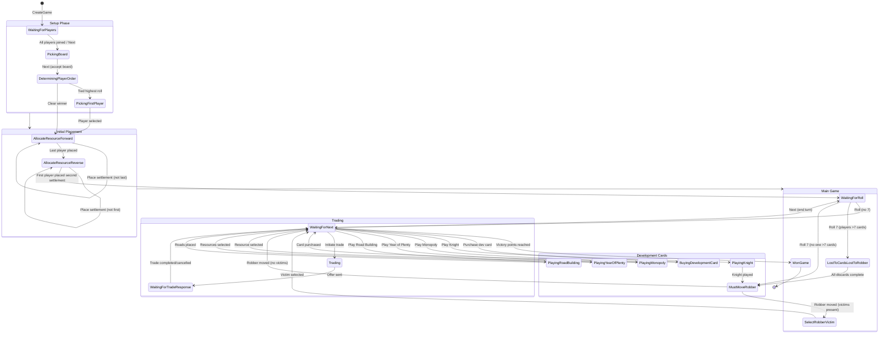

# Game Play Design: State Machine and Transitions

This document provides a comprehensive analysis of the Catan game state machine, describing all states, transitions, and the actions required to progress through a game. This informs integration testing and UI implementation.

## Overview

The game is driven by `GameStateMachine.cs` which manages all state transitions. The state is stored in `GameModel.GameState` and broadcast to all clients via SignalR `GameStateUpdated` events.

**Communication Pattern:**
- **REST API**: Game lifecycle (create, load) and commands (undo, redo, next, shuffle, etc.)
- **SignalR**: Real-time state broadcasts and group management

## GameState Enum

All possible game states (from `Catan3.Shared/Models/GameState.cs`):

| State | Value | Phase | Description |
|-------|-------|-------|-------------|
| `Unknown` | 0 | - | Invalid/uninitialized state |
| `WaitingForPlayers` | 1 | Setup | Game created, waiting for players to join |
| `PickingBoard` | 2 | Setup | Players reviewing/shuffling the board |
| `DeterminingPlayerOrder` | 3 | Setup | Rolling to determine turn order |
| `PickingFirstPlayer` | 4 | Setup | Choosing who goes first (if tied rolls) |
| `AllocateResourceForward` | 5 | Setup | First round of initial settlements (1st→last) |
| `AllocateResourceReverse` | 6 | Setup | Second round of initial settlements (last→1st) |
| `WaitingForRoll` | 7 | Main | Waiting for current player to roll dice |
| `WaitingForNext` | 8 | Main | Roll resolved, waiting to end turn |
| `LostToCardsLostToRobber` | 9 | Robber | Players must discard (>7 cards on 7) |
| `MustMoveRobber` | 10 | Robber | Active player must move robber |
| `SelectRobberVictim` | 11 | Robber | Choose player to steal from |
| `MustMovePirate` | 12 | Expansion | Must move pirate (Seafarers) |
| `SelectPirateVictim` | 13 | Expansion | Choose victim for pirate |
| `SupplementalBuildingPhase` | 14 | Expansion | Extra building after roll (C&K) |
| `WaitingForRollNoSupplemental` | 15 | Expansion | Waiting for roll, no supplemental allowed |
| `BuyingDevelopmentCard` | 16 | Dev Cards | Processing dev card purchase (not currently used) |
| `PlayingDevelopmentCard` | 17 | Dev Cards | Playing a development card (not currently used) |
| `PlayingKnight` | 18 | Dev Cards | Knight/Soldier card - move robber |
| `PlayingMonopoly` | 19 | Dev Cards | Monopoly card (not implemented) |
| `PlayingYearOfPlenty` | 20 | Dev Cards | Year of Plenty (not implemented) |
| `PlayingRoadBuilding` | 21 | Dev Cards | Road Building (not implemented) |
| `WonGame` | 22 | End | Game over - player reached victory points |
| `Trading` | 23 | Trade | Trade in progress |
| `WaitingForTradeResponse` | 24 | Trade | Waiting for trade offer responses |
| `MissedOpportunity` | 25 | Expansion | Missed opportunity to act |
| `Barbarians` | 26 | Expansion | Barbarian attack (C&K) |
| `BarbarianAttackLost` | 27 | Expansion | Lost to barbarians |
| `SelectingProgressCard` | 28 | Expansion | Choosing progress card (C&K) |
| `PlayingProgressCard` | 29 | Expansion | Playing progress card (C&K) |
| `Diplomat` | 30 | Expansion | Diplomat progress card |
| `Deserter` | 31 | Expansion | Deserter progress card |

## State Diagram



## Phase Details

### 1. Setup Phase

#### WaitingForPlayers → PickingBoard
- **Trigger**: All players connected OR host clicks "Next"
- **Actions Valid**: None (waiting)
- **REST Command**: `POST /api/game/action` with `command: "next"`

#### PickingBoard
- **Purpose**: Review and optionally modify the randomly generated board
- **Actions Valid**:
  - `shuffle` - Randomize entire board
  - `balance` - Auto-balance number tokens
  - `next` - Accept board and continue
  - `undo` / `redo` - Revert/restore shuffle operations
- **Transition**: `next` command moves to `DeterminingPlayerOrder`

#### DeterminingPlayerOrder
- **Purpose**: Each player rolls to determine turn order
- **Actions Valid**: `roll` - Each player rolls dice
- **Transition**:
  - If clear winner → `AllocateResourceForward`
  - If tie for highest → `PickingFirstPlayer`

#### PickingFirstPlayer
- **Purpose**: Resolve tied rolls by manual selection
- **Actions Valid**: `goFirst` with `firstPlayerId`
- **Transition**: → `AllocateResourceForward`

### 2. Initial Placement Phase

#### AllocateResourceForward
- **Purpose**: First round of settlement placement (player 1 → player N)
- **Actions Valid**:
  - Place settlement at valid intersection
  - Place road adjacent to settlement
- **Transition**: After last player places → `AllocateResourceReverse`

#### AllocateResourceReverse
- **Purpose**: Second round of settlement placement (player N → player 1)
- **Actions Valid**: Same as forward phase
- **Resource Grant**: Second settlement grants initial resources from adjacent hexes
- **Transition**: After first player places second settlement → `WaitingForRoll`

### 3. Main Game Loop

#### WaitingForRoll
- **Purpose**: Current player must roll dice
- **Actions Valid**:
  - `roll` with `die1`, `die2` values
  - Play Knight card (before roll)
- **Transition**:
  - Roll 2-6 or 8-12 → `WaitingForNext` (resources distributed)
  - Roll 7 with players >7 cards → `LostToCardsLostToRobber`
  - Roll 7 with no one >7 cards → `MustMoveRobber`

#### WaitingForNext
- **Purpose**: Main action phase - build, trade, play cards
- **Actions Valid**:
  - `purchase` with `entitlement` (Road, Settlement, City, DevCard)
  - `roadPurchase` with `roadKey` - Specific road placement
  - `buildingUpgrade` with `buildingKey` - Upgrade to city
  - Initiate trade
  - Play development cards
  - `next` - End turn
- **Transition**:
  - `next` → `WaitingForRoll` (next player)
  - Victory points reached → `WonGame`

### 4. Robber Sequence

#### LostToCardsLostToRobber
- **Trigger**: Roll 7 when any player has >7 cards
- **Actions Valid**: Discard cards (affected players only)
- **Transition**: All players discarded → `MustMoveRobber`

#### MustMoveRobber
- **Trigger**: Roll 7 OR Knight card played
- **Actions Valid**: `moveRobber` with `coordinates`
- **Transition**:
  - Victims available at new location → `SelectRobberVictim`
  - No victims → `WaitingForNext`

#### SelectRobberVictim
- **Trigger**: Robber moved to hex with opponent buildings
- **Actions Valid**: `moveRobber` with `targetPlayerId`
- **Transition**: → `WaitingForNext` (card stolen)

### 5. Development Cards

#### BuyingDevelopmentCard
- **Trigger**: `purchase` with `DevCard` entitlement
- **Automatic**: Card added to player's hand
- **Transition**: → `WaitingForNext`

#### PlayingKnight
- **Trigger**: Play Knight card
- **Transition**: → `MustMoveRobber`
- **Side Effect**: Progress toward Largest Army

#### PlayingMonopoly
- **Trigger**: Play Monopoly card
- **Actions Valid**: Select resource type
- **Transition**: → `WaitingForNext` (all selected resource collected)

#### PlayingYearOfPlenty
- **Trigger**: Play Year of Plenty card
- **Actions Valid**: Select 2 resources from bank
- **Transition**: → `WaitingForNext`

#### PlayingRoadBuilding
- **Trigger**: Play Road Building card
- **Actions Valid**: Place up to 2 roads
- **Transition**: → `WaitingForNext`

### 6. End State

#### WonGame
- **Trigger**: Player reaches required victory points (default 10)
- **Actions Valid**: None (game over)
- **Display**: Winner announcement, final scores

## ActionFlags

The `GameModel.ActionFlags` property indicates valid actions for the current state:

```typescript
interface ActionFlags {
  undoEnabled: boolean;      // Can undo last action
  redoEnabled: boolean;      // Can redo undone action
  nextEnabled: boolean;      // Can advance to next state/turn
  shuffleEnabled: boolean;   // Can shuffle board (PickingBoard only)
  balanceEnabled: boolean;   // Can balance board (PickingBoard only)
  rollEnabled: boolean;      // Can roll dice
  purchaseEnabled: boolean;  // Can buy items
  tradeEnabled: boolean;     // Can initiate trade
  // ... additional flags
}
```

## REST API Commands

All game commands use `POST /api/game/action`:

```typescript
interface GameActionRequest {
  gameId: string;
  playerId: string;
  command: string;
  // Command-specific payload properties
}
```

### Command Examples

```typescript
// Shuffle board
{ gameId, playerId, command: "shuffle" }

// Roll dice
{ gameId, playerId, command: "roll", turnRollModel: { die1: 3, die2: 4, specialDice: "None", rollIndex: 0 } }

// End turn
{ gameId, playerId, command: "next" }

// Purchase
{ gameId, playerId, command: "purchase", entitlement: "Road" }

// Move robber
{ gameId, playerId, command: "moveRobber", coordinates: { row: 2, col: 3 }, targetPlayerId: "Joe-001" }

// Undo
{ gameId, playerId, command: "undo" }
```

## Testing Strategy

Based on this state machine, integration tests should cover:

### Setup Flow
1. Create game → verify `WaitingForPlayers` or `PickingBoard`
2. Execute `next` → verify state progression
3. Execute `shuffle` in `PickingBoard` → verify board changes
4. Execute `undo`/`redo` → verify history works

### Main Game Flow
1. Complete setup through `AllocateResourceReverse`
2. Verify `WaitingForRoll` reached
3. Execute `roll` → verify resource distribution
4. Execute building actions in `WaitingForNext`
5. Execute `next` → verify turn rotation

### Robber Flow
1. Roll 7 → verify robber sequence triggered
2. Discard flow (if applicable)
3. Move robber → verify location update
4. Select victim → verify card stolen

### Victory Condition
1. Build to victory points threshold
2. Verify `WonGame` state reached
3. Verify game actions disabled

## Key Implementation Notes

1. **State Validation**: GameStateMachine validates all actions against current state
2. **Player Turn**: Only `currentPlayerId` can execute most actions
3. **Broadcast**: All state changes broadcast to all connected clients
4. **Hash Tracking**: `GameModel.gameHash` changes on every state mutation (useful for detecting updates)
5. **Undo Stack**: Most actions support undo/redo within the same turn

## Recordings System

The game includes a recording/playback system for capturing game sessions and replaying them for testing. This is critical for integration tests.

### Recording Format

Recordings are stored as JSON files with this structure:

```typescript
interface RecordingEntity {
  id: string;                    // GUID
  name: string;                  // User-provided name
  createdAt: string;             // ISO timestamp
  gameType: string;              // "Regular" or "Expansion"
  playerCount: number;
  playerIds: string;             // Comma-separated player IDs
  actionCount: number;
  data: string;                  // JSON string of RecordingData
}

interface RecordingData {
  initialGameModel: GameModel;   // Starting game state
  actions: RecordedAction[];     // Sequence of actions
}

interface RecordedAction {
  type: string;                  // Discriminator (see Action Types below)
  expectedGameHash: string;      // Hash AFTER this action executes
  expectedGameState: GameState;  // State AFTER this action executes
  // ... action-specific properties
}
```

### Action Types (Discriminators)

| Type | Description | Additional Properties |
|------|-------------|----------------------|
| `undoRecord` | Undo last action | - |
| `redoRecord` | Redo undone action | - |
| `nextRecord` | Advance to next phase/turn | - |
| `shuffleRecord` | Shuffle board | - |
| `balanceBoard` | Balance number tokens | - |
| `purchase` | Buy entitlement | `entitlement` |
| `buildingUpgrade` | Place/upgrade building | `buildingKey` |
| `roadPurchase` | Place road | `roadKey` |
| `roll` | Dice roll | `roll: TurnRollModel` |
| `moveRobber` | Move robber/steal | `coordinates`, `targetPlayerId` |
| `goFirst` | Select first player | `playerId` |
| `setPlayerOrder` | Set turn order | `playerIds[]` |
| `declareWinner` | End game | `winnerId`, `victoryPoints` |
| `participatingInSupplemental` | Supplemental phase | `playerId`, `participating` |
| `swapTileResources` | Swap tile resources | `sourceTileCoordinates`, `destinationTileCoordinates` |

### Recording REST API

```
GET    /api/recordings                      List all recordings
GET    /api/recording/{id}                  Get recording with full data
POST   /api/recording/{id}/replay           Replay entire recording (verify hashes)
GET    /api/recording/{id}/actions          List action summaries
POST   /api/recording/{id}/replay/start     Start step-by-step replay
POST   /api/replay/{sessionId}/step         Execute next step
DELETE /api/replay/{sessionId}              End replay session
```

### Available Test Recordings

Located in `Catan3.GameService/Default Data/Recordings/`:

| File | Description |
|------|-------------|
| `Simulated-Regular-Game.json` | Full 3-player game to victory (105 actions) |
| `full-simulated-game.json` | Complete game playthrough |
| `full-simulated-game-with-VPs.json` | Game with victory point cards |
| `VP-test.json` | Victory point testing |
| `Balanced---Winner.json` | Balanced board to victory |

### TypeScript Recording Player

To test the React UI, we need a TypeScript implementation that:

1. Loads a recording from the API
2. Creates a new game with the same players/settings
3. Executes each action via `GameServiceProxy`
4. Verifies the resulting `gameHash` matches `expectedGameHash`

```typescript
// Proposed interface for recording playback
interface RecordingPlayer {
  loadRecording(recordingId: string): Promise<RecordingData>;
  createGameFromRecording(recording: RecordingData): Promise<string>;
  executeAction(gameId: string, action: RecordedAction): Promise<boolean>;
  playAll(recordingId: string): Promise<PlaybackResult>;
  playStep(recordingId: string, stepIndex: number): Promise<StepResult>;
}

interface PlaybackResult {
  success: boolean;
  actionsExecuted: number;
  failedAt?: number;
  error?: string;
}

interface StepResult {
  success: boolean;
  actualHash: string;
  expectedHash: string;
  hashMatch: boolean;
}
```

### Action Mapping for Playback

Each recorded action maps to a `GameServiceProxy` method:

```typescript
async function executeRecordedAction(
  proxy: GameServiceProxy,
  action: RecordedAction
): Promise<CommandResult> {
  switch (action.type) {
    case 'undoRecord':
      return proxy.undo();
    case 'redoRecord':
      return proxy.redo();
    case 'nextRecord':
      return proxy.next();
    case 'shuffleRecord':
      return proxy.shuffle();
    case 'balanceBoard':
      return proxy.balanceBoard();
    case 'purchase':
      return proxy.purchase(action.entitlement);
    case 'buildingUpgrade':
      return proxy.upgradeBuilding(action.buildingKey);
    case 'roadPurchase':
      return proxy.purchaseRoad(action.roadKey);
    case 'roll':
      return proxy.roll(action.roll.redRoll, action.roll.whiteRoll);
    case 'moveRobber':
      return proxy.moveRobber(action.coordinates, action.targetPlayerId);
    case 'goFirst':
      return proxy.goFirst(action.playerId);
    case 'declareWinner':
      return proxy.declareWinner(action.winnerId, action.victoryPoints);
    default:
      throw new Error(`Unknown action type: ${action.type}`);
  }
}
```

### Hash Verification

The `expectedGameHash` in each action is the hash of the `GameModel` AFTER the action executes. This provides deterministic verification:

1. Execute action
2. Receive `GameStateUpdated` with new `GameModel`
3. Compare `gameModel.gameHash` with `action.expectedGameHash`
4. If mismatch, the game state diverged from recording

This catches:
- State machine bugs
- Network/serialization issues
- Race conditions in async operations

## Files Reference

- **State Machine**: `Catan3.Shared/GameLogic/GameStateMachine.cs`
- **Game State Enum**: `Catan3.Shared/Models/GameState.cs`
- **Game Model**: `Catan3.Shared/Models/GameModel.cs`
- **SignalR Hub**: `Catan3.GameService/Hubs/GameHub.cs`
- **REST Controller**: `Catan3.GameService/Controllers/GameApiController.cs`
- **Recording Controller**: `Catan3.GameService/Controllers/RecordingController.cs`
- **Recorded Message Types**: `Catan3.Shared/Models/RecordedMessage.cs`
- **TypeScript Types**: `react-ui/types/generated/models/game-state.ts`
- **Test Recordings**: `Catan3.GameService/Default Data/Recordings/*.json`
