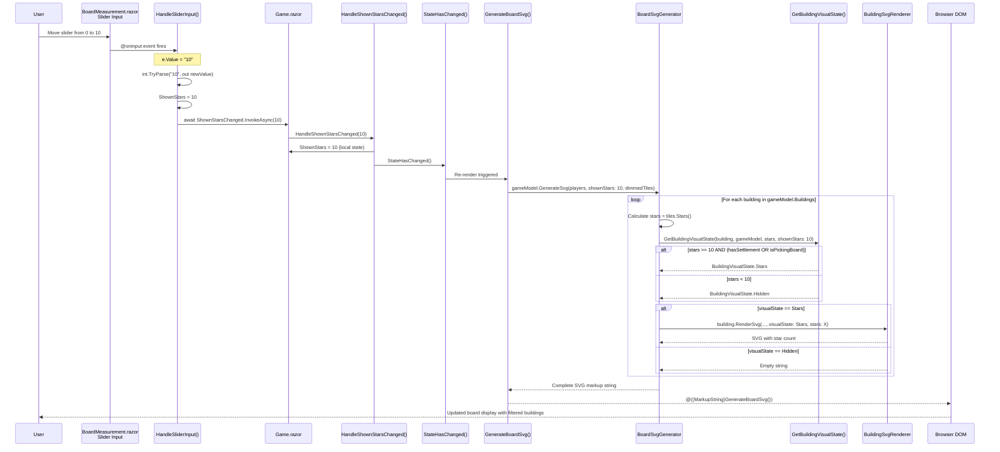
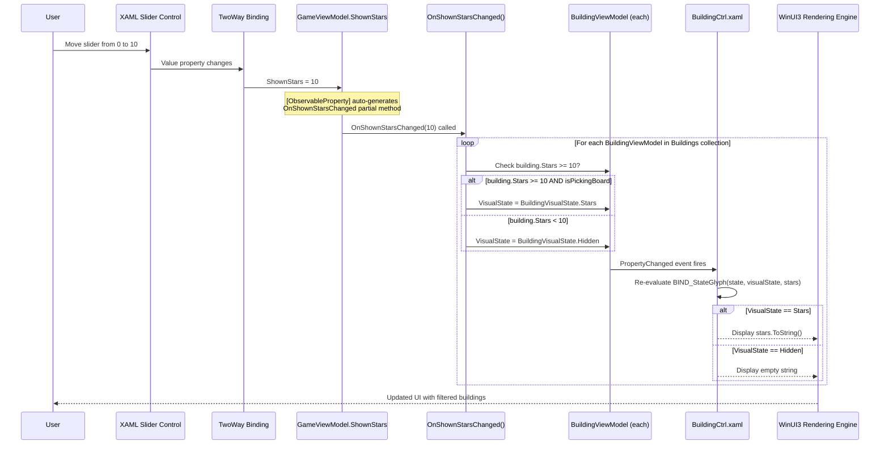

# Board Measurement Slider Call Flow Analysis

**Date:** 2025-11-28
**Purpose:** Deep analysis of slider call flow when changing from value 0 to 10

---

## WebUI Call Flow: Slider Value 0 → 10

### Mermaid Sequence Diagram



---

## Step-by-Step Call Flow

### 1. User Interaction
**Location:** `BoardMeasurement.razor:39-46`

```razor
<input type="range"
       id="star-slider"
       class="star-slider"
       min="0"
       max="14"
       value="@ShownStars"
       @oninput="HandleSliderInput"
       data-testid="star-threshold-slider" />
```

**Action:** User drags slider from position 0 to position 10
**Trigger:** Browser fires `@oninput` event with `e.Value = "10"`

---

### 2. Event Handler Execution
**Location:** `BoardMeasurement.razor:120-127`

```csharp
private async Task HandleSliderInput(ChangeEventArgs e)
{
    if (int.TryParse(e.Value?.ToString(), out var newValue))
    {
        ShownStars = newValue;  // Updates component parameter
        await ShownStarsChanged.InvokeAsync(newValue);  // Notifies parent
    }
}
```

**Actions:**

1. Parse event value string → integer 10
2. Update local `ShownStars` parameter to 10
3. Invoke parent callback `ShownStarsChanged` with value 10

---

### 3. Parent Component Update
**Location:** `Game.razor:531-536`

```csharp
private async Task HandleShownStarsChanged(int newValue)
{
    ShownStars = newValue;  // Updates Game.razor local state
    StateHasChanged();       // Triggers Blazor re-render
    await Task.CompletedTask;
}
```

**Actions:**

1. Update `Game.razor` local `ShownStars` field to 10
2. Call `StateHasChanged()` to queue Blazor re-render
3. Return completed task

---

### 4. Blazor Re-Render Cycle

**Location:** `Game.razor:100`

```csharp
@((MarkupString)GenerateBoardSvg())
```

**Blazor automatically re-executes:**

- All `@` expressions in the render tree
- Calls `GenerateBoardSvg()` method with current state

---

### 5. SVG Generation Orchestration

**Location:** `Game.razor:586-603`

```csharp
private string GenerateBoardSvg()
{
    if (GameModel == null)
        return "<svg><text x='50' y='50'>Waiting for game data...</text></svg>";

    try
    {
        return GameModel.GenerateSvg(
            GameStateService.Players,    // Player view models with colors
            shownStars: ShownStars,       // Now = 10
            dimmedTiles: null
        );
    }
    catch (Exception ex)
        ```csharp

    {
        return $"<svg><text x='50' y='50'>Error generating board: {ex.Message}</text></svg>";
    }
}
```

**Actions:**

1. Null check GameModel
2. Call extension method on GameModel
3. Pass `ShownStars = 10` as parameter
4. Handle errors gracefully

---

### 6. Board SVG Generator Main Loop

**Location:** `BoardSvgGenerator.cs:27-135`

```csharp
public static string GenerateSvg(
    this GameModel gameModel,
    IReadOnlyList<PlayerViewModel> players,
    int shownStars = 0,        // Receives 10
    HashSet<HexCoordinates>? dimmedTiles = null)
{
    // ... SVG header, defs, styles ...

    // Render tiles (lines 70-74)
    foreach (var tile in gameModel.Tiles)
    {
        var isDimmed = dimmedTiles.Contains(tile.TileKey);
        sb.Append(tile.RenderSvg(isDimmed));
    }

    // Render harbors (lines 77-80)

    // Render roads (lines 86-109)

    // Render buildings (lines 112-129) ← CRITICAL SECTION
    int buildingIndex = 1;
    foreach (var building in gameModel.Buildings)
    {
        // Calculate stars for this building
        var stars = gameModel.TilesForBuildings(building.BuildingKey).Stars();

        // Determine visibility based on shownStars threshold
        var visualState = GetBuildingVisualState(building, gameModel, stars, shownStars);

        // Get colors
        var currentPlayerColors = currentPlayerViewModel?.Colors;
        var ownerColors = playerLookup.TryGetValue(building.OwnerId ?? "", out var owner)
            ? owner.Colors : null;

        // Assign build index for highlighted buildings
        var buildIndex = visualState == BuildingVisualState.Highlighted
            ? buildingIndex++ : 0;

        sb.Append(building.RenderSvg(currentPlayerColors, ownerColors,
                                     visualState, stars, buildIndex));
    }

    return sb.ToString();
}
```

---

### 7. Building Visual State Logic

**Location:** `BoardSvgGenerator.cs:146-180`

```csharp
private static BuildingVisualState GetBuildingVisualState(
    BuildingModel building,
    GameModel gameModel,
    int stars,              // e.g., 12
    int shownStars)         // = 10
{
    var currentPlayer = gameModel.CurrentPlayer();
    var hasCityEntitlement = currentPlayer.UnspentEntitlements.Contains(Entitlement.City);
    var hasSettlementEntitlement = currentPlayer.UnspentEntitlements.Contains(Entitlement.Settlement);
    var isPickingBoard = gameModel.GameState == GameState.PickingBoard;

    return building.BuildingState switch
    {
        // PossibleSettlement buildings
        BuildingState.PossibleSettlement =>
            hasSettlementEntitlement && gameModel.Phase() != GamePhase.PickingResources
                ? BuildingVisualState.Highlighted  // Has entitlement → show settlement icon
                : stars >= shownStars && (hasSettlementEntitlement || isPickingBoard)
                    ? BuildingVisualState.Stars     // 12 >= 10 → SHOW STARS
                    : BuildingVisualState.Hidden,   // 7 >= 10 → HIDE

        // NotBuildable during PickingBoard can show stars
        BuildingState.NotBuildable =>
            isPickingBoard && stars >= shownStars
                ? BuildingVisualState.Stars
                : BuildingVisualState.Hidden,

        // Settlement that can be upgraded
        BuildingState.Settlement =>
            hasCityEntitlement && building.OwnerId == currentPlayer.Id
                ? BuildingVisualState.Highlighted
                : BuildingVisualState.Normal,

        // Other states
        BuildingState.City => BuildingVisualState.Normal,
        BuildingState.Metropolis => BuildingVisualState.Normal,
        BuildingState.Knight => BuildingVisualState.Normal,

        _ => BuildingVisualState.Hidden
    };
}
```

**Decision Tree Example:**

For a PossibleSettlement building with 12 stars:

- hasSettlementEntitlement? → No (during PickingBoard)
- stars >= shownStars? → 12 >= 10 → **YES**
- isPickingBoard? → **YES**
- **Result:** BuildingVisualState.Stars

For a PossibleSettlement building with 7 stars:

- hasSettlementEntitlement? → No
- stars >= shownStars? → 7 >= 10 → **NO**
- **Result:** BuildingVisualState.Hidden

---

### 8. Building SVG Rendering

**Location:** `BuildingSvgRenderer.cs:44-86`

```csharp
public static string RenderSvg(
    this BuildingModel building,
    PlayerColors? currentPlayerColors,
    PlayerColors? ownerColors,
    BuildingVisualState visualState,
    int stars = -1,
    int buildIndex = 0)
{
    if (visualState == BuildingVisualState.Hidden)
        return string.Empty;  // ← Buildings with < 10 stars return empty

    var sb = new StringBuilder();
    var (x, y) = GetVertexPosition(building.BuildingKey);

    var cssClass = visualState == BuildingVisualState.Highlighted
        ? "building building-highlighted" : "building";
    sb.AppendLine($@"  <g class=""{cssClass}"" data-player=""{building.OwnerId}"">");

    if (visualState == BuildingVisualState.Stars)
    {
        // Render numeric star count with gradient circle
        RenderStars(sb, building, currentPlayerColors, stars, x, y);
    }
    else if (visualState == BuildingVisualState.Highlighted)
    {
        // Render settlement/city icon with gradient
        RenderBuildingGlyph(sb, building, currentPlayerColors, x, y);

        if (buildIndex > 0)
        {
            RenderBuildIndex(sb, x, y, buildIndex, currentPlayerColors);
        }
    }
    else
    {
        // Normal owned buildings
        RenderBuildingGlyph(sb, building, ownerColors, x, y);
    }

    sb.AppendLine("  </g>");
    return sb.ToString();
}
```

**For Stars Visual State:**

```csharp
private static void RenderStars(StringBuilder sb, BuildingModel building,
                                PlayerColors? currentPlayerColors, int stars,
                                double x, double y)
{
    var radius = BuildingSize / 2;
    var gradientId = "gradient-current-player";  // ← ISSUE: Not defined in defs!

    // Circle with gradient background
    sb.AppendLine($@"<circle cx=""{x}"" cy=""{y}"" r=""{radius}""
                    fill=""url(#{gradientId})""
                    stroke=""{currentPlayerColors.Foreground}""
                    stroke-width=""2""/>");

    // Numeric star count
    sb.AppendLine($@"<text x=""{x}"" cy=""{y}"" text-anchor=""middle""
                    font-size=""20"" font-weight=""bold""
                    fill=""{currentPlayerColors.Foreground}"">{stars}</text>");
}
```

---

### 9. DOM Update

**Final Step:**

Blazor receives complete SVG markup string and updates:
```html
<div class="board-container">
    <svg xmlns="http://www.w3.org/2000/svg" viewBox="...">
        <!-- Tiles, harbors, roads -->

        <!-- Building with 12 stars (VISIBLE) -->
        <g class="building">
            <circle cx="..." cy="..." r="20"
                    fill="url(#gradient-current-player)"
                    stroke="#FFFFFF" stroke-width="2"/>
            <text x="..." y="..." font-size="20" fill="#FFFFFF">12</text>
        </g>

        <!-- Building with 7 stars (HIDDEN - no markup) -->

    </svg>
</div>
```

User sees board with only buildings >= 10 stars visible.

---

## Desktop Call Flow: Slider Value 0 → 10

### Desktop Overview

Desktop uses XAML data binding with MVVM pattern and WinUI3 framework.

### Mermaid Sequence Diagram



### Key Differences

|Aspect|Desktop|WebUI|
|------|-------|-----|
|**Binding**|TwoWay XAML binding|EventCallback pattern|
|**Property Change**|Auto INotifyPropertyChanged|Manual StateHasChanged()|
|**Update Mechanism**|Individual BuildingViewModel updates|Full SVG regeneration|
|**Granularity**|Per-building property changes|Entire board re-render|
|**Performance**|Only changed buildings re-render|All buildings re-evaluated|

---

## Desktop Implementation Details

### 1. Slider Binding

**Location:** `BoardMeasurementCtrl.xaml:130-133`

```xml
<Slider HorizontalAlignment="Center" Width="300"
        IsDirectionReversed="false" Minimum="0" Maximum="14"
        Value="{x:Bind GameViewModel.ShownStars, Mode=TwoWay}"
        Orientation="Horizontal" SmallChange="1" TickFrequency="1" />
```

**TwoWay Binding:**

- Slider.Value ↔ GameViewModel.ShownStars
- Changes in either direction propagate automatically
- No manual event handler needed

---

### 2. ViewModel Property

**Location:** `GameViewProps.cs:116-119`

```csharp
[ObservableProperty]
public partial int ShownStars { get; set; } = 13;  // Default = 13!
```

**MVVM Toolkit Magic:**

- `[ObservableProperty]` generates:
    - Private backing field `_shownStars`
    - Public property with INotifyPropertyChanged
    - `partial void OnShownStarsChanged(int value)` hook

---

### 3. Property Change Handler

**Location:** `GameViewProps.cs:194-217`

```csharp
partial void OnShownStarsChanged(int value)
{
    Debug.Assert(GameModel is not null);
    foreach (var building in Buildings)
    {
        if (building.Building.OwnerId is not null) continue;  // Skip owned

        // During PickingBoard, NotBuildable can show stars
        if (building.Building.BuildingState == BuildingState.NotBuildable
            && GameModel.GameState != GameState.PickingBoard)
            continue;

        if (building.VisualState == BuildingVisualState.Highlighted)
            continue;  // Don't change highlighted buildings

        bool hasEntitlement = CurrentPlayer.Player.UnspentEntitlements
                                .Contains(Entitlement.Settlement);

        // CRITICAL LOGIC: Show stars if >= threshold
        if (building.Stars >= value
            && (hasEntitlement || GameModel.GameState == GameState.PickingBoard))
        {
            building.VisualState = BuildingVisualState.Stars;
        }
        else
        {
            building.VisualState = BuildingVisualState.Hidden;
        }
    }
}
```

**Process:**

1. Loop through all BuildingViewModels in collection
2. Skip owned buildings (already visible)
3. Skip NotBuildable unless PickingBoard state
4. Skip Highlighted buildings (placement phase)
5. Compare `building.Stars >= value` (e.g., 12 >= 10)
6. Set VisualState to Stars or Hidden
7. Each VisualState change fires PropertyChanged event

---

### 4. Building Rendering

**Location:** `BuildingCtrl.xaml:27-80` (simplified)

```xml
<Grid Background="{x:Bind ViewModel.BIND_Background(ViewModel.VisualState,
                                                     ViewModel.Building.OwnerId,
                                                     ViewModel.CurrentPlayer),
                          Mode=OneWay}">

    <TextBlock Text="{x:Bind ViewModel.BIND_StateGlyph(ViewModel.Building.BuildingState,
                                                        ViewModel.VisualState,
                                                        ViewModel.Stars),
                            Mode=OneWay}"
               Foreground="{x:Bind ViewModel.BIND_Foreground(...)}"
               FontSize="20" />

    <TextBlock Text="{x:Bind ViewModel.BuildIndex, Mode=OneWay}"
               Visibility="{x:Bind ViewModel.BIND_BuildIndexVisibility(ViewModel.VisualState)}" />
</Grid>
```

**BIND_StateGlyph Logic:**

```csharp
public string BIND_StateGlyph(BuildingState state, BuildingVisualState visualState, int stars)
{
    string glyph;
    switch (state)
    {
        case BuildingState.PossibleSettlement:
            if (visualState == BuildingVisualState.Stars)
            {
                glyph = stars.ToString();  // "12"
            }
            else if (visualState == BuildingVisualState.Highlighted)
            {
                glyph = CatanFont.Settlement;  // Unicode glyph
            }
            else
            {
                glyph = String.Empty;  // Hidden
            }
            break;
        // ... other cases
    }
    return glyph;
}
```

---

## Issues Identified

### Issue 1: Missing Gradient Definition (CRITICAL)

**Location:** `BuildingSvgRenderer.cs:126`

```csharp
var gradientId = "gradient-current-player";  // ← NOT DEFINED!
```

**Problem:**
- Code references `url(#gradient-current-player)` in SVG
- Gradient never created in `<defs>` section
- Browser falls back to black/transparent

**Root Cause:**
- `GeneratePlayerGradients()` only creates gradients for players in the game
- Uses pattern `gradient-{playerId}` (e.g., `gradient-joe-001`)
- Never creates special `gradient-current-player` gradient

**Expected Behavior (Desktop):**
- Buildings in Stars state use current player's gradient colors
- During PickingBoard, all star buildings show in current player's colors

**Impact:**
- Star buildings render with missing gradient (black fill)
- Visual inconsistency with Desktop

---

### Issue 2: Default Slider Value (HIGH)

**WebUI:** `BoardMeasurement.razor:74`

```csharp
public int ShownStars { get; set; } = 0;
```

**Desktop:** `GameViewProps.cs:119`

```csharp
public partial int ShownStars { get; set; } = 13;
```

**Problem:**
- WebUI defaults to 0 → shows ALL buildings (no filtering)
- Desktop defaults to 13 → shows only high-quality buildings (13+ stars)

**Expected Behavior:**
- During PickingBoard, slider should default to 13
- Encourages players to evaluate best building sites first
- Matches 20+ years of Catan Desktop behavior

**Impact:**
- Different UX than Desktop
- May confuse users switching between platforms

---

### Issue 3: StateHasChanged Redundancy (LOW)

**Location:** `Game.razor:531-536`

```csharp
private async Task HandleShownStarsChanged(int newValue)
{
    ShownStars = newValue;
    StateHasChanged();  // ← May be redundant?
    await Task.CompletedTask;
}
```

**Analysis:**
- Blazor automatically queues re-render after event handlers complete
- Manual `StateHasChanged()` call may be unnecessary
- However, explicit call ensures immediate re-render
- Not a bug, just potentially redundant

**Recommendation:**

- Keep `StateHasChanged()` for clarity and guaranteed behavior
- Document why it's needed (if it is)

---

### Issue 4: No Initialization Logic (MEDIUM)

**Desktop:** `GameViewModel.cs:247-250`

```csharp
if (gameModel.Phase() == GamePhase.PickingBoard || gameModel.Phase() == GamePhase.PickingResources)
{
    var currentStars = ShownStars;
    ShownStars = 14;  // Force to max
    ShownStars = currentStars;  // Restore, triggers OnShownStarsChanged
}
```

**Purpose:**

- Forces re-evaluation of building visual states
- Ensures buildings update when entering PickingBoard phase

**WebUI Equivalent:**

- Missing this initialization logic
- Buildings may not update correctly when game state changes

**Impact:**
- Buildings might not appear/disappear correctly on phase transitions

---

## Performance Comparison

### Desktop

- **Granular Updates:** Only changed BuildingViewModels re-render
- **XAML Efficiency:** WinUI3 rendering engine optimizes updates
- **Memory:** Maintains ViewModel collection in memory

### WebUI

- **Full Regeneration:** Entire SVG string rebuilt on every slider change
- **String Building:** StringBuilder creates new string each render
- **DOM Diffing:** Blazor diffs SVG markup to minimize DOM updates
- **Memory:** Temporary string garbage collected after render

**Performance Impact:**

- WebUI generates ~50-100KB SVG string per slider change
- Modern browsers handle this efficiently (< 16ms)
- Acceptable for 60 FPS UI responsiveness

---

## Summary

### Call Flow Comparison Table

|Step|Desktop|WebUI|
|----|-------|-----|
|**1. User Input**|Slider Value property|@oninput event|
|**2. Property Update**|TwoWay binding|EventCallback invoke|
|**3. Change Notification**|INotifyPropertyChanged|StateHasChanged()|
|**4. Logic Execution**|OnShownStarsChanged() loop|GenerateBoardSvg() call|
|**5. Building Update**|Set VisualState property|Generate SVG markup|
|**6. UI Rendering**|XAML re-evaluates bindings|Blazor diffs DOM|
|**7. Final Display**|WinUI3 compositor|Browser rendering engine|

### Architectural Differences

**Desktop (MVVM):**
- Property-based reactivity
- Fine-grained updates
- ViewModel orchestration
- XAML binding system

**WebUI (Component Model):**
- Event-based reactivity
- Full re-render cycle
- Extension method composition
- Blazor rendering engine

Both achieve the same user experience through different architectural patterns.

---

## Next Steps

1. Fix missing `gradient-current-player` definition
2. Update default ShownStars value to 13
3. Add initialization logic for phase transitions
4. Document StateHasChanged usage
5. Add performance monitoring for SVG generation

---

## End of Call Flow Analysis
