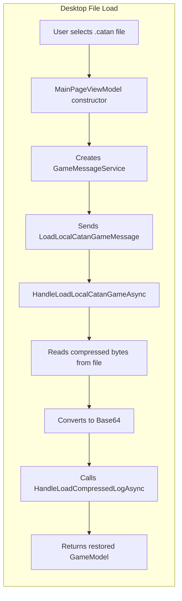
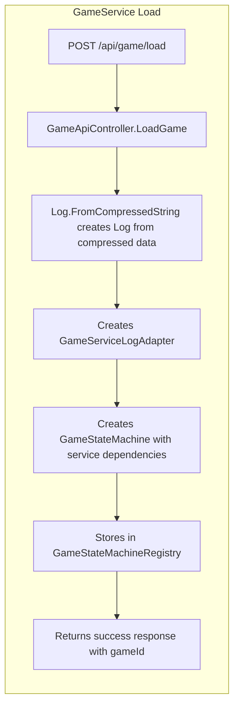

# New Game Creation Flow - Desktop vs GameService Architecture

## Desktop App - New Game Flow

```mermaid
graph LR
    subgraph "Desktop UI Layer"
        A1[User clicks New Game] --> B1[NewGamePage]
        B1 --> C1[Selects game type & players]
        C1 --> D1[Creates MainPageViewModel]
    end
    
    subgraph "Desktop MVVM Layer"
        D1 --> E1[Constructor receives dependencies]
        E1 --> F1[Creates GameMessageService with IPersistenceService]
        F1 --> G1[Sends NewGameMessage via MVVM]
    end
    
    subgraph "Desktop GameMessageService"
        G1 --> H1[HandleNewGameAsync receives message]
        H1 --> I1[Calls CreateNewGameAsync helper]
        I1 --> J1[Creates GameModel via GameModelExtensions.CreateNew]
        J1 --> K1[Gets save file path via FileService]
        K1 --> L1[Calls CreateGameStateMachineWithDesktopDependencies]
        L1 --> M1[Creates Desktop dependencies]
        M1 --> N1[Creates GameStateMachine]
        N1 --> O1[Calls InitializeLoggingState with gameModel]
        O1 --> P1[Returns GameModel]
        P1 --> Q1[Sends UpdateGameModel message to UI]
    end
```

## GameService - New Game Flow

```mermaid
graph LR
    subgraph "Client Request"
        A2[POST /api/game/new] --> B2[GameApiController.NewGame]
        B2 --> C2[Validates NewGameMessage]
    end
    
    subgraph "GameService Controller"
        C2 --> D2[Gets game metadata based on GameType]
        D2 --> E2[Creates GameModel via GameModelExtensions.CreateNew]
        E2 --> F2[Creates Log with GameModel and isTest flag]
        F2 --> G2[Creates GameServiceLogAdapter]
        G2 --> H2[Creates GameStateMachine with service dependencies]
        H2 --> I2[Stores GameStateMachine in GameStateMachineRegistry]
        I2 --> J2[Returns success response with gameId]
    end
    
    subgraph "Client Connection"
        J2 --> K2[Client connects to SignalR GameHub]
        K2 --> L2[GameHub.JoinGame gets GameStateMachine from registry]
        L2 --> M2[Sends current game state to client]
    end
```

## Key Architectural Differences

### Desktop App

- **MVVM Messaging**: UI communicates via MVVM message pattern
- **GameMessageService**: Owns GameStateMachine lifecycle
- **File-based persistence**: Saves to local .catan files
- **Direct UI updates**: UpdateGameModel message updates UI immediately

### GameService

- **REST + SignalR**: REST for game creation, SignalR for real-time updates
- **Static Registry**: GameStateMachineRegistry manages all game instances
- **No direct persistence**: Games exist in memory, can be saved via API
- **Client-server model**: Clients connect via SignalR for game updates

## Loading Existing Games

### Desktop - Loading .catan Files

### GameService - Loading Compressed Data

## Current Implementation Status

✅ **Desktop App**: Full MVVM message-driven architecture working
✅ **GameService**: Simplified architecture with GameStateMachineRegistry
✅ **Unified GameStateMachine**: Shared between both apps
✅ **Log Initialization**: Better pattern with SerializableLog constructor

The architectures are now properly separated and simplified, with the GameService eliminating unnecessary abstractions while maintaining the same core game logic.
